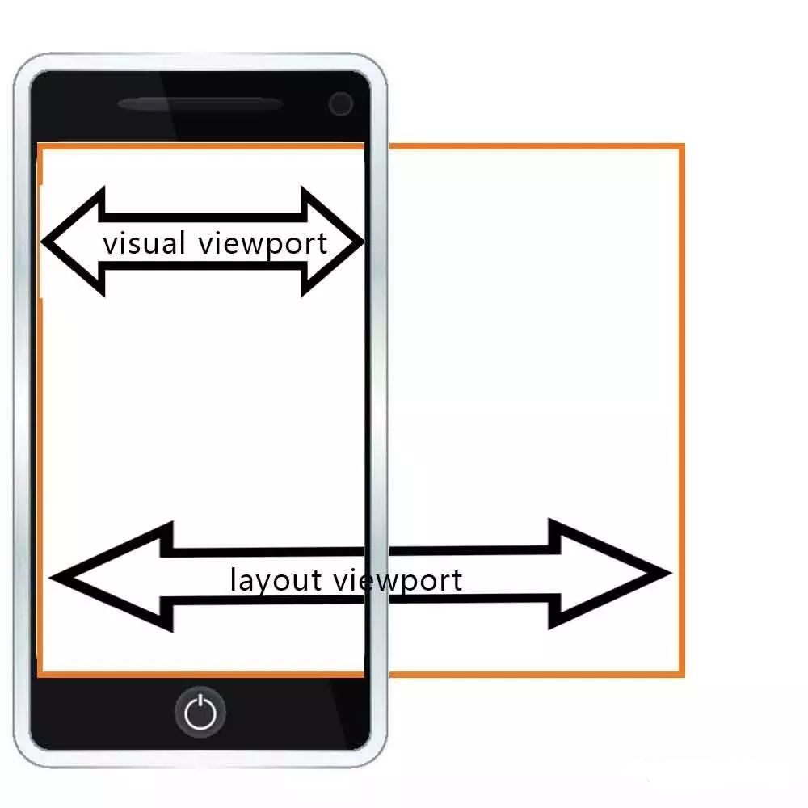
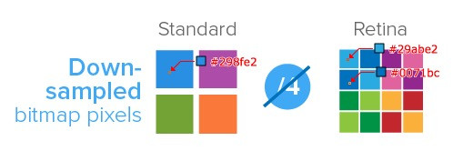
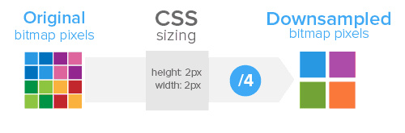
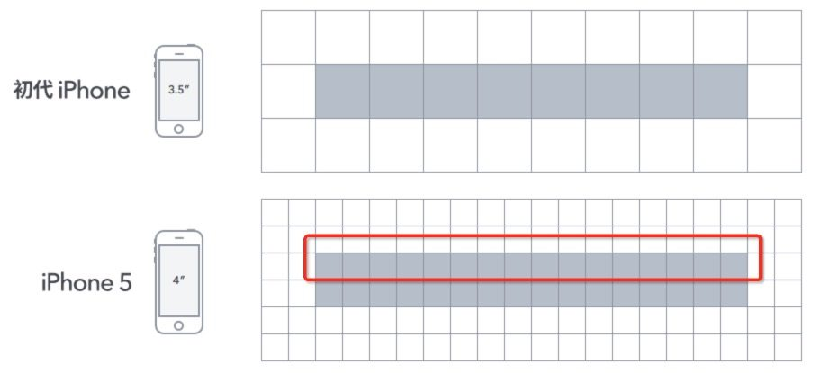

<!--
 * @Author: your name
 * @Date: 2021-04-28 15:06:17
 * @LastEditTime: 2021-05-07 18:21:05
 * @LastEditors: Please set LastEditors
 * @Description: In User Settings Edit
 * @FilePath: /my-docs/docs/103841964.md
-->

**本文旨在讲解移动端高清适配的几种方案，在这之前我们先整理与这些方法相关的知识：`物理像素`、`设备独立像素`、`设备像素比`和 `viewport`。**

## 设备独立像素、物理像素和设备像素比

### 设备独立像素(device-independent pixel)

**设备独立像素** 又被称为 `CSS像素`，是我们写 `CSS` 时所用的像素，它是一个**抽像的单位**，主要使用在浏览器上，用来精确度量Web页面上的内容。

### 物理像素(physical pixel)

**物理像素** 又被称为**设备像素**、**设备物理像素**。它是显示器（电脑、手机屏幕）**最小**的**物理显示单位**。

每个**物理像素**由 **颜色值** 和 **亮度** 值组成。所谓的一倍屏、二倍屏(Retina)、三倍屏，指的是设备 **以多少物理像素来显示一个CSS像素（设备独立像素）**。

也就是说，多倍屏以更多更精细的物理像素点来 **显示一个CSS像素点**，在 **普通** 屏幕下 **1个CSS像素** 对应 **1个物理像素** ，而在 `Retina` 屏幕下，**1个CSS像素**对应的却是 **4个物理像素**。

### 设备像素比(device pixel ratio)

设备像素比简称为 `dpr` ，定义了 **物理像素和设备独立像素** 的对应关系。

> 设备像素比 ＝ 物理像素 / 设备独立像素


**物理像素 =  设备像素比 \* 设备独立像素** 然而 **物理像素** 除了和 `dpr` 有关，还和用户缩放有关系。

例如，当用户把页面放大一倍，那么 **物理像素** 也会增加一倍；反之把页面缩小一倍，**物理像素** 也会减少一倍。关于这点，在文章后面的1px细线问题部分还会讲到。

## viewport

`viewport` 就是设备上用来显示网页的那一块区域，但 `viewport` 又不局限于浏览器可视区域的大小，它可能比浏览器的可视区域要大，也可能比浏览器的可视区域要小。

在默认情况下，一般来讲，移动设备上的 `viewport` 都是要大于浏览器可视区域的，这是因为考虑到移动设备的 **分辨率** 相对于桌面电脑来说都比较小，所以为了能在移动设备上正常显示那些传统的为桌面浏览器设计的网站，移动设备上的浏览器都会把自己 **默认** 的 `viewport` 设为 `980px` 或 `1024px`，但带来的后果就是浏览器会出现横向滚动条，因为浏览器可视区域的宽度是比这个默认的 `viewport` 的宽度要小的。



明确三种不同的 `viewport` 视口：

1. `visual viewport` 可见视口，指屏幕宽度

2. `layout viewport` 布局视口，指DOM宽度

3. `ideal viewport` 理想适口，使布局视口就是可见视口即为理想适口

获取屏幕宽度(`visual viewport`)的尺寸：

```js
window.innerWidth
window.innerHeight
```

获取DOM宽度(`layout viewport`)的尺寸：

```js
document.documentElement.clientWidth
document.documentElement.clientHeight
```

设置理想视口 `ideal viewport`：

```html
<meta name="viewport" content="width=device-width, user-scalable=no, initial-scale=1.0, maximum-scale=1.0, minimum-scale=1.0">
```

该 `meta` 标签的作用是让 `layout viewport` 的宽度等于 `visual viewport` 的宽度，同时不允许用户手动缩放，从而达到理想视口。

meta标签里各参数的含义为：

- `width`: 设置 `layout viewport` 的宽度，为一个正整数，或字符串 `width-device`。

- `initial-scale`: 设置页面的 **初始缩放值**，为一个数字，可以带小数。

- `minimum-scale`: 允许用户的 **最小缩放值**，为一个数字，可以带小数。

- `maximum-scale`: 允许用户的 **最大缩放值**，为一个数字，可以带小数。

- `user-scalable`: **是否允许用户进行缩放**，值为 `no` 或 `yes`。


## rem适配

适配是为了使页面在不同手机设备上，相对保持统一的效果。移动端自适应方案很多，有 **百分比布局**，**弹性盒模型布局** 等，但是最好用的要数 **rem布局** 了。

`rem` 是相对于 **根元素** 的字体大小的单位，我们可以根据 **设备宽度** 动态设置根元素的 `font-size`，使得以 `rem` 为单位的元素在不同终端上以 **相对一致** 的视觉效果呈现。


```text
font-size: 100px;
那么1rem = 100px

width: 1rem; 实际为100px
```


下面介绍3种根据屏幕宽度设置 `rem` 基准值的方法。（注：为了换算方便，以下三种方法都用1:100的比例，即1rem=100px）

用JS设置rem基准值

```js
/* 设计稿是750,采用1：100的比例,用1rem表示100px,font-size为100 * (clientWidth / 750) */
(function(doc, win) {
    var docEl = doc.documentElement,
        resizeEvt = 'orientationchange' in window ? 'orientationchange' : 'resize',
        recalc = function() {
            var clientWidth = docEl.clientWidth;
            if (!clientWidth) return;
            docEl.style.fontSize = 100 * (clientWidth / 750) + 'px';
        };
    if (!doc.addEventListener) return;
    win.addEventListener(resizeEvt, recalc, false);
    doc.addEventListener('DOMContentLoaded', recalc, false);
})(document, window);
```

用密集的媒体查询设置font-size

```css
/* 设计稿是750,采用1：100的比例,用1rem表示100px,100*(100/750)=13.333 以min-width: 750px时font-size: 100px为基准，
min-width每缩小100px,font-size就缩小13.3333px，如需更密集的媒体查询可以按照这个对照关系设置。*/
@media screen and (min-width: 320px) {
    html {
        font-size: 42.6667px;
    }
}
@media screen and (min-width: 375px) {
    html {
        font-size: 50px;
    }
}
@media screen and (min-width: 425px) {
    html {
        font-size: 56.6667px;
    }
}
@media screen and (min-width: 768px) {
    html {
        font-size: 102.4px;
    }
}
```

用单位vw设置font-size

```css
/* 设计稿是750,采用1：100的比例,用1rem表示100px,font-size为100*(100vw/750) */
html {
    font-size: 13.3334vw;
}
```

## 解决方案

了解了**物理像素**、**设备独立像素**、**设备像素比**和 **viewport** 这几个重要概念后，来看一下移动端开发中，由于屏幕分辨率导致的两个经典问题：图片模糊问题和1px细线问题。

### 图片模糊问题

一个 **位图像素** 是栅格图像 **最小的数据单元**。

每一个 **位图像素** 都包含着一些自身的显示信息(如：**显示位置**，**颜色值**，**透明度**等)。

理论上，**1个位图像素** 对应于 **1个物理像素**，图片才能得到完美清晰的展示。对于 `dpr=2` 的 `Retina` 屏幕而言，**1个位图像素** 对应于 **4个物理像素**，由于单个位图像素 **不可以再进一步分割**，所以只能 **就近取色**，导致图片看起来比较**模糊** 。



对于图片模糊问题，比较好的方案就是用 **多倍图片(@2x)** 。如：1个 **200×300(CSS pixel)** 的 `img` 标签，对于 `dpr=2` 的屏幕，用 **400×600** 的图片，如此一来，**位图像素点个数** 就是原来的 **4** 倍，在 `Retina` 屏幕下，**位图像素点个数** 就可以跟 **物理像素点个数** 形成 `1 : 1` 的比例，图片自然就清晰了。

在普通屏幕下，**200×300(CSS pixel)** `img` 标签，所对应的物理像素个数就是 **200×300** 个，而两倍图片的位图像素个数是 **200×300×4** 个，所以就出现1个 **物理像素点** 对应 **4个位图像素点** ，但它的取色也只能通过一定的算法取某一个位图像素点上的色值，这个过程叫做 `downsampling` ，肉眼看上去虽然图片不会模糊，但是会觉得图片缺少一些锐利度，或者是有点色差。



> 所以最好的解决办法是：不同的 `dpr` 下，加载不同的尺寸的图片。不管是通过CSS媒体查询，还是通过JS条件判断都是可以的。

### 1px边框问题

在上文我们已经知道，**设备独立像素** 为 `1px` 的直线，对应的 **物理像素** 是不同的，可能是 `2px` 或者 `3px` ,而设计师想要的 `1px` 宽的直线,其实就是 `1物理像素宽`。



> 上面两张图分别是在 iphone3gs(**dpr=1**) 和 iphone5(**dpr=2**) 下面的测试效果

对于 `CSS` 而言，可以认为是 `border: 0.5px;`，这是多倍屏下能显示的最小单位。

然而，并不是所有手机浏览器都能识别 `border: 0.5px;`，有的系统里，`0.5px` 会被当成为 `0px` 或 `1px` 处理，那么如何实现这 `0.5px` 呢？

有几种解决方法，比如 `border-image 图片`、`background-image 渐变`、`box-shadow` 等，因为这些方案不太好，所以不做赘述了。

我推荐两种方法：
- 用 **媒体查询** 根据 `dpr` 用 **伪元素+transform** 对边框进行缩放；

- 用 `JS` 根据 **屏幕尺寸** 和 `dpr` 精确地设置不同屏幕所应有的 `rem` 基准值和 `initial-scale` 缩放值。

### 伪元素+transform

构建1个 **伪元素**, `border` 为 `1px` , 再以 `transform` 缩放到 `50%`。

```css
/* 设计稿是750,采用1：100的比例,font-size为100*(100vw/750) */
.border-1px {
    position: relative;
}
@media screen and (-webkit-min-device-pixel-ratio: 2) {
    .border-1px:before {
        content: " ";
        position: absolute;
        left: 0;
        top: 0;
        width: 100%;
        height: 1px;
        background-color: #D9D9D9;
        -webkit-transform-origin: 0 0;
        transform-origin: 0 0;
        -webkit-transform: scaleY(0.5);
        transform: scaleY(0.5);
    }
}
```

### 用JS计算rem基准值和viewport缩放值

```js
/* 设计稿是750,采用1：100的比例,font-size为100 * (docEl.clientWidth * dpr / 750) */
var dpr, rem, scale;
var docEl = document.documentElement;
var fontEl = document.createElement('style');
var metaEl = document.querySelector('meta[name="viewport"]');
dpr = window.devicePixelRatio || 1;
rem = 100 * (docEl.clientWidth * dpr / 750);
scale = 1 / dpr;
// 设置viewport，进行缩放，达到高清效果
metaEl.setAttribute('content', 'width=' + dpr * docEl.clientWidth + ',initial-scale=' + scale + ',maximum-scale=' + scale + ', minimum-scale=' + scale + ',user-scalable=no');
// 设置data-dpr属性，留作的css hack之用，解决图片模糊问题和1px细线问题
docEl.setAttribute('data-dpr', dpr);
// 动态写入样式
docEl.firstElementChild.appendChild(fontEl);
fontEl.innerHTML = 'html{font-size:' + rem + 'px!important;}';
```

> 感兴趣的同学 可以看一下 网易提供的 [adaptive](https://github.com/finance-sh/adaptive) 自适应解决方案（附带源码） 逻辑上大同小异；