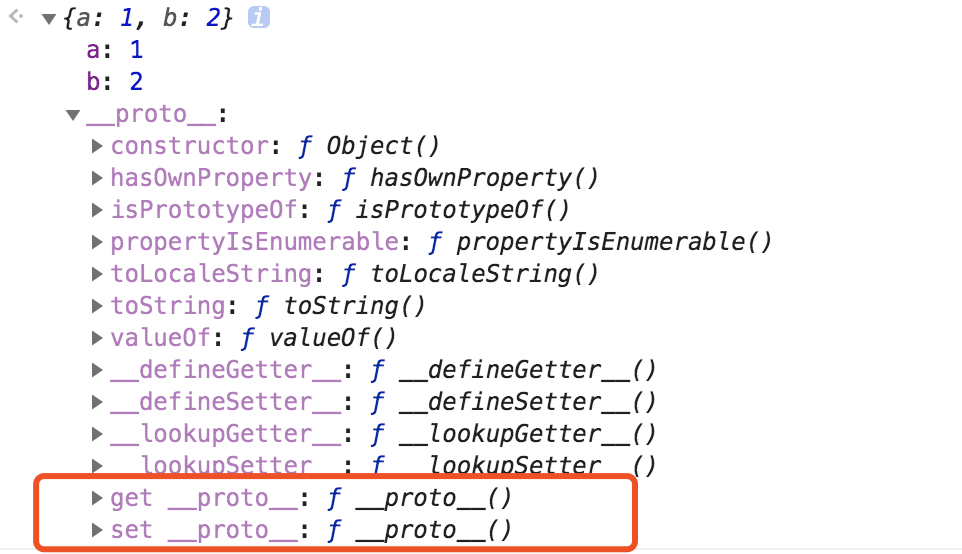
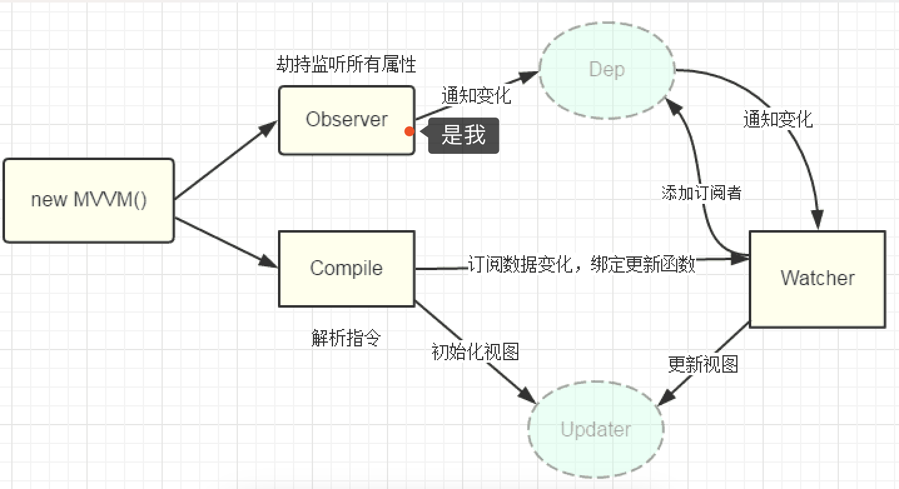
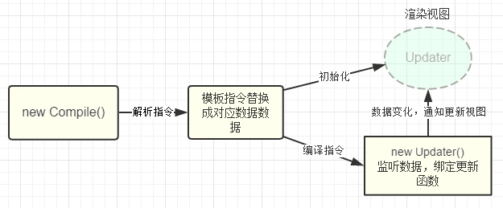

<!--
 * @Author: your name
 * @Date: 2021-04-21 17:35:17
 * @LastEditTime: 2021-04-22 15:23:34
 * @LastEditors: Please set LastEditors
 * @Description: In User Settings Edit
 * @FilePath: /my-docs/docs/11077628.md
-->


## 名词理解

简单说一下 `vue` 的 **数据双向绑定**，我们这次不背题，而是要你理解这个流程，保证读完就懂，逢人能讲，面试必过，如果没做到，请再来看一遍。

介绍双向数据之前，我们先解释几个名词：

### 1. 什么是 `setter` , `getter` ？ 

首先，别误以为他们就是一会要说的`get`、`set`，我们先看一句定义：

> 对象有两种属性：1、数据属性，就是我们经常使用的属性； 2、访问器属性，也称存取器属性（**存取器属性就是一组获取和设置值的函数**）

再看一行代码：

```js
const obj = {a: 1, b: 2};
console.log(obj)
```


**数据属性** 就是 `a` 和 `b` ；

`get` 和 `set` 就是 **关键字** 它们后面各自对应一个 **函数** ，这个函数就是上面红字部分所讲的，**存储器属性** 。

`get` 对应的方法称为 `getter` ，负责 **获取值**，它不带任何参数。 `set` 对应的方法为 `setter` ，负责 **设置值** ，在它的函数体中，一切的 `return` 都是无效的。

### 2. 什么是 [Object.defineProperty](https://developer.mozilla.org/zh-CN/docs/Web/JavaScript/Reference/Global_Objects/Object/defineProperty) ？

老规矩走起，我们先看一句定义：

> 对象是由多个名/值对组成的无序的集合。对象中每个属性对应任意类型的值。

> `Object.defineProperty()` 方法会直接在一个对象上定义一个新属性，或者修改一个对象的现有属性，并返回此对象

定义对象可以使用 **构造函数** 或 **字面量** 的形式：

```js
let obj = new Object; // obj = {}
obj.name = '张学友'; // 添加描述
obj.say = function(){}  // 添加行为
```

除了以上添加属性的方式，当然还可以使用 `Object.defineProperty` 定义 **新属性** 或 **修改原有的属性**；

```js
Object.defineProperty(obj, prop, descriptor)

// 参数：
// obj：必需。目标对象；
// prop：必需。需定义或修改的属性的名字；
// descriptor：必需。目标属性所拥有的特性；

// 返回值：
// 传入函数的对象，即第一个参数obj；
```

OK，定义介绍完了，我们现在说一下一会关于双向绑定我们要用到的知识点：**存取器描述**；

```js
let obj = {};
Object.defineProperty(obj, 'name', {
  get: function(){
    conosle.log('get')
  },
  set: function(){
    console.log('set')
  }
})

obj.name = '张学友';
// set
// 在给obj设置name属性的时候，触发了 set 存储器 

const val = obj.name;
// get
// 获取obj的name属性，触发了 get 存储器
```

现在无论是你 **获取** 还是 **设置** 我们都可以接到通知，是不是有一点 **双向数据绑定** 的雏形了。

## 双向绑定的原理（version < Vue3.x）

### Observer

OK，我终于叨叨完没用的了，现在开始说正题，如何理解Vue的双向数据绑定，先来一个定义：

> `Vue` 是采用 `数据劫持` 结合 `发布/订阅模式` 的方式，通过 `Object.defineProperty` 来 `劫持` 各个属性的 `setter` ， `getter` ，在  **数据变动时** **发布消息** 给 **订阅者**，触发相应的 **监听回调** 。

我们结合上面的栗子来看一个很粗暴的栗子，简易版双向绑定：

```html
<input id="input" />
<span id="text"></span>
```

```js
let obj = {};
let text = document.querySelector('#text');
let input = document.querySelector('#input');

Object.defineProperty(obj, 'name', {
  get: function(){
    return val;
  },
  set: function(newVal){
    // 当该属性被赋值的时候触发
    input.value = newVal;
    input.innerHTML = newVal;
  }
})

input.addEventListener('input', function(e){
  // 当对obj的name属性赋值时，进行触发该属性的set方法
  obj.name = e.target.value;
})
```

是不是有点明白了呢？当然这也不是全部。

我们刚刚说的大概就是 `Observer` 的部分，对每个 `Vue` 实例中的 `data` 中定义的属性循环用 `Object.defineProperty` 实现数据劫持，以便利用其中的 `setter` 和 `getter` ，然后通知订阅者，订阅者会触发它的 `update` 方法，对 **视图进行更新** 。



### Dep

`Dep` ，它就像一个 **依赖管理** 一样，那么什么又是依赖管理呢？简易版又来了：

```js
function Dep(){
  this.subs = [];
}

Dep.prototype = {
  addSub: function(sub){
    this.subs.push(sub);
  },
  notify: function(){
    this.subs.forEach(sub => sub.update());
  }
}
```

在 `Vue` 中 `v-model`，`v-name`，`{{}}` 等都可以对 **数据进行展示** ，也就是说假如一个属性都通过这三个指令了，那么每当这个属性 `改变` 的时候，相应的这个三个指令的 `html` **视图** 也必须改变；

于是 `Vue` 中每当有这样的可能用到 **双向绑定** 的指令，就在一个 `Dep` 中增加一个 **订阅者（addSub）**，其订阅者只是更新自己的指令对应的数据，也就是`v-model='name'` 和 `{{name}}` 有 **两个对应的订阅者**，各自管理自己的地方；

每当属性的 `set` 方法触发，就循环更新 `Dep` 中的**订阅者（notify）**;

### Compile

集合上面的那张图来看，就是 `Observer` 一旦有了 `set` 触发，就会通知到 `Dep` ，那 `Dep` 接到通知之后呢？从图上来看，下面所讲的就应该是 `Compile` 了，也不复杂：

首先，先要知道它负责干什么？

`Compile` 主要做的事情是 **解析模板指令** ，将模板中的 **变量** 替换成 **数据**;

其次知道它什么时候要工作，只有两种情况，先上图：



1. 初始化，`init` 的时候 初始化渲染页面视图；

2. 将每个**指令**对应的节点**绑定更新函数**，**添加**监听数据的**订阅者**；

`Dep` 负责维护依赖，而订阅者则来自于 `Compile` ，一旦有数据变动，则会绑定**更新函数**，此时也就是产生了订阅者，这个时候 `Dep` 内就增加了一个订阅者，而一旦数据变动，则会收到通知，更新视图；

好了，你是不是觉得上面这行说不通，或是读不通。

当然，因为上面的这个流程并不完整，我们最后要说的 `Watcher`，把上面这句话补全，就是 `Watcher` 的工作了；

`Dep` 负责维护依赖，而 **订阅者** 则来自于 `Compile` ，一旦有数据变动，则会通过 `Watcher` 绑定更新函数。`Watcher` 向 `Dep` 中添加了 **订阅者** ，一旦 `Dep` 接到 `Observer` 的通知，它就会再去通知 `Watcher` ， `Watcher` 则会调用自身绑定的`Update`方法，并触发 `Compile` 中绑定的回调，更新视图；


### 最后敲黑板


首先我们为每个 `Vue` 属性用 `Object.defineProperty` 实现**数据劫持**，为每个属性分配一个 **订阅者集合** 的 **管理数组`dep`** ；

然后在 **编译的时候** 在该属性的数组`dep`中 **添加订阅者** ，`v-model` 会 **添加一个订阅者**，`{{}}` 也会，`v-bind` 也会，只要用到该属性的指令理论上都会；

接着为 `input` 添加监听事件，修改值就等于为该属性赋值，则会触发该属性的 `set` 方法，在 `set` 方法内 **通知订阅者数组 `dep`**，订阅者数组循环调用各订阅者的 `update` 方法更新视图。


