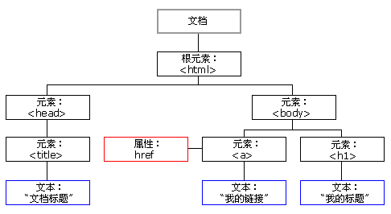

<!--
 * @Author: your name
 * @Date: 2021-06-02 17:57:32
 * @LastEditTime: 2021-06-03 16:57:40
 * @LastEditors: Please set LastEditors
 * @Description: In User Settings Edit
 * @FilePath: /my-docs/docs/296494422.md
-->

## DOM 概念

**文档对象模型**（`Document Object Model`），它定义了访问和处理 `HTML` 文档的标准方法。

`HTML` 文档中的每个成分都是一个节点。`HTML` 文档中的所有节点组成了一个 **文档树**（**节点树**）。

`HTML` 文档中的每个元素、属性、文本等都代表着树中的一个节点。树起始于文档节点，并由此继续延伸枝条，直到处于这棵树最低级别的所有文本节点为止。



### DOM 的组成

`DOM` 是由节点组成的。节点又分为 **标签节点**、**属性节点**、**文本节点**。

### DOM 的用途

通过 `JS`，我们可以重构整个 `HTML` 页面文档。

可以 **添加**、**移除**、**改变或重排** 页面上的项目。

要改变页面的某个东西（即动态改变），`JS` 就需要获得对 `HTML` 文档中所有元素进行访问的入口。这个入口，连同对 `HTML` 元素进行添加、移动、改变或移除的方法和属性，都是通过 **文档对象模型**（`DOM`）来获得的。

## DOM 节点的操作

学习 `DOM`，就是学习一些操作页面元素的 `API`（方法）。

### 节点的类型

- **标签节点**

- **属性节点**

- **文本节点**

### 节点的组成

```html
<!-- index.html -->
<span id="span">hello world</span>
```

- `nodeType`（**节点类型**）

```js
const span = document.getElementById("span");
span.nodeType === 1; // true
```

<div class="Alert Alert--point">

`nodeType` 属性返回节点类型。

如果节点是一个元素节点，`nodeType` 属性返回 `1`。

如果节点是属性节点, `nodeType` 属性返回 `2`。

如果节点是一个文本节点，`nodeType` 属性返回 `3`。

如果节点是一个注释节点，`nodeType` 属性返回 `8`。

该属性是只读的。

</div>

- `nodeName`（**节点名称**）

```js
const span = document.getElementById("span");
span.nodeName === "SPAN"; // true
```

- `nodeValue`（**节点值**）

```js
const span = document.getElementById("span");
span.nodeValue === null; // true

const spanText = document.getElementById("span");
spanText.childNodes[0].nodeValue === "hello world"; //true
```

<div class="Alert">

请注意，该属性只返回 `文本节点` 的节点值；

</div>

### 节点的获取

```js
document.getELementById(idStr);
document.getElementsByTagName(tagStr);
document.getElementsByClassName(classStr); //不常用
```

### 节点的层次

#### 父节点

<table> 
   <thead> 
    <tr> 
     <th colspan="2">父节点</th> 
    </tr> 
    <tr> 
     <th>方法名</th> 
     <th>释义</th> 
    </tr> 
   </thead> 
   <tbody> 
    <tr> 
     <td>parentNode</td> 
     <td>获取父节点</td> 
    </tr> 
   </tbody> 
  </table>

```js
//伪代码
const parent = child.parentNode;
```

<div class="Alert">

可以通过 `parentNode` 逐一向上访问，最顶层为 `#document` 文档对象，再向上访问是 `null`；

</div>

#### 子节点

<table> 
   <thead> 
    <tr> 
     <th colspan="2">子节点</th> 
    </tr> 
    <tr> 
     <th>方法名</th> 
     <th>释义</th> 
    </tr> 
   </thead> 
   <tbody> 
    <tr> 
     <td>childNodes</td> 
     <td>标准的DOM属性，获取子标签以外，还会获取文本节点，IE8中会忽略空白节点</td> 
    </tr> 
    <tr> 
     <td>children</td> 
     <td>不是标准的DOM属性，但是所有的浏览器都支持，只会返回元素节点</td> 
    </tr> 
    <tr> 
     <td>firstChild</td> 
     <td>第一个子节点</td> 
    </tr> 
    <tr> 
     <td>firstElementChild</td> 
     <td>第一个子元素节点</td> 
    </tr>
    <tr> 
     <td>lastChild</td> 
     <td>最后一个子节点</td> 
    </tr>
     <tr> 
     <td>lastElementChild</td> 
     <td>最后一个子元素节点</td> 
    </tr>
   </tbody> 
  </table>

```html
<!-- index.html -->
<div class="parent" id="parent">
  <div class="child">
    <div class="child3"></div>
  </div>
  <div class="child2">
    <div class="child4"></div>
    <div class="child5" id="child5" data="2">
      123
    </div>
  </div>
</div>
```

```js
const parent = document.getElementById("parent");
console.log(parent.childNodes);
// NodeList(5) [text, div.child, text, div.child2, text]

console.log(parent.children);
// HTMLCollection(2) [div.child, div.child2]

console.log(parent.firstChild);
// #text

console.log(parent.firstElementChild);
// <div class="child">…</div>

console.log(parent.lastChild);
// #text

console.log(parent.lastElementChild);
// <div class="child2">…</div>
```

#### 兄弟节点

<table> 
   <thead> 
    <tr> 
     <th colspan="2">子节点</th> 
    </tr> 
    <tr> 
     <th>方法名</th> 
     <th>释义</th> 
    </tr> 
   </thead> 
   <tbody> 
    <tr> 
     <td>nextSibling</td> 
     <td>火狐、谷歌、IE9+版本：都指的是下一个节点</td> 
    </tr> 
    <tr> 
     <td>nextElementSibling</td> 
     <td>火狐、谷歌、IE9+版本：都指的是下一个元素节点</td> 
    </tr> 
    <tr> 
     <td>previousSibling</td> 
     <td>火狐、谷歌、IE9+版本：都指的是前一个节点</td> 
    </tr> 
    <tr> 
     <td>previousElementSibling</td> 
     <td>火狐、谷歌、IE9+版本：都指的是前一个元素节点</td> 
    </tr>
   </tbody> 
  </table>

```html
<!-- index.html -->
<div class="parent" id="parent">
  <div class="child" id="child">
    <div class="child3"></div>
  </div>
  <div class="child2">
    <div class="child4"></div>
    <div class="child5" id="child5" data="2">
      123
    </div>
  </div>
</div>
```

```js
const child = document.getElementById("child");
console.log(child.nextSibling);
// #text

console.log(child.nextElementSibling);
// div class="child2">…</div>

const child2 = document.getElementById("child2");

console.log(child2.previousSibling);
// #text

console.log(child2.previousElementSibling);
// <div class="child">…</div>
```

### 创建节点

#### 创建文本节点

```html
<!-- index.html -->
<span id="span"></span>
```

```js
const span = document.getElementById("span");
span.innerHTML = "hello world";

// 等同于

const text = document.createTextNode("hello world");
span.appendChild(text);
```

#### 创建元素节点

```html
<!-- index.html -->
<div id="div"></div>
```

```js
const div = document.getElementById("div");
const span = document.createElement('span'); // 不区分大小写
div.appendChild(span);
```

### 节点操作

#### 插入节点

```html
<!-- index.html -->
<div id="parent">
    <span>hello world</span>
</div>
```

```js
// 向父节点末尾插入新节点
const parent = document.getElementById('parent');
const child = document.createElement('span');

parent.appendChild(child);

// 等同于

parent.insertBefore(child, null);
```

<div class="Alert Alert--point">

语法 node.insertBefore (newnode,existingnode)  
`newnode`	节点对象 要插入的节点对象  
`existingnode`	节点对象 要添加新的节点前的子节点  
如果 `existingnode` 为 `null` 默认插入到父节点末尾  

</div>

```js
// 向已有 子节点 前插入一个新的子节点
// 向 hello world 前 增加一句话 'hi'

const parent = document.getElementById('parent');
const parentFirst = parent.firstElementChild;
const text = document.createTextNode('hi');
parent.insertBefore(text, parentFirst);
```

#### 删除节点

```html
<!-- index.html -->
<div id="parent">
    <span id='span'>hello world</span>
</div>
```

```js
const parent = document.getElementById('parent');
const span = document.getElementById('span');

parent.removeChild(span);

// 如果想删除自身
parent.parentNode.removeChild(parent);
```

#### 克隆节点

```html
<!-- index.html -->
<div id="parent"></div>
```

```js
const parent = document.getElementById('parent');

parent.cloneNode();

//  等同于 

parent.cloneNode(false);
```

<div class="Alert Alert--point">

不带参数或者带参数 `false` ：只复制节点本身，不复制子节点。

带参数 `true`：既复制节点本身，也复制其所有的子节点。

</div>

### 节点的属性

```html
<!-- index.html -->
<div id="parent"></div>
```

```js
const parent = document.getElementById('parent');

console.log(parent.getAttribute('id')) //parent

parent.setAttribute('class', 'parent') // <div id="parent" class="parent"></div>

parent.removeAttribute('id') // <div></div>
```