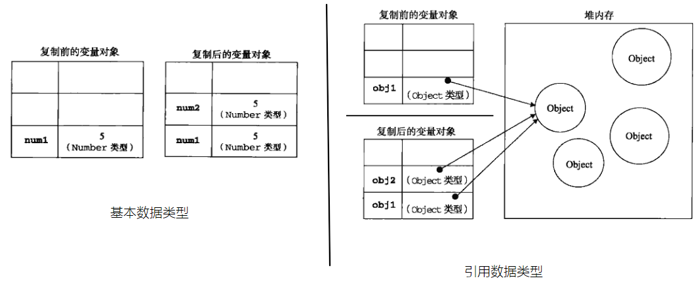
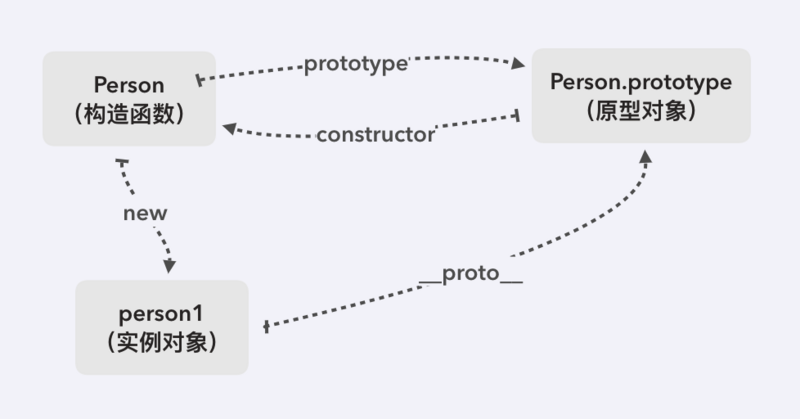

<!--
 * @Author: your name
 * @Date: 2021-05-21 14:31:04
 * @LastEditTime: 2021-06-02 16:31:44
 * @LastEditors: Please set LastEditors
 * @Description: In User Settings Edit
 * @FilePath: /my-docs/docs/309476933.md
-->

## 变量的本质

> 变量是用于 **存放数据的容器**。其本质是**程序在内存中申请的一块用来存放数据的空间**。

`JS`中所有的 **变量的值** 都是保存在 **栈内存** 中的，只不过 **引用类型** 存储在 **栈** 中的是其在 **堆中的地址**。

为什么需要数据类型？

在计算机中，**不同的数据** 所需占用的 **存储空间不同**，为了充分利用存储空间，于是定义了不同的数据类型。而且，不同的数据类型，寓意也不同。

## 通用数据类型

**基本数据类型（值类型）：**

- `String` —— **字符串**

- `Number` —— **数值**

- `Boolean` —— **布尔值**

- `Null` —— **空值**

- `Undefined` —— **未定义**

- `BigInt` —— **大整数**

- `Symbol` —— **唯一性**

**引用数据类型（引用类型）：**

- `Object` —— **对象**

<div class="Alert">

注意：内置对象 `Function`、`Array`、`Date`、`RegExp`、`Error` 等都是属于 `Object` 类型。也就是说，除了那 **7 种基本数据类型** 之外，其他的都称之为 `Object` 类型。

</div>

## String

字符串里面的值 **不可被改变**。虽然可以通过拼接等等实现貌似值的改变，但其实是 **指向的地址变了**，内存中开辟了一个 **新的内存空间**。

<div class="Alert">

ES6 模板字符串 反引号 ` `` ${} ` 类似一个函数体，可以执行函数，获取数值，遍历等等

</div>

```js
const name = "xx";
const age = "26";

console.log("我是" + name + ",age:" + age); //传统写法
console.log(`我是${name},age:${age}`); //ES6 写法。注意语法格式
```

## Number

在 `JS` 中，数值都属于 `Number` 类型。无论整数、浮点数（即小数）、无论大小、无论正负。

`JS` 所有数字都保存成 `64 位浮点数`，这给数值的表示带来了两大限制。

1. 数值的精度只能到 `53 个二进制位`（相当于 16 个十进制位），大于这个范围的整数，`JS` 是无法精确表示的，这使得 `JS` 不适合进行科学和金融方面的精确计算。

2. 大于或等于 `2的1024次方` 的数值，`JS` 无法表示，会返回 `Infinity`。

<div class="Alert Alert--point">

十进制的 `0.1` 和 `0.2` 会 `转换成二进制` 的，但是由于 `浮点数用二进制表示是无穷` 的

0.1 ——> 0.0001 1001 1001 1001 ...(1001循环)

0.2 ——> 0.0011 0011 0011 0011 ...(0011循环)

标准的 `64` 位双精度浮点数的小数部分最多支持 `53` 位二进制，多余的二进制数字被截断，所以两者相加之后的二进制之和是

0.0100110011001100110011001100110011001100110011001101

将截断之后的二进制数字再转换为十进制，就成了 0.30000000000000004，所以在计算时产生了误差

</div>

### 数值范围

由于内存的限制，`ECMAScript` 并不能保存世界上所有的数值。

- **最大值**：`Number.MAX_VALUE`，这个值为： `1.7976931348623157e+308`

- **最小值**：`Number.MIN_VALUE`，这个值为： `5e-324`

### Infinity

如果使用 `Number` 表示的变量超过了最大值，则会返回 `Infinity`。

`Number.isFinite()` 检查一个数值是否为有限:

- **无穷大**（正无穷）：`Infinity`

- **无穷小**（负无穷）：`-Infinity`

> 注意：`typeof Infinity` 的返回结果是 `number` 。

### NaN

这一个特殊的数字，表示 `Not a Number`，**非数值**。通过 `isNaN()` 来检测。

```js
console.log(isNaN("a")); //true
```

> 如果是 `Number.isNaN()` 不存在隐式的 `Number()` **类型转换**，非 `NaN` 全部返回 `false`

- `NaN` 与任何值都不相等，包括 `NaN` 本身。

- `typeof NaN` 的返回结果是 `number`。

- `undefined` 做任何数值运算都是 `NaN`。

- `null` 做数值运算被视为 `0`。

```js
console.log("a" - 2); //NaN
console.log(typeof NaN); //number
console.log(isNaN("a")); //true
console.log(NaN == NaN); //false
```

### 浮点数的运算

在 `JS` 中，整数的运算基本可以保证精确；但是 **小数运算**，可能会得到一个 **不精确** 的结果。所以，千万不要使用 `JS` 进行对精确度要求比较高的运算。

```js
const a = 0.1 + 0.2;
console.log(a); //0.30000000000000004
```

 <div class="Alert">

这是因为，计算机在做运算时，**所有的运算都要转换成二进制** 去计算。然而，有些数字转换成二进制之后，无法精确表示。比如说，`0.1` 和 `0.2` 转换成二进制之后，是无穷的，因此存在浮点数的计算不精确的问题。

 </div>

如果只是一些简单的精度问题，可以使用 `toFix()` 方法进行小数的截取。

市面上有很多针对数学运算的开源库，比如 `decimal.j`s、 `Math.js`。

- `Math.js`：属于很全面的运算库，文件很大，压缩后的文件就有`500kb`。如果你的项目涉及到大型的复杂运算，可以使用。

- `decimal.js`：属于轻量的运算库，压缩后的文件只有`32kb`。大多数项目的数学运算，使用 `decimal.js` 足够了。

## Boolean

布尔型有两个值：`true` 和 `false`。

> 布尔型和数字型相加时， true 按 1 来算 ，false 按 0 来算。

## Null

`Null` 类型的值只有一个，就是 `null`，表示一个空对象的引用。

> 使用 `typeof` 检查一个 `null` 值时，会返回 `object`。

```js
const myObj = null;
cosole.log(typeof myObj); // object
```

## Undefined

`Undefined` 类型的值只有一个，就是 `undefind`。

> 使用 `typeof` 检查一个 `undefined` 值时，会返回 `undefined`

## BigInt

基于 `Number` 类型的数值位数限制，无法满足科学计算等，`ES6` 推出了 `BigInt` 数据类型。

- `BigInt` 只用来表示整数，没有位数的限制，任何位数的整数都可以精确表示。

- `BigInt` 类型的数据必须添加后缀 n。

- `BigInt` 与普通整数是两种值，它们之间并不相等。

```js
42 == 42n; //false
```

## Symbol

> 对象属性名都是字符串，这容易造成属性名的冲突。使用别人提供的对象，想给对象添加新的方法，新的方法名可能与现有的方法名产生冲突。

`ES6` 推出新的原始数据类型 `Symbol`，表示独一无二的值。（ `JS` 第七种数据类型）

## Object

> `ECMAScript` 中的对象其实就是一组数据和功能的集合。通过 `new` 操作符后跟要创建的对象类型的名称来创建。

`JS` 中的类继承模式类似 java 中的基类和派生类的关系。派生类对象存储了基类的数据成员。

派生类的实例对象可以访问基类的属性，方法。

<div class="Alert">

`JS` 中的内置对象 `Date`、`RegExp`、`Number`、`Function`… 可以看做派生类、`Object`可以被看做 **基类**。

而特殊的是，`javascript` 中 `Object` 这个基类，同时又是 `Function` 这个派生类的 实例对象。

</div>

每个 `Object` 类型的实例共有的属性和方法：

- `constructor`： 保存着用于创建当前对象的函数。

- `hasOwnProperty`：用于检测给定的属性在当前对象的实例中是否存在。

- `isPrototypeOf` ： 用于检查传入的对象是否是当前对象的原型

- `propertyIsEnumerble` ： 用于检查给定属性能否使用 `for-in` 来枚举

- `toLocaleString()` : 返回对象的字符串表示。

- `toString()` : 返回对象的字符串表示。

- `valueOf()` : 返回对象的字符串，数值，或布尔表示。通常和 toString() 返回的值相同。

## 存储关系




<div class="Alert Alert--point">

基本数据类型变量的数据存储在栈中，占据空间小、大小固定。  
引用数据类型变量的数据存储在堆中，占据空间大、大小不固定；（如果存储在栈中，将会影响程序运行的性能）
引用数据类型的变量在栈中存储了指针，该指针指向堆中该实体的起始地址。

</div>

- 基本数据类型：参数赋值的时候，传数值（参数指向独立内存空间）。

<div class="Alert">

基本数据类型的值，直接保存在栈内存中。值与值之间是独立存在，修改一个变量不会影响其他的变量。

</div>

```js
let a = 23;
let b = a;

a++;

console.log(a); // 24
console.log(b); // 23
```

- 引用数据类型：参数赋值的时候，传地址（参数指向同一片内存空间）。

<div class="Alert">

对象是保存到堆内存中的。每创建一个新的对象，就会在堆内存中开辟出一个新的空间；而变量保存了对象的内存地址（对象的引用），保存在栈内存当中。如果两个变量保存了同一个对象的引用，当通过一个变量修改属性时，另一个也会受到影响。

</div>

```js
let obj1 = new Object();
obj1.name = "bar";

let obj2 = obj1;

obj1.name = "foo";

console.log(obj1.name); // foo
console.log(obj2.name); // foo
```

## 数据类型转换

- 隐式类型: 部分算术运算符

- [显示转换：](https://blog.csdn.net/q535999731/article/details/79643665)`Number()`，`Boolean()`，`String()`，`parseInt()` 等

## 判断变量的数据类型

### typeof

只能精确判断**基本数据类型**，引用类型只能分出 `object` 和 `function` ,`function`也属于对象类型。

```js
const arr = [
  { name: "1", age: 11 },
  { name: "2", age: 22 },
  { name: "3", age: 33 },
  { age: 44 },
];

const number = 2;

//两种 typeof 写法
console.log(typeof number); // "number"
console.log(typeof arr); // "object"
console.log(Array.isArray(arr)); // true
```

### constructor

<div class="Alert">

比较构造器（构造函数）。不过要注意，`constructor` 属性是可以被修改的，会导致检测出的结果不正确。

</div>

```js
const arr = [
  { name: "1", age: 11 },
  { name: "2", age: 22 },
  { name: "3", age: 33 },
  { age: 44 },
];
console.log(arr.constructor === Array); //true
```

### instanceof

`instanceof` 比对的是 **左边对象实例原型链上的原型** 是否等同 **构造函数的原型**。

<div class="Alert">

- 原型的指向是可以改变的。所以并不是最初判断为 `true` 就一定永远为真。

- `instanceof` 只能用来判断对象类型，原始类型不可以。并且所有对象类型 `instanceof Object` 都是 `true`。

</div>



```js
let a = "abc";
let b = new String("abc");
console.log(a instanceof String); //false
console.log(b instanceof String); //true

const arr = [
  { name: "1", age: 11 },
  { name: "2", age: 22 },
  { name: "3", age: 33 },
  { age: 44 },
];
console.log(arr instanceof Array); //true

// arr.__proto__.constructor === arr.constructor
```

## Object.prototype.toString.call() 推荐使用

<div class="Alert">

可以通过 `toString()` 来获取每个对象的类型。

为了每个对象都能通过 `Object.prototype.toString()` 来检测，需要以 `call()` 或者 `apply()` 的形式来调用，传递要检查的对象作为第一个参数，称为 `thisArg`。

</div>

`Object.prototype.toString` 方法的在被调用的时候，会执行如下的操作步骤：

1. 获取对象的类名（对象类型）。

<div class="Alert">

`[[Class]]` 是一个内部属性，所有的对象（原生对象和宿主对象）都拥有该属性。  
在规范中，`[[Class]]` 是这么定义的：内部属性，`[[Class]]` 一个字符串值，表明了该对象的类型。

</div>

2. 然后将 `object` 获取的对象类型的名组合为字符串。

3. 返回字符串 `[object ${Class}]` 。

```js
const arr = [
  { name: "1", age: 11 },
  { name: "2", age: 22 },
  { name: "3", age: 33 },
  { age: 44 },
];
console.log(Object.prototype.toString.call(arr) == "[object Array]"); //true
```
