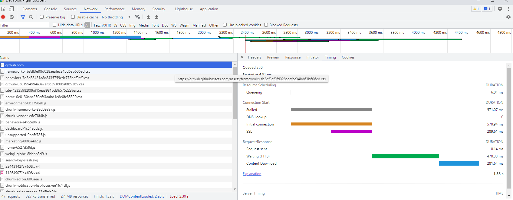
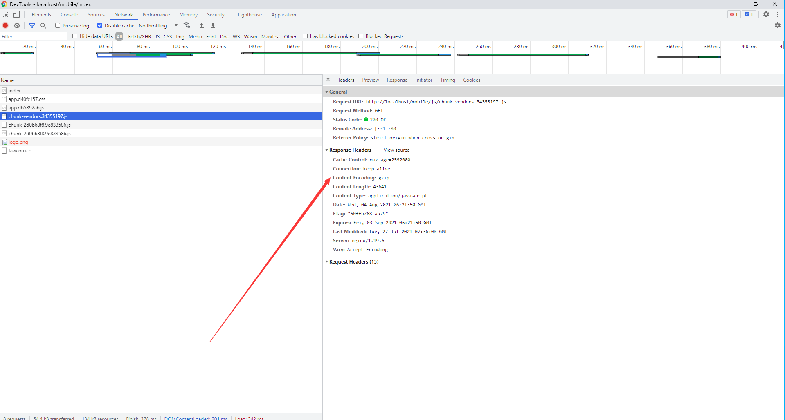
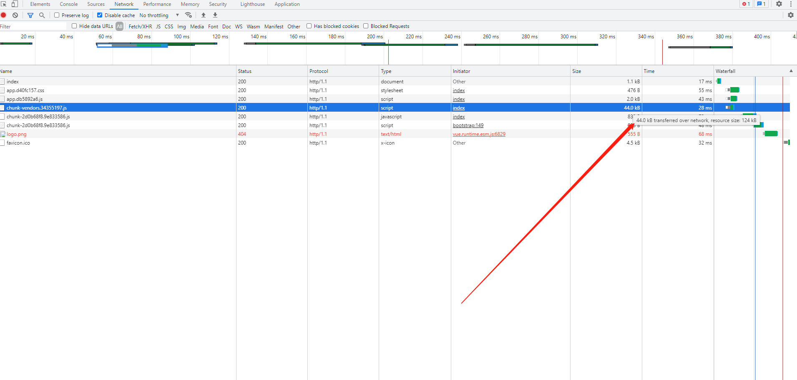

<!--
 // @Author: xl
 // @Date: 2022-01-03 12:55:47
 * @LastEditors: xl
 * @LastEditTime: 2022-01-03 20:42:13
 // @Description: 打开koroFileHeader查看配置 进行设置: https://github.com/OBKoro1/koro1FileHeader/wiki/%E9%85%8D%E7%BD%AE
 * @FilePath: /my-docs/docs/4234234.md
-->

## 目录

- **`Nginx` 的应用场景**

- **`Nginx` 的单页面加载优化**

## 应用场景

### 服务器

`Nginx` 本身也是一个 **静态资源的服务器**，当只有静态资源的时候，就可以使用 `Nginx` 来做服务器，如果一个网站只是静态页面的话，那么就可以通过这种方式来实现部署。

<div class="Alert Alert--point">

使用时，可以有两种方案，本地安装和 docker 镜像部署。

默认本地安装，一般在初装路径，`usr/local/etc/nginx` 下面的 `nginx.conf` 进行配置。

静态文件在 `/usr/local/var/www` 路径下；

</div>

```js
// nginx中还有很多配置 我们此处只是简单举例
http {
    server {
        listen       8081;
        server_name  localhost;

        location / {
            root   /usr/local/var/www;
            index  index.html index.htm;
        }

        location /test {
            root /usr/local/var/www/html;
            index test.html;
        }

        error_page  404              /404.html;
        error_page   500 502 503 504  /50x.html;
        location = /50x.html {
            root   html;
        }
    }
```

`www` 下面的 `html` 是我单独创建的 里面创建有 `test.html` 目的是为了演示测试

#### 指令

4、指令简介

- `server` : 用于定义服务，`http` 中可以有多个 `server` 块

- `listen` : 指定服务器侦听请求的 **`IP` 地址\*// 和 **端口\*\*，如果省略地址，服务器将侦听所有地址，如果省略端口，则使用标准端口

- `server_name` : 服务名称，用于配置域名，一般可以配置本地 `localhost`，通过修改本地 host 文件，可以修改本地域名解析；

- `location` : 用于配置映射路径 `uri` 对应的配置，一个 `server` 中可以有多个 `location`, `location` 后面跟一个 `uri`,可以是一个正则表达式, `/` 表示匹配任意路径, 当客户端访问的路径满足这个 `uri` 时就会执行 `location` 块里面的代码

- `root` : 根路径，当访问 `http://localhost/test.html`，“`/test.html`”会匹配到“`/`”`uri`, 找到 `root` 为 `/usr/local/var/www/html`，用户访问的资源物理地址 = `root + uri` = `/usr/local/var/www/html` + `/test.html` = `/usr/local/var/www/html/test.html`

- `index` : 设置首页，当只访问 `server_name` 时后面不跟任何路径是不走 `root` 直接走 `index` 指令的；如果访问路径中没有指定具体的文件，则返回 `index` 设置的资源，如果访问 `http://localhost/html` 则默认返回 `index.html`

#### localtion url 的匹配正则

- `.` ：匹配除换行符以外的任意字符
- `?` ：重复 `0`次或 `1` 次
- `+` ：重复 `1` 次或更多次
- `*` ：重复 `0` 次或更多次
- `\d` ：匹配数字
- `^` ：匹配字符串的开始
- `\$` ：匹配字符串的结束
- `{n}` ：重复 `n` 次
- `{n,}` ：重复 `n` 次或更多次
- `[c]` ：匹配单个字符 `c`
- `[a-z]` ：匹配 `a-z` 小写字母的任意一个
- `(a|b|c)` : 属线表示匹配任意一种情况，每种情况使用竖线分隔，一般使用小括号括括住，匹配符合 `a` 字符 或是 `b` 字符 或是 `c` 字符的字符串
- `\` 反斜杠：用于转义特殊字符

<div class="Alert">

小括号`()`之间匹配的内容，可以在后面通过 `$1` 来引用，`$2` 表示的是前面第二个`()`里的内容。正则里面容易让人困惑的是 `\` 转义特殊字符。

</div>

#### 测试运行

- **启动**：`nginx`

- **停止**(快速停止 | 完整有序的停止)：`nginx -s stop` | `nginx -s quit`

- **重启**：`nginx -s reload`

- **检测**：`nginx -t`

- **强行关闭**： `ps aux | grep nginx` 查看主进程号（master），使用 `kill -9 nginx` 的进程号强行停止

> 此处为简单命令，详细具体命令可以参考官网文档

#### 使用静态服务示例

某些公共静态资源可以通过 `nginx` 来获取，比如图片服务：

在 `/usr/local/var/www` 下面分别创建 `/images` `/img` 目录，分别在两个目录下放一张 `test.jpg`;

修改 `nginx.conf` 中的 `server`：

```js
http {
    server {
        listen       80;
        server_name  localhost;


        set $doc_root /usr/local/var/www;

        # 默认location
        location / {
            root   /usr/local/var/www/html;
            index  index.html index.htm;
        }

        location ^~ /images/ {
            root $doc_root;
       }

       location ~// \.(gif|jpg|jpeg|png|bmp|ico|swf|css|js)$ {
           root $doc_root/img;
       }
    }
}
```

> 自定义变量使用 `set` 指令，语法 `set` 变量名值;引用使用变量名值;引用使用变量名; 这里自定义了 `doc_root` 变量。

静态服务器 `location` 的映射一般有两种方式：

- **使用路径**，如 `/images/` 一般图片都会放在某个图片目录下，

- **使用后缀**，如 `.jpg`、`.png` 等后缀匹配模式

<div>

访问 `http://localhost/test.jpg` 会映射到 `\$doc_root/img`

访问 `http://localhost/images/test.jpg`，当同一个路径满足多个 `location` 时，优先匹配优先级高的 `location`，由于 `^~` 的优先级大于 `~`, 所以会走 `/images/` 对应的 `location`

</div>

#### localtion 的优先级

当一个路径匹配多个 `location` 时究竟哪个 `location` 能匹配到时有优先级顺序的，而优先级的顺序于 `location` 值的表达式类型有关，和在配置文件中的 **先后顺序无关**。相同类型的表达式，字符串长的会优先匹配。

常见的 location 路径映射路径有以下几种：

- `=` 进行普通字符精确匹配。也就是完全匹配。
- `^~` 前缀匹配。如果匹配成功，则不再匹配其他 `location`。
- `~` 表示执行一个正则匹配，区分大小写
- `~\*` 表示执行一个正则匹配，不区分大小写
- `/xxx/` 常规字符串路径匹配
- `/` 通用匹配，任何请求都会匹配到

优先级搜索问题：不同类型的 `location` 映射决定是否继续向下搜索

- 等号类型、`^~`类型：一旦匹配上就停止搜索了，不会再匹配其他 `location` 了

- 正则表达式类型(`~ ~\*`）,常规字符串匹配类型`/xxx/` : 匹配到之后，还会继续搜索其他其它 `location`，直到找到优先级最高的，或者找到第一种情况而停止搜索

优先级排列说明：

- 等号类型`（=）`的优先级最高。一旦匹配成功，则不再查找其他匹配项，停止搜索。

- `^~`类型表达式，不属于正则表达式。一旦匹配成功，则不再查找其他匹配项，停止搜索。

- 正则表达式类型`（~ ~\*）`的优先级次之。如果有多个 `location` 的正则能匹配的话，则使用正则表达式最长的那个。

- 常规字符串匹配类型。按前缀匹配。

- `/` 通用匹配，如果没有匹配到，就匹配通用的

location 优先级从高到底：

(location `=`) > (location `完整路径`) > (location `^~ 路径`) > (location `~,~\// 正则顺序`) > (location `部分起始路径`) > (`/`)

```js
location = / {
    // 精确匹配/，主机名后面不能带任何字符串 /
    [ configuration A ]
}
location / {
    // 匹配所有以 / 开头的请求。
    // 但是如果有更长的同类型的表达式，则选择更长的表达式。
    // 如果有正则表达式可以匹配，则优先匹配正则表达式。
    [ configuration B ]
}
location /documents/ {
    // 匹配所有以 /documents/ 开头的请求，匹配符合以后，还要继续往下搜索。
    // 但是如果有更长的同类型的表达式，则选择更长的表达式。
    // 如果有正则表达式可以匹配，则优先匹配正则表达式。
    [ configuration C ]
}
location ^~ /images/ {
    // 匹配所有以 /images/ 开头的表达式，如果匹配成功，则停止匹配查找，停止搜索。
    // 所以，即便有符合的正则表达式location，也不会被使用
    [ configuration D ]
}

location ~// \.(gif|jpg|jpeg)$ {
    // 匹配所有以 gif jpg jpeg结尾的请求。
    // 但是 以 /images/开头的请求，将使用 Configuration D，D具有更高的优先级
    [ configuration E ]
}

location /images/ {
    // 字符匹配到 /images/，还会继续往下搜索
    [ configuration F ]
}

location = /test.htm {
    root   /usr/local/var/www/htm;
    index  index.htm;
}
```

### 反向代理

反向代理应该是 `Nginx` 使用最多的功能了，反向代理(`Reverse Proxy`)方式是指以代理服务器来接受 `internet` 上的连接请求，然后将请求转发给内部网络上的服务器，并将从服务器上得到的结果返回给 `internet` 上请求连接的客户端，此时代理服务器对外就表现为一个反向代理服务器。

简单来说就是真实的服务器不能直接被外部网络访问，所以需要一台**代理服务器**，而代理服务器能被**外部网络访问的同时又跟真实服务器在同一个网络环境**，当然也可能是同一台服务器，端口不同而已。

**反向代理通过 `proxy_pass` 指令来实现**

```js
server {
    listen       80;
    server_name  localhost;

    location / {
        proxy_pass http://localhost:8081;
        proxy_set_header Host $host:$server_port;
        // 设置用户ip地址
         proxy_set_header X-Forwarded-For $remote_addr;
         // 当请求服务器出错去寻找其他服务器
         proxy_next_upstream error timeout invalid_header http_500 http_502 http_503;
    }
}
```

还有一种场景比较常见，当下前端项目多为 `SPA` ，如果一个很大的移动应用，进行项目拆分，基于优化考虑或和构建等原因，我们可能要拆成几个部分：

比如一个外卖应用 **个人中心**、**点单部分**、**付款部分**等，都是独立的业务，但是我们在对外向用户展示的时候，为了保证访问对齐，可能是以 `https://xxx.com/menu` `https://xxx.com/user` `https://xxx.com/pay` 等等来展示

已知 `SPA` 打包为 `/dist` 形式，那么如何形成我们上面提到的需求呢？

`nginx` 的 **反代功能**

> 其实现代的一些静态存储，比如 `cos` `s3` 其实很好实现转发功能，我们这里只是为了演示反代功能而已

我们将 `spa` 打包后的代码分别 `copy` 进 `www` 下面，如 `/dist/menu` `/dist/user` `/dist/pay`

```js
// 在 www 下面分别创建 web_user web_pay web_menu文件夹 将各个前端dist放入其中
http {
    server {
        listen       80;
        server_name  localhost;

        root /usr/local/var/www;

        location / {
            index  index.html index.htm;
        }

        location /user {
            rewrite /user /web_user/dist/index.html last;
        }

        location /pay {
            rewrite /pay /web_pay/dist/index.html last;
        }

        location /menu {
            rewrite /menu /web_menu/dist/index.html last;
        }
    }
}
```

### 负载均衡

负载均衡也是 `Nginx` 常用的一个功能，负载均衡其意思就是分摊到多个操作单元上进行执行，例如 `Web` 服务器、`FTP` 服务器、企业关键应用服务器和其它关键任务服务器等，从而共同完成工作任务。

简单而言就是当有 `2` 台或以上服务器时，根据规则随机的将请求分发到指定的服务器上处理，负载均衡配置一般都需要同时配置反向代理，通过反向代理跳转到负载均衡。

而 `Nginx` 目前支持自带 `3` 种负载均衡策略，还有 `2` 种常用的第三方策略。

#### RR(round robin :轮询 默认)

每个请求按时间顺序逐一分配到不同的后端服务器，也就是说第一次请求分配到第一台服务器上，第二次请求分配到第二台服务器上，如果只有两台服务器，第三次请求继续分配到第一台上，这样循环轮询下去，也就是服务器接收请求的比例是 `1:1`， 如果后端服务器 `down` 掉，能自动剔除。

轮询是默认配置，不需要太多的配置。

同一个项目分别使用 8081 和 8082 端口启动项目

```js
upstream web_servers {
   server localhost:8081;
   server localhost:8082;
}

server {
    listen       80;
    server_name  localhost;

    location / {
        proxy_pass http://web_servers;
        proxy_set_header Host $host:$server_port;
    }
 }
```

#### 权重

指定轮询几率，`weight` 和访问比率成正比, 也就是服务器接收请求的比例就是各自配置的 `weight` 的比例，用于后端服务器性能不均的情况,比如服务器性能差点就少接收点请求，服务器性能好点就多处理点请求。

```js
upstream test {
    server localhost:8081 weight=1;
    server localhost:8082 weight=3;
    server localhost:8083 weight=4 backup;
}
```

<div class="Alert Alert--point">

示例是 `4` 次请求只有一次被分配到 `8081` 上，其他 `3` 次分配到 `8082` 上。`backup` 是指热备，只有当 `8081` 和 `8082` 都宕机的情况下才走 `8083`

</div>

#### ip_hash

上面的 `2` 种方式都有一个问题，那就是下一个请求来的时候请求可能分发到另外一个服务器，当我们的程序不是无状态的时候(采用了 `session` 保存数据)，这时候就有一个很大的很问题了，比如把登录信息保存到了 `session` 中，那么跳转到另外一台服务器的时候就需要重新登录了，所以很多时候我们需要一个客户只访问一个服务器，那么就需要用 `iphash` 了，`iphash` 的每个请求按访问 `ip` 的 `hash` 结果分配，这样每个访客固定访问一个后端服务器，可以解决 `session` 的问题。

```js
upstream test {
    ip_hash;
    server localhost:8080;
    server localhost:8081;
}
```

#### fair(第三方)

按后端服务器的响应时间来分配请求，响应时间短的优先分配。这个配置是为了更快的给用户响应

```js
upstream backend {
    fair;
    server localhost:8080;
    server localhost:8081;
}
```

#### url_hash(第三方)

按访问 `url` 的 `hash` 结果来分配请求，使每个 `url` 定向到同一个后端服务器，后端服务器为缓存时比较有效。

在 `upstream` 中加入 `hash` 语句，`server` 语句中不能写入 `weight` 等其他的参数，`hash_method` 是使用的 `hash` 算法

```js
upstream backend {
    hash $request_uri;
    hash_method crc32;
    server localhost:8080;
    server localhost:8081;
}
```

以上 `5` 种负载均衡各自适用不同情况下使用，所以可以根据实际情况选择使用哪种策略模式,不过 `fair` 和 `url_hash` 需要安装第三方模块才能使用。

### 动静分离

动静分离是让动态网站里的动态网页根据一定规则把不变的资源和经常变的资源区分开来，动静资源做好了拆分以后，我们就可以根据静态资源的特点将其做缓存操作，这就是网站静态化处理的核心思路。

```js
pstream web_servers {
       server localhost:8081;
       server localhost:8082;
}

server {
    listen       80;
    server_name  localhost;

    set $doc_root /usr/local/var/www;

    location ~* \.(gif|jpg|jpeg|png|bmp|ico|swf|css|js)$ {
       root $doc_root/img;
    }

    location / {
        proxy_pass http://web_servers;
        proxy_set_header Host $host:$server_port;
    }

    error_page 500 502 503 504  /50x.html;
    location = /50x.html {
        root $doc_root;
    }

 }
```

### 指令和变量

#### return

返回 `http` 状态码 和 可选的第二个参数可以是重定向的 `URL`

```js
location /permanently/moved/url {
    return 301 http://www.example.com/moved/here;
}
```

#### rewrite

重写 `URI` 请求 `rewrite`，通过使用 `rewrite` 指令在请求处理期间多次修改请求 `URI`，该指令具有一个可选参数和两个必需参数。

第一个(**必需**)参数是请求 `URI` 必须匹配的正则表达式。

第二个参数是用于替换匹配 `URI` 的 `URI`。

可选的第三个参数是可以停止进一步重写指令的处理或发送重定向(代码 `301` 或 `302`)的标志

```js
location /users/ {
    rewrite ^/users/(.*)$ /show?user=$1 break;
}
```

#### error_page

使用 `error_page` 指令，您可以配置 `nginx` 返回自定义页面以及错误代码，替换响应中的其他错误代码，或将浏览器重定向到其他 `URI`。

在以下示例中，`error_page` 指令指定要返回 `404` 页面错误代码的页面(`/404.html`)。

```js
error_page 404 /404.html;
```

#### log

访问日志：需要开启压缩 `gzip on`; 否则不生成日志文件，打开 `log_format`、`access_log` 注释

```js
log_format  main  '$remote_addr - $remote_user [$time_local] "$request" '
                      '$status $body_bytes_sent "$http_referer" '
                      '"$http_user_agent" "$http_x_forwarded_for"';

access_log  /usr/local/etc/nginx/logs/host.access.log  main;

gzip  on;
```

#### deny

```js
// 禁止访问某个目录
location ~* \.(txt|doc)${
    root $doc_root;
    deny all;
}
```

#### 内置变量

`nginx` 的配置文件中可以使用的 **内置变量以美元符 `$` 开始**，也有人叫全局变量。

其中，部分预定义的变量的值是可以改变的:

- `$args` ：这个变量等于请求行中的参数，同 `$query_string`

- `$content_length` ：请求头中的 `Content-length` 字段。

- `$content_type` ：请求头中的 `Content-Type` 字段。

- `$document_root` ：当前请求在 `root` 指令中指定的值。

- `$host` ：请求主机头字段，否则为服务器名称。

- `$http_user_agent` ：客户端 `agent` 信息

- `$http_cookie` ：客户端 `cookie` 信息

- `$limit_rate` ：这个变量可以限制连接速率。

- `$request_method` ：客户端请求的动作，通常为 `GET` 或 `POST`。

- `$remote_addr` ：客户端的 `IP` 地址。

- `$remote_port` ：客户端的端口。

- `$remote_user` ：已经经过 `Auth Basic Module` 验证的用户名。

- `$request_filename` ：当前请求的文件路径，由 `root` 或 `alias` 指令与 `URI` 请求生成。

- `$scheme` ：`HTTP` 方法（如 `http`，`https`）。

- `$server_protocol` ：请求使用的协议，通常是 `HTTP/1.0` 或 `HTTP/1.1`。

- `$server_addr` ：服务器地址，在完成一次系统调用后可以确定这个值。

- `$server_name` ：服务器名称。

- `$server_port` ：请求到达服务器的端口号。

- `$request_uri` ：包含请求参数的原始 `URI`，不包含主机名，如：`/foo/bar.php?arg=baz`。

- `$uri` ：不带请求参数的当前 `URI`，`$uri` 不包含主机名，如`/foo/bar.html`。

- `$document_uri` ：与 `$uri` 相同

## 加载优化

### 网页加载

首先我们要看一下我们网页加载到底中间是个什么流程，那些东西比较耗费时间，比如我们访问 `github`：



- `Queued、Queueing`：如果是 `HTTP/1.1` 的话，会有队头阻塞，浏览器对每个域名最多开 `6` 个并发连接。

- `Stalled`：浏览器要预先分配资源，调度连接。

- `DNS Lookup`：`DNS` 解析域名。

- `Initial connection`、`SSL`：与服务器建立连接，`TCP` 握手，当然你是 `https` 的话还有 `TLS` 握手。

- `Request sent`：发送 `HTTP` 请求的时间（从第一个 `bit` 到最后一个 `bit`）。

- `TTFB`：等待返回的数据，网络传输，也就是首字节响应时间。

- `Content Dowload`：接收数据。

从图中可以看出从 **与服务器建立连接**，到**接收数据**，这里的时间花费是非常多的，当然还有 `DNS` 解析，不过这里有**本地缓存**，所以基本没有时间。

### gzip-减少加载体积

首先我们可以通过 `gzip` 对我们的 `js` 以及 `css` 进行压缩：(以 `vue` 为栗子，`vue.config.js` 的设置)

```js
const CompressionWebpackPlugin = require('compression-webpack-plugin')

buildcfg = {
  productionGzipExtensions: ['js', 'css'],
}
configureWebpack: (config) => {
  config.plugins.push(
    new CompressionWebpackPlugin({
      test: new RegExp(
        '\\.(' + buildcfg.productionGzipExtensions.join('|') + ')$'
      ),
      threshold: 8192,
      minRatio: 0.8,
    })
  )
}
```

其次，在 `nginx` 里也可以开启 `gzip`：

```js
// 使用gzip实时压缩
gzip on;
gzip_min_length 1024;
gzip_buffers 4 16k;
gzip_comp_level 6;
gzip_types text/plain application/javascript application/x-javascript text/css application/xml text/javascript;
gzip_vary on;
gzip_disable "MSIE [1-6]\.";
// 使用gzip_static
gzip_static on;
```

<div class="Alert Alert--point">

`gzip_static` 是会自动查找对应文件的`.gz` 文件，这个的与 `gzip` 开启与否以及 `gzip_types` 等并没有关联，你可以理解为优先返会`.gz` 文件。

</div>



`gzip` 的开启是针对于请求文件的实时压缩，这个是会消耗 `cpu` 的，比如说上面的请求文件的 `Content-Length` 大于 `gzip_min_length`，就进行压缩返回。

想看 `gzip` 是否成功启用可以通过，查看返回的 `header` 头 `Content-Encoding: gzip`，以及查看文件的 `size`，这里可以看到我们原来文件的是 `124kb`，而返回的 `gzip` 文件为 `44kb`:



总结一下就是你如果打包后有`.gz` 文件，只需要开启 `gzip_static` 即可，如果没有那么得启用 `gzip` 实时压缩。

建议使用前者，另外 `gzip` 的适用于文本类型，图片之类的使用的话会适得其反，故 `gzip_types` 请适当设置。

### 缓存控制

浏览器与服务器的缓存交互，内容比较多，想了解完整的童鞋 [可以转到我之前的一篇文章](./6047613.md)

```js
location /mobile {
  alias   /usr/share/nginx/html/mobile/;
  try_files uriuri/ /mobile/index.html;
  if (request_filename ~ .*\.(htm|html)){
      add_header Cache-Control no-cache;
  }
  if (request_uri ~* /.*\.(js|css)) {
      # add_header Cache-Control max-age=2592000;
      expires 30d;
  }
  index  index.html;
}
```

#### 弱缓存（协商缓存）

**`Last-Modified`**

我们的单页入口文件是 `index.html`，这个文件决定了我们要加载的 `js` 以及 `css`，故我们给 `html` 文件设置缓存 `Cache-Control no-cache`，当我们首次加载时 `http` 的状态码为 `200`，服务器会返回一个 `Last-Modified` 表示这个文件的最后修改时间，再次刷新时浏览器会把这个修改时间通过 `If-Modified-Since` 发送给服务器，如果没有变动（`Etag` 也会校验），那么服务器会返回 `304` 状态码，说我的文件没有变，你直接用缓存吧。

**`Etag`**

`HTTP` 协议解释 `Etag` 是被请求变量的实体标记，你可以理解为一个 `id`，当文件变化了，这个 `id` 也会变化，这个和 `Last-Modified` 差不多，服务器会返回一个 `Etag`，浏览器下次请求时会带上 `If-None-Match`，进行对比返回，有些服务器的 `Etag` 计算不同，故在做分布式的时候可能会出问题，文件没改动不走缓存，当然你可以关闭这个只使用 `Last-Modified`。

#### 强缓存

我们的单页应用打包时 `webpack` 等工具是会根据文件的变化生成对应的 `js` 的，也就也是文件不变的话 `js` 的 `hash` 值不变，故我们在加载 `js` 等文件时可以使用强缓存，让浏览器在缓存时间类不进行请求，直接从缓存里面取值。

比如上面我们通过设置 `expires`（`Cache-Control` 也行，这个优先级更高）为 `30` 天，那么浏览器下此访问我们相同的缓存过的 `js` 和 `css` 时（缓存时间内），就直接从缓存里面拿（`200 from cache`），而不会请求我们的服务器。

<div class="Alert Alert--point">

此方法是基于上述打包生成 `hash` 而言的，假如你生成的是 `1.js`，`2.js` 之类的，那么你修改了 `1.js` 里面的类容，打包出来的还是 `1.js`，那么浏览器还是会从缓存里面拿，不会进行请求的。

也就是说使用此方式需要确保你修改了文件打包后修改的 `hash` 值需要变动。

</div>

#### 强制刷新

强缓存如果在错误情况下使用会造成内容滞后，如何清理这个呢？

我们常用的方式是 `Ctrl+F5` 或者在浏览器控制台上把 `Disable cache` 给勾上，实际上这个是在请求文件时会自动加上一个 `header` 头 `Cache-Control: no-cache`，也就是说我不要缓存，那么浏览器会老老实实的向服务器发出请求。

### 长连接

**减少握手次数**

也就是优化上面最耗时的两步 `Initial connection`、`SSL`

`TCP` 握手以及 `TLS` 握手还是比较费时的，比如以前的 `http1.1` 之前的连接就是每一条都要进过 `TCP` 三次握手，超级费时，还好 `1.1` 默认使用了长连接，可以减少握手开销，但是假如你做大文件上传时会发现超过一定时间会断掉，这是由于 `Nginx` 默认的长连接时间为 `75s`，超过了就会断开，当你的网页确实要加载很多很多东西时可以适当把这个时间延长一点，以减少握手次数（`keepalive_requests` 可以限制 `keep alive` 最大请求数），至于大文件上传，你可以选择分片上传，这里就不做介绍了。

```js
keepalive_timeout 75;
keepalive_requests 100;
```

#### HTTP/2

现在很多网站都启用了 `HTTP/2`，`HTTP/2` 最大的一个优点是完全保持了与 `HTTP/1` 的兼容，`HTTP/2` 协议本身并不要求一定开启 `SSL`，但浏览器要求一定要启用 `SSL` 才能使用 `HTTP/2`，**头部压缩**、**虚拟的 流 传输**、**多路复用** 等技术可以充分利用带宽，降低延迟，从而大幅度提高上网体验。

`Nginx` 开启相当简单：

```js
server {
  listen       443 ssl http2;
  ssl_certificate         /etc/nginx/conf.d/ssl/xxx.com.pem;
  ssl_certificate_key     /etc/nginx/conf.d/ssl/xxx.com.key;
  ssl_ciphers   ECDHE-ECDSA-AES256-GCM-SHA384:ECDHE-RSA-AES256-GCM-SHA384:ECDHE-RSA-AES128-GCM-SHA256:ECDHE-RSA-CHACHA20-POLY1305:ECDHE+AES128:!MD5:!SHA1; # 弃用不安全的加密套件
  ssl_prefer_server_ciphers   on; # 缓解 BEAST 攻击
}
```

### HSTS

现在大多数网站都是 `https` 的了，但是有个问题就是用户在输入网址时一般来说不会主动输入 `https`，走的还是 `80` 端口，我们一般会在 `80` 端口进行 `rewrite` 重写：

```js
server{
  listen    80;
  server_name   test.com;
  rewrite ^(.*)$ https://$host$1 permanent;
}
```

但这种重定向增加了网络成本，多出了一次请求，我想下次访问时直接访问 `https` 怎么处理？

我们可以使用 `HSTS`，`80` 端口的不变，在 `443` 端口的 `server` 新增：

```js
add_header Strict-Transport-Security "max-age=15768000; includeSubDomains;";
```

<div class="Alert Alert--point">

这相当于告诉浏览器：我这个网站必须严格使用 `HTTPS` 协议，在在 `max-age` 时间内都不允许用 `HTTP`，下次访问你就直接用 `HTTPS` 吧，那么浏览器只会在第一次访问时走 `80` 端口重定向，之后访问就直接是 `HTTPS` 的了（`includeSubDomains` 指定的话那么说明此规则也适用于该网站的所有子域名）。

</div>

当然这里还提供另外一个思路：

```html
<!-- 强制https 有一定的兼容性-->
<meta
  http-equiv="Content-Security-Policy"
  content="upgrade-insecure-requests"
/>
```

### Session

我们知道 `https` 通信时，`SSL` 握手会消耗大量时间，使用 **非对称加密** 保护 **会话密钥** 的生成。

而真正传输的是通过 **对称加密** 进行通信传输。那么我们每次刷新都进行 `SSL` 握手太费时间了，既然双方都拿到会话密钥了，那么用这个密钥进行通信不就可以了，这就是 **会话复用**。

服务器把密钥加密后生成 `session ticket` 发送给客户端，请求关闭后，如果客户端发起后续连接（**超时时间内**），下次客户端再和服务器建立 `SSL` 连接的时候，将此 `session ticket` 发送给服务器，服务器解开 `session ticket` 后拿出会话密钥进行加密通信。

```js
// 开启TLS1.2 以上的协议
ssl_protocols               TLSv1.2 TLSv1.3;
ssl_session_timeout         5m; # 过期时间，分钟
ssl_session_tickets         on; # 开启浏览器的Session Ticket缓存
```
