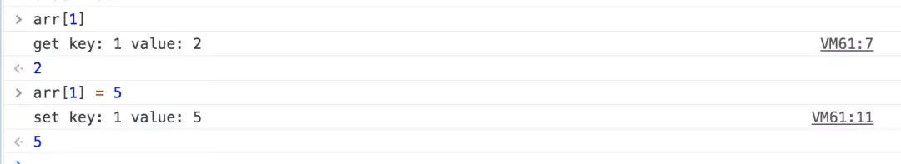
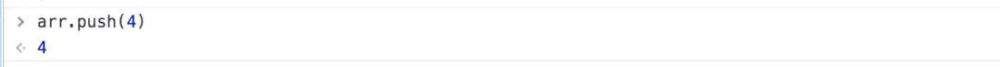
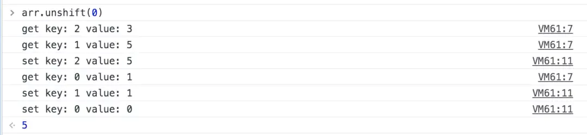
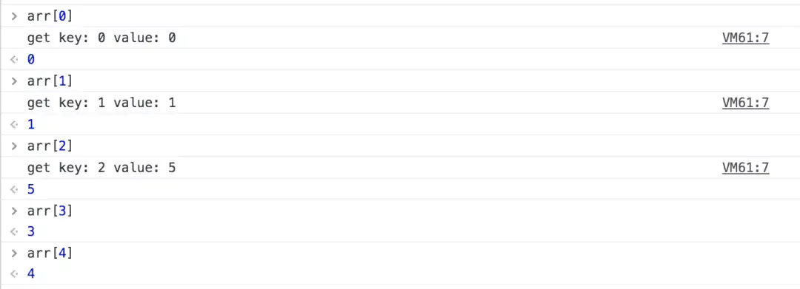
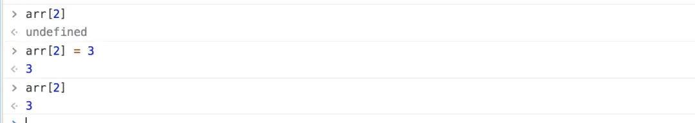
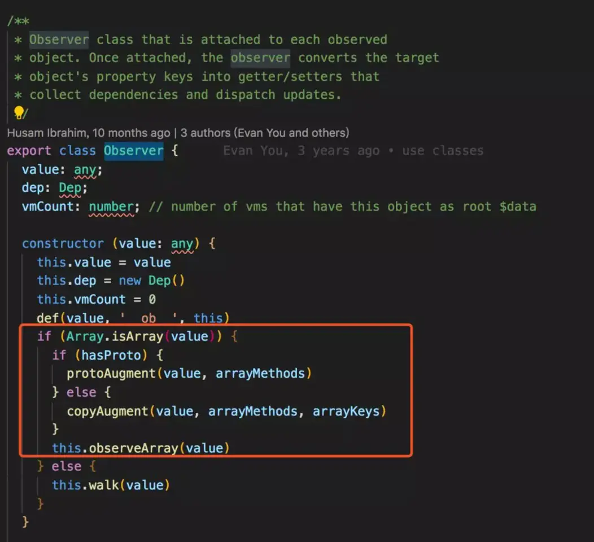
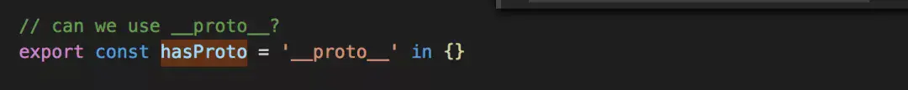
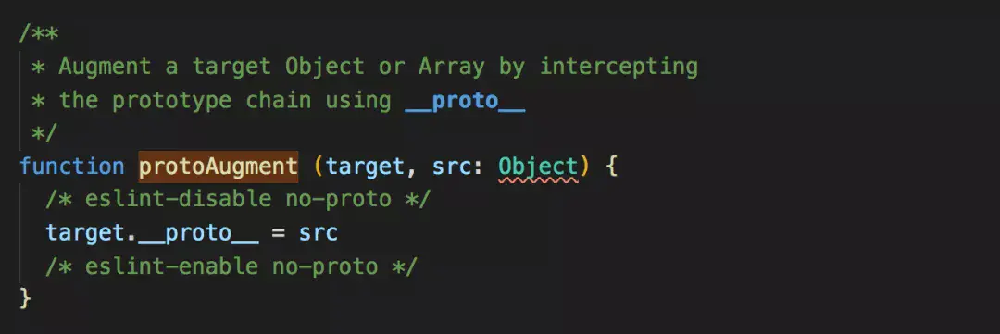

<!--
 * @Author: your name
 * @Date: 2021-06-10 11:16:37
 * @LastEditTime: 2021-06-11 17:56:15
 * @LastEditors: Please set LastEditors
 * @Description: In User Settings Edit
 * @FilePath: /my-docs/docs/462965322.md
-->

## 目的

`vue3.0` 中，响应式数据部分弃用了 `Object.defineProperty`，使用 `Proxy` 来代替它。本文将主要通过以下方面来分析为什么 `vue` 选择弃用 `Object.defineProperty`。

1. `Object.defineProperty` 真的无法监测数组下标的变化吗？

2. 分析 `vue2.x` 中对数组 `Observe` 部分源码

3. 对比 `Object.defineProperty` 和 `Proxy`

## 无法监控到数组下标的变化？

在一些技术博客上看到过这样一种说法，认为 `Object.defineProperty` 有一个缺陷是无法监听数组变化：

> 无法监控到数组下标的变化，导致直接通过数组的下标给数组设置值，不能实时响应。所以 `vue` 才设置了 `7` 个变异数组（`push`、`pop`、`shift`、`unshift`、`splice`、`sort`、`reverse`）的 `hack` 方法来解决问题。

> `Object.defineProperty` 的第一个缺陷,无法监听数组变化。 然而 `Vue` 的文档提到了 `Vue` 是可以检测到数组变化的，但是只有变种方法, `vm.items[indexOfItem] = newValue` 这种是无法检测的。

这种说法是有问题的，事实上，`Object.defineProperty` 本身是可以监控到数组下标的变化的，只是在 `Vue` 的实现中，从性能/体验的性价比考虑，放弃了这个特性。

下面我们通过一个例子来为 `Object.defineProperty` 正名：

```js
function defineReactive(data, key, value) {
  Object.defineProperty(data, key, {
    enumerable: true,
    configurable: true,
    get: function defineGet() {
      console.log(`get key: ${key} value: ${value}`);
      return value;
    },
    set: function defineSet(newVal) {
      console.log(`set key: ${key} value: ${newVal}`);
      value = newVal;
    },
  });
}

function observe(data) {
  Object.keys(data).forEach(function (key) {
    defineReactive(data, key, data[key]);
  });
}

let arr = [1, 2, 3];
observe(arr);
```

上面代码对数组 `arr` 的每个属性通过 `Object.defineProperty` 进行劫持，下面我们对数组 `arr` 进行操作，看看哪些行为会触发数组的 `getter` 和 `setter` 方法。

### 获取、设置值



可以看到，通过下标获取某个元素会触发 `getter` 方法, 设置某个值会触发 `setter` 方法。

### push



`push` 并未触发 `setter` 和 `getter` 方法，数组的下标可以看做是对象中的 `key` ，这里 `push` 之后相当于增加了下索引为 3 的元素，但是并未对新的下标进行 `observe` ，所以不会触发。

### unshift



`unshift` 操作会导致原来索引为 0，1，2，3 的值发生变化，这就需要将原来索引为 0，1，2，3 的值取出来，然后重新赋值，所以取值的过程触发了 `getter` ，赋值时触发了 `setter` 。

下面我们尝试通过索引获取一下对应的元素：



只有索引为 0，1，2 的属性才会触发 `getter` 。

<div class="Alert Alert--point">

这里我们可以对比对象来看，`arr` 数组初始值为[1, 2, 3]，即只对索引为 0，1，2 执行了 `observe` 方法，所以无论后来数组的长度发生怎样的变化，依然只有索引为 0，1，2 的元素发生变化才会触发，其他的新增索引，就相当于对象中新增的属性，需要再手动 `observe` 才可以。

</div>

### pop


当移除的元素为引用为 2 的元素时，会触发 `getter` 。



删除了索引为 2 的元素后，再去修改或获取它的值时，不会再触发 `setter` 和 `getter` 。

这和对象的处理是同样的，数组的索引被删除后，就相当于对象的属性被删除一样，不会再去触发 `observe`。

### 结论

`Object.defineProperty` 在数组中的表现和在对象中的表现是一致的，数组的索引就可以看做是对象中的 `key`。

- 通过索引访问或设置对应元素的值时，可以触发 `getter` 和 `setter` 方法

- 通过 `push` 或 `unshift` 会增加索引，对于新增加的属性，需要再手动初始化才能被 `observe`。

- 通过 `pop` 或 `shift` 删除元素，会删除并更新索引，也会触发 `setter` 和 `getter` 方法。

**所以，`Object.defineProperty` 是有监控数组下标变化的能力的，只是 `vue2.x` 放弃了这个特性。**

## Vue 对数组的 observe 做了什么

`vue` 的 `Observer` 类定义在 `core/observer/index.js` 中。



可以看到，`vue` 的 `Observer` 对数组做了单独的处理。



`hasProto` 是判断数组的实例是否有 `proto` 属性，如果有 `proto` 属性就会执行 `protoAugment` 方法，将 `arrayMethods` 重写到原型上。 `hasProto` 定义如下。



`arrayMethods` 是对数组的方法进行重写，定义在 `core/observer/array.js` 中, 下面是这部分源码的分析。

```js
/*
 * not type checking this file because flow doesn't play well with
 * dynamically accessing methods on Array prototype
 */

import { def } from "../util/index";

// 复制数组构造函数的原型，Array.prototype也是一个数组。
const arrayProto = Array.prototype;
// 创建对象，对象的__proto__指向arrayProto，所以arrayMethods的__proto__包含数组的所有方法。
export const arrayMethods = Object.create(arrayProto);

// 下面的数组是要进行重写的方法
const methodsToPatch = [
  "push",
  "pop",
  "shift",
  "unshift",
  "splice",
  "sort",
  "reverse",
];

/**
 * Intercept mutating methods and emit events
 */
// 遍历methodsToPatch数组，对其中的方法进行重写
methodsToPatch.forEach(function (method) {
  // cache original method
  const original = arrayProto[method];
  // def方法定义在lang.js文件中，是通过object.defineProperty对属性进行重新定义。
  // 即在arrayMethods中找到我们要重写的方法，对其进行重新定义
  def(arrayMethods, method, function mutator(...args) {
    const result = original.apply(this, args);
    const ob = this.__ob__;
    let inserted;
    switch (method) {
      // 上面已经分析过，对于push，unshift会新增索引，所以需要手动observe
      case "push":
      case "unshift":
        inserted = args;
        break;
      // splice方法，如果传入了第三个参数，也会有新增索引，所以也需要手动observe
      case "splice":
        inserted = args.slice(2);
        break;
    }
    // push，unshift，splice三个方法触发后，在这里手动observe，其他方法的变更会在当前的索引上进行更新，所以不需要再执行ob.observeArray
    if (inserted) ob.observeArray(inserted);
    // notify change
    ob.dep.notify();
    return result;
  });
});
```

## Object.defineProperty VS Proxy

### Object.defineProperty 只能劫持对象的属性，而 Proxy 是直接代理对象。

由于 `Object.defineProperty` 只能对属性进行劫持，需要遍历对象的每个属性。而 `Proxy` 可以直接代理对象。

### Object.defineProperty 对新增属性需要手动进行 Observe。

由于 `Object.defineProperty` 劫持的是对象的属性，所以新增属性时，需要重新遍历对象，对其新增属性再使用 `Object.defineProperty` 进行劫持。

<div class="Alert">

也正是因为这个原因，使用 `vue` 给 `data` 中的数组或对象新增属性时，需要使用 `vm.$set` 才能保证新增的属性也是响应式的。

</div>

下面看一下 `vue` 的 `set` 方法是如何实现的，`set` 方法定义在 `core/observer/index.js` ，下面是核心代码。

```js
/**
 * Set a property on an object. Adds the new property and
 * triggers change notification if the property doesn't
 * already exist.
 */
export function set(target: Array<any> | Object, key: any, val: any): any {
  // 如果target是数组，且key是有效的数组索引，会调用数组的splice方法，
  // 我们上面说过，数组的splice方法会被重写，重写的方法中会手动Observe
  // 所以vue的set方法，对于数组，就是直接调用重写splice方法
  if (Array.isArray(target) && isValidArrayIndex(key)) {
    target.length = Math.max(target.length, key);
    target.splice(key, 1, val);
    return val;
  }
  // 对于对象，如果key本来就是对象中的属性，直接修改值就可以触发更新
  if (key in target && !(key in Object.prototype)) {
    target[key] = val;
    return val;
  }
  // vue的响应式对象中都会添加了__ob__属性，所以可以根据是否有__ob__属性判断是否为响应式对象
  const ob = (target: any).__ob__;
  // 如果不是响应式对象，直接赋值
  if (!ob) {
    target[key] = val;
    return val;
  }
  // 调用defineReactive给数据添加了 getter 和 setter，
  // 所以vue的set方法，对于响应式的对象，就会调用defineReactive重新定义响应式对象，defineReactive 函数
  defineReactive(ob.value, key, val);
  ob.dep.notify();
  return val;
}
```

在 `set` 方法中，对 `target` 是数组和对象做了分别的处理，`target` 是数组时，会调用重写过的 `splice` 方法进行手动 `Observe` 。

对于对象，如果 `key` 本来就是对象的属性，则直接修改值触发更新，否则调用 `defineReactive` 方法重新定义响应式对象。

如果采用 `proxy` 实现，`Proxy` 通过 `set(target, propKey, value, receiver)` 拦截对象属性的设置，是可以拦截到对象的新增属性的。

不止如此，`Proxy` 对数组的方法也可以监测到，不需要像上面 `vue2.x` 源码中那样进行 `hack`。

关于 [proxy 的拦截方法](https://developer.mozilla.org/zh-CN/docs/Web/JavaScript/Reference/Global_Objects/Proxy)

## 总结

1. `Object.defineProperty` 对数组和对象的表现一致，并非不能监控数组下标的变化，`vue2.x` 中无法通过数组索引来实现响应式数据的自动更新是 `vue` 本身的设计导致的，不是 `defineProperty` 的锅

   - `vue` 支持监听数组/对象变化的场景

     - 通过赋值的形式改变正在被监听的数组；

     - 通过 `splice(index,num,val)`、`push`、`unshift` 形式改变正在被监听的数组；

     - 通过直接赋值的场景，`watchObj = {name:"hello world"}`

   - `vue` 不支持监听数组/对象变化的场景

     - 通过数组索引改变数组元素的值

     - 改变数组的长度

     - 对象的增加、删除、修改无法被 `vue` 监听到

   - `vue` 解决无法监听数组/对象变化的方法

     - `this.$set(arr, index, newVal)`;

     - 通过 `splice（index，num，val）`

     - 使用 `this.$set(object, key, value)`（`vue` 无法监听 `this.set` 修改原有属性）

     - 使用 `Object.assign()`，直接赋值的原理

2. `Object.defineProperty` 和 `Proxy` 本质差别是，`defineProperty` 只能对属性进行劫持，新增属性需要手动 `Observe` 的问题。

3. `Proxy` 作为新标准，浏览器厂商势必会对其进行持续优化，但它的 **兼容性是硬伤**，并且目前还没有完整的 `polyfill` 方案。
