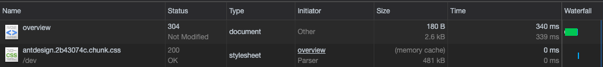
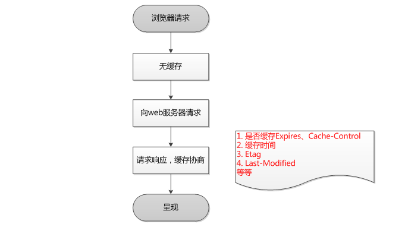
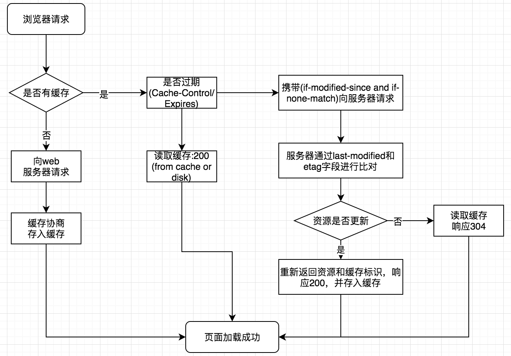

<!--
 * @Author: your name
 * @Date: 2021-04-26 18:37:24
 * @LastEditTime: 2021-04-27 15:01:31
 * @LastEditors: Please set LastEditors
 * @Description: In User Settings Edit
 * @FilePath: /my-docs/docs/6047613.md
-->

**在浏览器众多缓存中的 `HTTP` 缓存可能很多人对这个的概念并没有很清晰，每个人都知道进入一次网页之后再刷新一次页面，加载速度会比首次加载快非常多，每个人都知道这是浏览器缓存的magic，但是对此背后的原因可能不甚了解**

## HTTP缓存



- `304` 属于 **弱缓存**（协商缓存） **发送请求** 到服务器 询问是否有效

- `200` 属于 **强缓存**（本地缓存） **不发送请求**

## 第一次缓存流程



浏览器 **第一次** 请求资源时，**必须下载** 所有的资源，然后根据响应的 **header** 内容来决定，如何缓存资源。可能采用的是强缓存，也可能是弱缓存。

## 后续请求缓存匹配流程



由上图可以知道当浏览器请求一个静态资源时的 `HTTP` 流程：

1. **强缓存阶段**：先在 **本地查找该资源**，如果发现该资源，并且其他限制也没有问题(比如:缓存有效时间)，就命中强缓存，返回 `200` ，直接使用 **强缓存**，并且 **不会发送请求** 到服务器。

2. **弱缓存阶段**：在 **本地缓存中找到该资源**，**发送一个http请求** 到服务器，服务器判断这个 **资源没有被改动过**，则返回 `304` ，让浏览器使用该资源。

3. **缓存失败阶段**(重新请求)：当服务器发现该资源 **被修改过**，或者在本地 **没有找到该缓存** 资源，服务器则返回该资源的数据。

## 强缓存与弱缓存的区别

 - **获取资源形式**： 都是从缓存中获取资源的。

 - **状态码**： 强缓存返回 `200` ,弱缓存返回 `304` 状态码。

 - **请求(最大区别)**:  
    - 强缓存不发送请求，直接从缓存中取。
    
    - 弱缓存需要发送一个请求，验证这个文件是否可以使用（有没有被改动过）。


## 强缓存

**强缓存**是利用 `Expires` 或者 `Cache-Control` ，让原始服务器为文件设置一个 **过期时间**，在多长时间内可以将这些内容视为最新的。

若时间未过期，则命中强缓存，使用缓存文件不发送请求。

### Expires

`http1.0` 时代的缓存机制，指定缓存到期 `GMT` 的 **绝对时间**，如果设了 `max-age`，`max-age` 就会覆盖 `expires`，如果 `expires` 到期需要重新请求。

```text
Expires:Sat, 09 Jun 2018 08:13:56 GMT
```

> 有一个问题是由于使用具体时间，如果时间表示出错或者没有转换到正确的时区都可能造成缓存生命周期出错。

### Cache-Control

`Cache-Control` 是 `http1.1` 中为了弥补 `Expires` 的缺陷而加入的，当 `Expires` 和 `Cache-Control` 同时存在时，`Cache-Control` 优先级高于 `Expires`。

```text
可缓存性：
**public**： 服务器端和浏览器端都能缓存
**private**: 只能浏览器端缓存
**no-cache**: 强制浏览器在使用cache拷贝之前先提交一个http请求到源服务器进行确认。http请求没有减少，会减少一个响应体(文件内容),这种个选项类似弱缓存。
**only-if-cached**: 表明客户端只接受已缓存的响应，并且不要向原始服务器检查是否有更新的拷贝。

到期设置：
**max-age=60**：设置缓存存储的最大周期，超过这个时间缓存被认为过期(单位秒)。 这里是60秒

其他设置：
no-store: 不缓存
must-revalidate: 缓存必须在使用之前验证旧资源的状态，并且不可使用过期资源。
```

### 强缓存命中 from memory cache & from disk cache

**命中强缓存** 时，有两种状态，`200 (from memory cache) cache` & `200 (from disk cache)`。

`memory cache`: 将资源存到 **内存** 中，从内存中获取。

`disk cache`：将资源缓存到 **磁盘** 中，从磁盘中获取。

二者最大的区别在于：当 **退出进程** 时，内存中的数据会被 **清空** ，而磁盘的数据不会。

## 弱缓存

如果强缓存时间过期，或者没有设置，导致未命中的话。就进入到了弱缓存的阶段了。

### Last-Modified & if-modified-since

`Last-Modified` 与 `If-Modified-Since` 是一对报文头，属于 `http 1.0` 。

`last-modified` 是web服务器认为文件的 **最后修改时间**，`last-modified` 是 **第一次请求** 文件的时候，服务器返回的一个属性。

```text
Last-Modified: Sat, 09 Jun 2018 08:13:56 GMT 
```

第二次请求这个文件时，浏览器把 `If-Modified-Since` 发送给服务器，询问该时间之后文件是否被修改过。

```text
If-Modified-Since: Sat, 09 Jun 2018 08:13:56 GMT // 跟Last-Modified的值一样
```

### ETag & If-None-Match

`ETag` 与 `If-None-Match` 是一对报文，属于 `http 1.1`。

`ETag` 是一个文件的 **唯一标志符**。就像一个哈希或者指纹，每个文件都有一个单独的标志，只要这个文件发生了改变，这个标志就会发生变化。

`ETag` 机制类似于乐观锁机制，如果请求报文的 `ETag` 与 **服务器不一致** ，则表示该资源已经被修改过来，需要发最新的内容给浏览器。

`ETag` 也是首次请求的时候，服务器返回的:

```text
ETag: "8F759D4F67D66A7244638AD249675BE2" // 长这样
```

`If-None-Match` 也是浏览器发送到服务器验证，文件是否改变的:

```text
If-None-Match: "8F759D4F67D66A7244638AD249675BE2" // 跟ETag的值一样
```

### Etag/lastModified验证过程

1. 客户端第一次向服务器发起请求，服务器将附加 `Last-Modified/ETag` 到所提供的资源上去。

2. 当再一次请求资源，如果没有命中强缓存，在执行在验证时，将上次请求时服务器返回的 `Last-Modified/ETag` 一起传递给服务器。

3. 服务器检查该 `Last-Modified` 或 `ETag` ，并判断出该资源页面自上次客户端请求之后还未被修改，返回响应 `304` 和一个**空的响应体**。

**同时使用两个报文头**

同时使用这两个报文头，两个 **都匹配才会命中弱缓存**，否则将 **重新请求资源**。

### Etag 主要为了解决 Last-Modified 无法解决的一些问题

1. 一些文件也许内容并不改变(仅仅改变的修改时间)，这个时候我们不希望文件重新加载。（`Etag` 值会触发缓存，`Last-Modified` 不会触发）

2. `If-Modified-Since` 能检查到的粒度是秒级的，当修改非常频繁时，`Last-Modified` 会触发缓存，而 `Etag` 的值不会触发，重新加载。

3. 某些服务器不能精确的得到文件的最后修改时间。

## 用户操作行为与缓存

| 用户操作 | Expires/Cache-Control | Last-Modified/ETag |
|    --    |  -----             |    ------           |
|    地址栏回车    |  有效             |    有效           |
|    页面链接跳转    |  有效             |    有效           |
|    新开窗口    |  有效             |    有效           |
|    前进后退    |  有效             |    有效           |
|    F5刷新    |  无效             |    有效           |
|    硬件重新刷新    |  无效             |    无效           |
