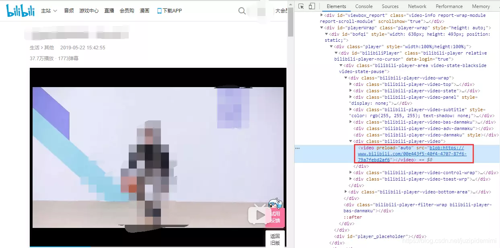
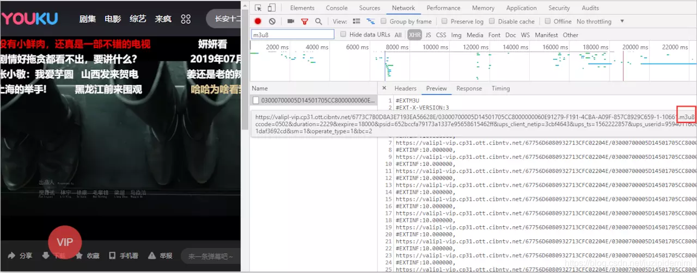
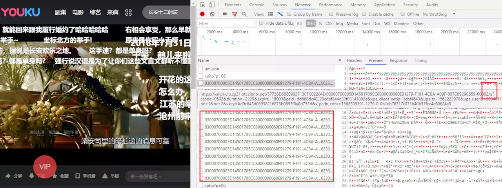
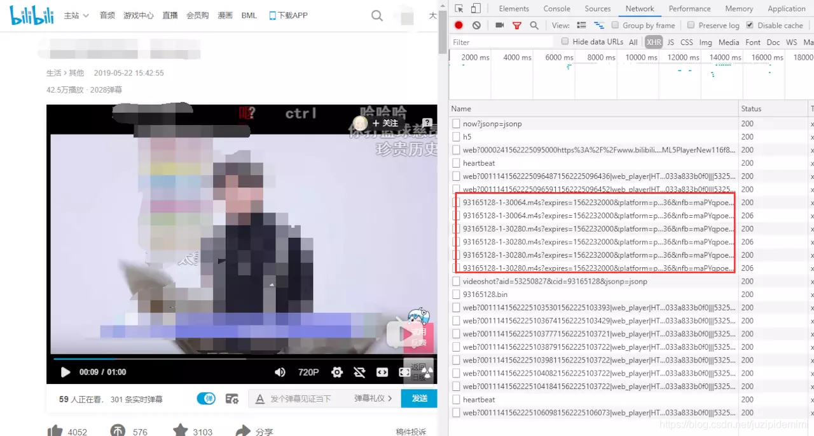

<!--
 * @Author: your name
 * @Date: 2021-07-02 17:14:05
 * @LastEditTime: 2021-07-02 18:13:26
 * @LastEditors: Please set LastEditors
 * @Description: In User Settings Edit
 * @FilePath: /my-docs/docs/632865845.md
-->

**最近几年如果观察过各大网站的视频播放地址（`src`），会发现变成了下面的形式：**



## Blob 和 ArrayBuffer

最早是数据库直接用 `Blob` 来存储 **二进制数据对象**，这样就不用关注存储数据的格式了。在 `web` 领域，`Blob` 对象表示一个 **只读原始数据** 的 **类文件对象**，虽然是二进制原始数据但是类似文件的对象，因此可以像操作文件对象一样操作 `Blob` 对象。

`ArrayBuffer` 对象用来表示通用的、固定长度的 **原始二进制数据缓冲区**。

我们可以通过 `new ArrayBuffer(length)` 来获得一片连续的内存空间，它不能直接读写，但可根据需要将其传递到 `TypedArray` 视图或 `DataView` 对象来解释原始缓冲区。

实际上视图只是给你提供了一个某种类型的读写接口，让你可以操作 `ArrayBuffer` 里的数据。`TypedArray` 需指定一个数组类型来保证数组成员都是同一个数据类型，而 `DataView` 数组成员可以是不同的数据类型。

`TypedArray` 视图的类型数组对象有以下几个:

- `Int8Array`：**8 位有符号整数，长度 1 个字节**。

- `Uint8Array`：**8 位无符号整数，长度 1 个字节**。

- `Uint8ClampedArray`：**8 位无符号整数，长度 1 个字节，溢出处理不同**。

- `Int16Array`：**16 位有符号整数，长度 2 个字节**。

- `Uint16Array`：**16 位无符号整数，长度 2 个字节**。

- `Int32Array`：**32 位有符号整数，长度 4 个字节**。

- `Uint32Array`：**32 位无符号整数，长度 4 个字节**。

- `Float32Array`：**32 位浮点数，长度 4 个字节**。

- `Float64Array`：**64 位浮点数，长度 8 个字节**。

<div class="Alert">

`Blob` 与 `ArrayBuffer` 的区别是，除了原始字节以外它还提供了 `mime type` 作为元数据，`Blob` 和 `ArrayBuffer` 之间可以进行转换。

</div>

> `File` 对象其实继承自 `Blob` 对象，并提供了提供了 `name`， `lastModifiedDate`， `size` ，`type`等基础元数据。

创建 `Blob` 对象并转换成 `ArrayBuffer`：

```js
//创建一个以二进制数据存储的html文件
const text = "<div>hello world</div>";
const blob = new Blob([text], { type: "text/html" }); // Blob {size: 22, type: "text/html"}
//以文本读取
const textReader = new FileReader();
textReader.readAsText(blob);
textReader.onload = function () {
  console.log(textReader.result); // <div>hello world</div>
};
//以ArrayBuffer形式读取
const bufReader = new FileReader();
bufReader.readAsArrayBuffer(blob);
bufReader.onload = function () {
  console.log(new Uint8Array(bufReader.result)); // Uint8Array(22) [60, 100, 105, 118, 62, 104, 101, 108, 108, 111, 32, 119, 111, 114, 108, 100, 60, 47, 100, 105, 118, 62]
};
```

创建一个相同数据的 `ArrayBuffer`，并转换成 `Blob`：

```js
//我们直接创建一个Uint8Array并填入上面的数据
const u8Buf = new Uint8Array([
  60,
  100,
  105,
  118,
  62,
  104,
  101,
  108,
  108,
  111,
  32,
  119,
  111,
  114,
  108,
  100,
  60,
  47,
  100,
  105,
  118,
  62,
]);
const u8Blob = new Blob([u8Buf], { type: "text/html" }); // Blob {size: 22, type: "text/html"}
const textReader = new FileReader();

textReader.readAsText(u8Blob);
textReader.onload = function () {
  console.log(textReader.result); // 同样得到div>hello world</div>
};
```

### 参考

[阮一峰 js 标准参考教程二进制数组](http://javascript.ruanyifeng.com/stdlib/arraybuffer.html)
[MDN ArrayBuffer](https://developer.mozilla.org/zh-CN/docs/Web/JavaScript/Reference/Global_Objects/ArrayBuffer)

## URL.createObjectURL

`video` 标签，`audio` 标签还是 `img` 标签的 `src` 属性，不管是相对路径，绝对路径，或者一个网络地址，归根结底都是指向一个文件资源的地址。

既然我们知道了 `Blob` 其实是一个可以当作文件用的二进制数据，那么只要我们可以生成一个指向 `Blob` 的地址，是不是就可以用在这些标签的 `src` 属性上，答案肯定是可以的，这里我们要用到的就是 `URL.createObjectURL()`。

```js
const objectURL = URL.createObjectURL(object); //blob:http://localhost:1234/abcedfgh-1234-1234-1234-abcdefghijkl
```

这里的 `object` 参数是用于创建 `URL` 的 **`File` 对象**、 **`Blob` 对象** 或者 **`MediaSource` 对象**，生成的链接就是以 `blob:` 开头的一段地址，表示指向的是一个二进制数据。

其中 `localhost:1234` 是当前网页的主机名称和端口号，也就是 `location.host`，而且这个 `Blob URL` 是可以直接访问的。

需要注意的是，即使是同样的二进制数据，每调用一次 `URL.createObjectURL` 方法，就会得到一个不一样的 `Blob URL`。这个 `URL` 的存在时间，等同于网页的存在时间，一旦网页刷新或卸载，这个 `Blob URL` 就失效。

通过 `URL.revokeObjectURL(objectURL)` 释放一个之前已经存在的、通过调用 `URL.createObjectURL()` 创建的 `URL` 对象。当你结束使用某个 `URL` 对象之后，应该通过调用这个方法来让浏览器知道不用在内存中继续保留对这个文件的引用了，允许平台在合适的时机进行垃圾收集。

> 如果是以文件协议打开的 `html` 文件（即 `url`为 `file://` 开头），则地址中 http://localhost:1234 会变成 `null`，而且此时这个 `Blob URL` 是无法直接访问的。

### 实战一：上传图片预览

```html
<!-- 伪代码 -->
<input id="upload" type="file" />

```

```js
const upload = document.querySelector("#upload");
const preview = document.querySelector("#preview");

upload.onchange = function () {
  const file = upload.files[0]; //File对象
  const src = URL.createObjectURL(file);
  preview.src = src;
};
```

这样一个图片上传预览就实现了，同样这个方法也适用于上传视频的预览。

### 实战二：以 Blob URL 加载网络视频

现在我们有一个网络视频的地址，怎么能将这个视频地址变成 `Blob URL` 是形式呢，思路肯定是先要拿到存储这个视频原始数据的 `Blob` 对象，但是不同于 `input` 上传可以直接拿到 `File` 对象，我们只有一个网络地址。

我们知道平时请求接口我们可以使用 `xhr`（`jquery` 里的 `ajax` 和 `axios` 就是封装的这个）或 `fetch`，请求一个服务端地址可以返回我们相应的数据，那如果我们用 `xhr` 或者 `fetch` 去请求一个图片或视频地址会返回什么呢？

当然是返回图片和视频的数据，只不过要设置正确 `responseType` 才能拿到我们想要的格式数据。

```js
function ajax(url, cb) {
  const xhr = new XMLHttpRequest();
  xhr.open("get", url);
  xhr.responseType = "blob"; // ""|"text"-字符串 "blob"-Blob对象 "arraybuffer"-ArrayBuffer对象
  xhr.onload = function () {
    cb(xhr.response);
  };
  xhr.send();
}
```

<div class="Alert">

注意 `XMLHttpRequest` 和 `Fetch API` 请求会有跨域问题，可以通过跨域资源共享(`CORS`)解决。

</div>

看到 `responseType` 可以设置 `blob` 和 `arraybuffer` 我们应该就有谱了，请求返回一个 `Blob` 对象，或者返回 `ArrayBuffer` 对象转换成 `Blob` 对象，然后通过 `createObjectURL` 生成地址赋值给视频的 `src` 属性就可以了,这里我们直接请求一个 `Blob` 对象。

```js
ajax("video.mp4", function (res) {
  const src = URL.createObjectURL(res);
  video.src = src;
});
```

用调试工具查看视频标签的 `src` 属性已经变成一个 `Blob URL`，表面上看起来是不是和各大视频网站形式一致了，但是考虑一个问题，这种形式要等到请求完全部视频数据才能播放，小视频还好说，要是视频资源大一点岂不爆炸，显然各大视频网站不可能这么干。

解决这个问题的方法就是 **流媒体**，其带给我们最直观体验就是使媒体文件可以 **边下边播**，`web` 端如果要使用流媒体，有多个流媒体协议可以供我们选择。

## HLS 和 MPEG DASH

`HLS` （`HTTP Live Streaming`）, 是由 `Apple` 公司实现的基于 `HTTP` 的 **媒体流传输协议**。

`HLS` 以 `ts` 为传输格式，`m3u8` 为索引文件（文件中包含了所要用到的 `ts` **文件名称**，**时长** 等信息，可以用播放器播放，也可以用 `vscode` 之类的编辑器打开查看），在移动端大部分浏览器都支持，也就是说你可以用 `video` 标签直接加载一个 `m3u8` 文件播放视频或者直播，但是在 `pc` 端，除了苹果的 `Safari`，需要引入库来支持。

用到此方案的视频网站比如优酷，可以在视频播放时通过调试查看 `Network` 里的 `xhr` 请求，会发现一个 `m3u8` 文件，和每隔一段时间请求几个 `ts` 文件。





但是除了 `HLS`，还有 **`Adobe`** 的 `HDS`，**微软** 的 `MSS`，方案一多就要有个标准点的东西，于是就有了 `MPEG DASH`。

<div class="Alert Alert--point">

`DASH` 是一种在互联网上传送动态码率的 `Video Streaming` 技术，类似于苹果的 `HLS`，`DASH` 会通过 `MPD` 将视频内容切片成一个很短的文件片段，每个切片都有多个不同的码率，`DASH Client` 可以根据网络的情况选择一个码率进行播放，支持在不同码率之间无缝切换。

</div>

`Youtube`，`B 站` 都是用的这个方案。

这个方案索引文件通常是 `mpd` 文件（类似 `HLS` 的 `m3u8` 文件功能），传输格式推荐的是 `fmp4`（`Fragmented MP4`）,文件扩展名通常为 `.m4s` 或直接用 `.mp4`。所以用调试查看 `b 站` 视频播放时的网络请求，会发现每隔一段时间有几个 `m4s` 文件请求。



不管是 `HLS` 还是 `DASH` 们，都有对应的库甚至是高级的播放器方便我们使用，但我们其实是想要学习一点实现。

其实抛开掉 **索引文件** 的解析拿到实 **际媒体文件的传输地址**，摆在我们面前的只有一个如何将多个视频数据 **合并** 让 `video` 标签可以 **无缝播放**。

[B 站 - 我们为什么使用 DASH](https://www.bilibili.com/read/cv855111/)

## MediaSource

`video` 标签 `src` 指向一个视频地址，视频播完了再将 `src` 修改为下一段的视频地址然后播放，这显然不符合我们无缝播放的要求。

其实有了我们前面 `Blob URL` 的学习，我们可能就会想到一个思路，用 `Blob URL` 指向一个 **视频二进制数据**，然后不断将下一段视频的二进制数据添加拼接进去。这样就可以在不影响播放的情况下，不断的更新视频内容并播放下去，想想是不是有点流的意思出来了。

要实现这个功能我们要通过 `MediaSource` 来实现，`MediaSource` 接口功能也很纯粹，作为一个 **媒体数据容器** 可以和 `HTMLMediaElement` 进行绑定。

基本流程就是通过 `URL.createObjectURL` 创建容器的 `BLob URL`，设置到 `video` 标签的 `src` 上，在播放过程中，我们仍然可以通过 `MediaSource.appendBuffer` 方法往容器里添加数据，达到更新视频内容的目的。

**代码实现**

```js
const video = document.querySelector("video");
//视频资源存放路径，假设下面有5个分段视频 video1.mp4 ~ video5.mp4，第一个段为初始化视频init.mp4
const assetURL = "http://www.demo.com";
//视频格式和编码信息，主要为判断浏览器是否支持视频格式，但如果信息和视频不符可能会报错
const mimeCodec = 'video/mp4; codecs="avc1.42E01E, mp4a.40.2"';
if ("MediaSource" in window && MediaSource.isTypeSupported(mimeCodec)) {
  const mediaSource = new MediaSource();
  video.src = URL.createObjectURL(mediaSource); //将video与MediaSource绑定，此处生成一个Blob URL
  mediaSource.addEventListener("sourceopen", sourceOpen); //可以理解为容器打开
} else {
  //浏览器不支持该视频格式
  console.error("Unsupported MIME type or codec: ", mimeCodec);
}

function sourceOpen() {
  const mediaSource = this;
  const sourceBuffer = mediaSource.addSourceBuffer(mimeCodec);
  let i = 1;
  function getNextVideo(url) {
    //ajax代码实现翻看上文，数据请求类型为arraybuffer
    ajax(url, function (buf) {
      //往容器中添加请求到的数据，不会影响当下的视频播放。
      sourceBuffer.appendBuffer(buf);
    });
  }
  //每次appendBuffer数据更新完之后就会触发
  sourceBuffer.addEventListener("updateend", function () {
    if (i === 1) {
      //第一个初始化视频加载完就开始播放
      video.play();
    }
    if (i < 6) {
      //一段视频加载完成后，请求下一段视频
      getNextVideo(`${assetURL}/video${i}.mp4`);
    }
    if (i === 6) {
      //全部视频片段加载完关闭容器
      mediaSource.endOfStream();
      URL.revokeObjectURL(video.src); //Blob URL已经使用并加载，不需要再次使用的话可以释放掉。
    }
    i++;
  });
  //加载初始视频
  getNextVideo(`${assetURL}/init.mp4`);
}
```

此时我们已经基本实现了一个简易的流媒体播放功能，如果愿意可以再加入 `m3u8` 或 `mpd` 文件的解析，设计一下 `UI` 界面，就可以实现一个流媒体播放器了。

<div class="Alert">

此处需要注意，很多人跑了 `MDN` 的 `MediaSource` 示例代码，可能会发现使用官方提供的视频是没问题的，但是用了自己的 `mp4` 视频就会报错，这是因为 `fmp4` 文件扩展名通常为 `.m4s` 或直接用 `.mp4`，但却是特殊的 `mp4` 文件。

</div>

## Fragmented MP4

通常我们使用的 `mp4` 文件是 **嵌套结构** 的，客户端必须要从头加载一个 `MP4` 文件，才能够完整播放，不能从中间一段开始播放。

而 `Fragmented MP4`（简称 fmp4），就如它的名字 `碎片 mp4`，是由一系列的片段组成，如果服务器支持 `byte-range` 请求，那么，这些片段可以独立的进行请求到客户端进行播放，而不需要加载整个文件。
