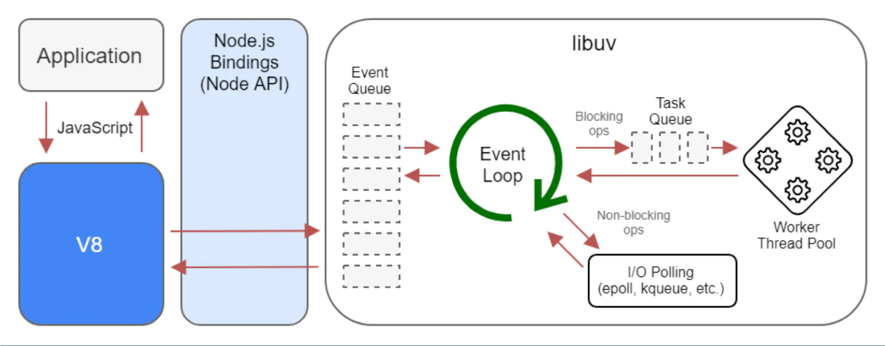
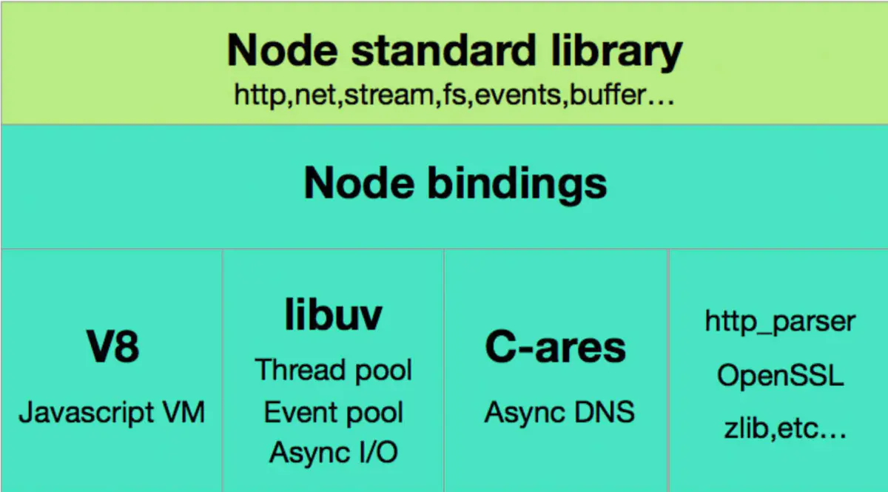
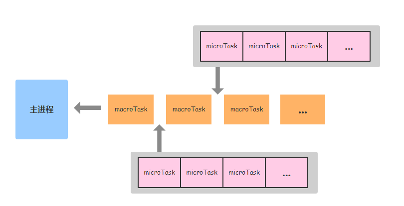

<!--
 * @Author: your name
 * @Date: 2021-06-09 10:42:49
 * @LastEditTime: 2021-06-10 10:56:00
 * @LastEditors: Please set LastEditors
 * @Description: In User Settings Edit
 * @FilePath: /my-docs/docs/6598658345.md
-->

<div class="Alert Alert--point">

本篇关于 `Event Loop` 的介绍，会先从简单的 `nodejs` 架构开始讲起，更利于我们理解 它的 `Event Loop`。

</div>

<!--  -->


## Nodejs 的三层架构

- 首先最上层是 `node api`，提供 `http` 模块、流模块、文件模块等等，可以使用 `js` 直接调用

- 中间层 `node bindings` 主要是使 `js` 和 `C/C++` 进行通信

- 最下面这一层是支撑 `nodejs` 运行的关键，主要由 `v8`、`libuv`、`c-ares` 等模块组成，向上一层提供 `api` 服务

### Node bindings

> `C/C++` 实现了一个用来解析 `http` 的库 `http-parser`，非常高效，可是对于只会写 `js` 的程序员非常的不友好，因为没有办法直接去调用这个 `C/C++` 的库，这两个语言连最基本的数据类型都不一样，还怎么做朋友
> 结论：`js` 无法直接调用 `C++` 的库，需要一个中间的桥梁（调用途径）

<div class="Alert">

那么 `bindings` 需要怎么实现呢？

`Node.js` 的作者 `Ryan` 做了一个中间层处理

`Node.js` 用 `C++` 对 `http-parse` 进行封装，使它符合某些要求（比如统一数据类型），封装好的文件叫做 `http_parse_binding.cpp`
用 `Node.js` 提供的编译工具将其编译为 `.node` 文件
`js` 代码可以直接通过 `require` 关键字引入这个 `.node` 文件

这样 `js` 就能够调用 `C++` 库，这个中间的桥梁就是 `bindings`，由于 `node` 提供了很多 `binding`，所以就叫做 `node bindings`

</div>

```js
// test.js
const addon = require("./build/Release/addon");

console.log("This should be eight:", addon.add(3, 5));
```

### V8

> 它是 `Google` 开发的 `js` 引擎，为 `js` 提供运行环境

那么 `v8` 的功能有哪些？

- 将 `JS` 源代码变成本地代码并执行

  **本地代码就是机器代码，就比如说 `0` 和 `1`，计算机看到这些代码直接就可以执行，不再需要借助其他的任何工具，非常的高效。`V8` 在运行之前将 `js` 编译成了机器代码**

- 维护调用栈，确保 `JS` 函数的执行顺序

  **`JS` 函数的执行顺序是由 `v8` 引擎决定的**

- 内存管理，为所有对象分配内存

  **那么 `v8` 如何做内存管理呢？比如说 `new` 一个对象，它的内存在哪里，也是引擎来决定的**

- 垃圾回收，重复利用无用的内存

  **因为内存是有限的，比如用了 `2k` 的内存，用完了还得还回来给下一个程序用，所以目的就是为了重复利用**

- 实现 `JS` 的标准库

  **实现数组的 `sort`，`splice` 等等 `api`，`v8` 来实现，`js` 来调用**

### libuv

> 背景：因为各个系统的 `I/O` 库都不一样，`windows` 系统有 `IOCP`，`Linux` 系统有 `epoll`。`Node.js` 的作者 `Ryan` 为了将其整合在一起实现一个跨平台的异步 `I/O` 库，开始写 `libuv`

读文件、写文件相关任务，`libuv` 都可以帮你管理。这样 `I/O` 的部分就全部交给 `c` 语言去做，`js` 完全不用管，只负责调用。

## Event Loop

先抛出一个问题，由 浏览器的 [Event Loop](./1969836432.md) 可以得出下面的结论：

```js
setTimeout(() => {
  console.log("timer1");

  Promise.resolve().then(function () {
    console.log("promise1");
  });
}, 0);

setTimeout(() => {
  console.log("timer2");

  Promise.resolve().then(function () {
    console.log("promise2");
  });
}, 0);

// timer1
// promise1
// timer2
// promise2
```

但在 `Node` 下执行，却是另一个结果：

```js
// timer1
// timer2
// promise1
// promise2
```

通过 `node` 不同结果，我们来了解一下，在 `node` 端的 `event loop` 有何不同：

### 循环顺序

根据 [Node.js](https://nodejs.org/en/docs/guides/event-loop-timers-and-nexttick/) 官方介绍，每次事件循环都包含了 `6` 个阶段，对应到 `libuv` 源码中的实现。


每一个 **阶段** 有一个 **队列** ，`event loop` 执行到该阶段时，会逐一调用该阶段的队列里的所有 `callback`，当队列 `callback` 为空时，或 `callback` **执行到上限** 的时，就跳至下一阶段进行执行。

<div class="Alert Alert--point">

对不同的事件分优先级

node.js 顺序的去轮询每一种事件

</div>

- **timers** 阶段：这个阶段执行 `timer`（`setTimeout`、`setInterval`）的回调

- **I/O callbacks** 阶段：其他 **没有归类** 的回调（比如说不属于其他阶段的回调，包括一些系统调用错误，网络通信的错误回调等等）

- **idle, prepare** 阶段：仅 `node` 内部使用

- **poll** 阶段：获取新的 `I/O` 事件, 适当的条件下 `node` 将阻塞在这里

- **check** 阶段：执行 `setImmediate()` 的回调

- **close callbacks** 阶段：执行 `socket` 的 `close` 事件回调

我们重点看 `timers`、`poll`、`check` 这 `3` 个阶段就好，因为日常开发中的绝大部分异步任务都是在这 `3` 个阶段处理的。

### timers 阶段

`timers` 是事件循环的第一个阶段，`Node` 会去检查有无已过期的 `timer`，如果有则把它的回调压入 `timer` 的 **任务队列中等待执行**。

事实上，`Node` 并不能保证 `timer` 在预设时间到了就会立即执行，因为 `Node` 对 `timer` 的过期检查不一定靠谱，它会受机器上其它运行程序影响，或者那个时间点主线程不空闲。

比如下面的代码，`setTimeout()` 和 `setImmediate()` 的执行顺序是不确定的

```js
setTimeout(() => {
  console.log("timeout");
}, 0);

setImmediate(() => {
  console.log("immediate");
});
```

<div class="Alert Alert--point">

但是把它们放到一个 `I/O` 回调里面，就一定是 `setImmediate()` 先执行，因为 `poll` 阶段后面就是 `check` 阶段。

</div>

### poll 阶段

`poll` 阶段主要有 `2` 个功能：

- 处理 `poll` 队列的事件

- 当有已超时的 `timer`，执行它的回调函数

`event loop` 将同步执行 `poll` 队列里的回调，直到 **队列为空** 或 **执行的回调达到系统上限**，接下来 `even loop` 会去检查有无预设的 `setImmediate()`，分两种情况：

1. 若有预设的 `setImmediate()`, `event loop` 将结束 `poll` 阶段进入 `check` 阶段，并执行 `check` 阶段的任务队列

2. 若没有预设的 `setImmediate()`，`event loop` 将阻塞在该阶段等待

<div class="Alert">

注意一个细节，没有 `setImmediate()` 会导致 `event loop` 阻塞在 `poll` 阶段，这样之前设置的 `timer` 岂不是执行不了了？所以，在 `poll` 阶段 `event loop` 会有一个检查机制，检查 `timer` 队列是否为空，如果 `timer` 队列非空，`event loop` 就开始下一轮事件循环，即重新进入到 `timer` 阶段。

</div>

### check 阶段

`setImmediate()` 的回调会被加入 `check` 队列中， 从 `event loop` 的阶段可以知道，`check` 阶段的执行顺序在 `poll` 阶段之后。

## Node 与浏览器的 Event Loop 差异

浏览器环境下，`microtask` 的任务队列是每个 `macrotask` 执行完之后执行



在 `Node` 中，`microtask` 会在事件循环的 **各个阶段之间执行**，也就是一个阶段执行完毕，就会去执行 `microtask` 队列的任务。


## process.nextTick

`process.nextTick()` 会在各个 **事件阶段之间** 执行，一旦执行，要直到 `nextTick` 队列被清空，才会进入到下一个事件阶段。

<div class="Alert">

来自官方文档有意思的一句话，从语义角度看，`setImmediate()` 应该比 `process.nextTick()` 先执行才对，而事实相反，命名是历史原因也很难再变。

</div>

举个栗子：

```js
const fs = require("fs");

fs.readFile("./index.json", () => {
  setTimeout(() => {
    console.log("fs =》timeout");
  });
  setImmediate(() => {
    console.log("fs =》setImmediate");
  });
});

setImmediate(function () {
  console.log("setImmediate延迟执行");
});

setTimeout(function () {
  console.log("setTimeout延迟执行");
});

process.nextTick(function () {
  console.log("nextTick延迟执行");
});

console.log("正常执行");

// 正常执行
// nextTick延迟执行
// setTimeout延迟执行
// setImmediate延迟执行     这一步的原因在于 fs.readFile 回调会在poll阶段执行， 下一个阶段是 check 所以 fs =》setImmediate 要 早于 fs =》timeout
// fs =》setImmediate
// fs =》timeout
```
