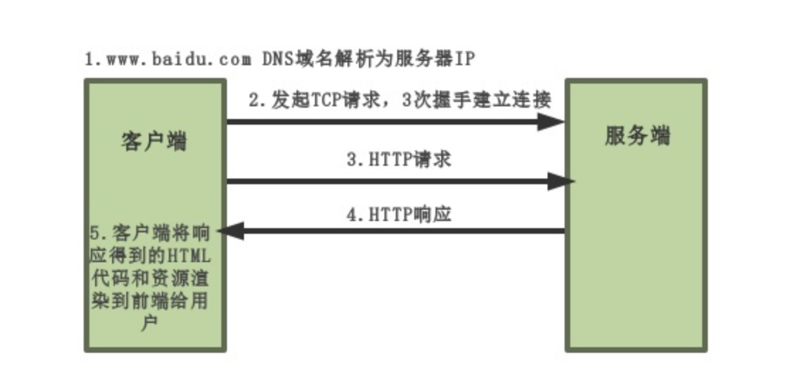

<!--
 * @Author: your name
 * @Date: 2021-04-19 17:20:13
 * @LastEditTime: 2021-04-21 16:41:43
 * @LastEditors: Please set LastEditors
 * @Description: In User Settings Edit
 * @FilePath: /my-docs/docs/http.https.md
-->

## 什么是协议

> 网络协议是计算机之间为了实现网络通信而达成的一种“约定”或者”规则“，有了这种”约定“，不同厂商的生产设备，以及不同操作系统组成的计算机之间，就可以实现通信。

## HTTP协议是什么？

`HTTP` 协议是超文本传输协议的缩写，英文是 **Hyper Text Transfer Protocol** 。它是从WEB服务器传输超文本标记语言(HTML)到本地浏览器的传送协议。  

设计 `HTTP` 最初的目的是为了提供一种发布和接收 **HTML页面** 的方法。

`HTPP` 有多个版本，目前广泛使用的是 **HTTP/1.1** 版本。

## HTTP原理

`HTTP` 是一个基于 **TCP/IP** 通信协议来传递数据的协议，传输的数据类型为 **HTML** , **文件** , **图片文件** , **查询结果** 等。  

`HTTP` 协议一般用于 `B/S` 架构。浏览器作为 **HTTP客户端** 通过 `URL` 向 **HTTP服务端** 即 **WEB服务器** 发送所有请求。

我们以访问百度为例：

## HTTP特点

1. `http` 协议支持 **客户端/服务端** 模式，也是一种 **请求/响应模式** 的协议。

2. 简单快速：客户向服务器请求服务时，只需传送 **请求方法** 和 **路径** 。请求方法常用的有 `GET、HEAD、POST` 。

3. 灵活：`HTTP` 允许传输 **任意类型** 的数据对象。传输的类型由 `Content-Type` 加以标记。

4. 无连接：限制每次连接只处理 **一个请求** 。服务器处理完请求，并收到客户的应答后，即断开连接，但是却不利于客户端与服务器保持会话连接，为了弥补这种不足，产生了两项记录 `http` 状态的技术，一个叫做 `Cookie` ,一个叫做 `Session` 。

5. 无状态：无状态是指 **协议对于事务处理没有记忆** ，后续处理需要前面的信息，则必须重传。

## URI和URL的区别

`HTTP` 使用统一 **资源标识符**（Uniform Resource Identifiers, URI）来传输数据和建立连接。

- URI：Uniform Resource Identifier 统一资源 **标识** 符
- URL：Uniform Resource Location 统一资源 **定位** 符

`URI` 是用来标示 **一个具体的资源** 的，我们可以通过 `URI` 知道一个资源是什么。

`URL` 则是用来 **定位具体的资源** 的，标示了一个具体的资源位置。互联网上的每个文件都有一个唯一的 `URL` 。

## HTTP报文组成

### 请求报文构成

1. **请求行** ：包括请求方法、URL、协议/版本

2. **请求头** (Request Header)

3. **请求正文**

### 响应报文构成

1. **状态行**
2. **响应头**
3. **响应正文**

## 常见请求方法

- `GET`: 请求指定的页面信息，并返回实体主体。

- `POST`: 向指定资源提交数据进行处理请求（例如提交表单或者上传文件）。数据被包含在请求体中。 `POST` 请求可能会导致新的 **资源的建立和/或已有资源的修改**。

- `HEAD`: 类似于get请求，只不过返回的响应中没有具体的内容，用于获取报头。

- `PUT`: 从客户端向服务器传送的数据取代指定的文档的内容。

- `DELETE`: 请求服务器删除指定的页面。

### post和get的区别

- 都包含请求头请求行， `POST` 多了请求 `body` 。

- `GET` 多用来查询，请求参数放在 `url` 中，不会对服务器上的内容产生作用。 `POST` 用来提交，如把账号密码放入 `body` 中。

- `GET` 是直接添加到 `URL` 后面的，直接就可以在 `URL` 中看到内容，而 `POST` 是放在报文内部的，用户无法直接看到。

- `GET` 提交的 **数据长度是有限制** 的，因为 `URL` 长度有限制，具体的长度限制视浏览器而定。而 `POST` 没有。

## 响应状态码

**访问一个网页时，浏览器会向web服务器发出请求。此网页所在的服务器会返回一个包含 `HTTP` 状态码的信息头 用以响应浏览器的请求。**

### 状态码分类：

- 1XX- 信息型，服务器收到请求，需要请求者继续操作。

- 2XX- 成功型，请求成功收到，理解并处理。

- 3XX - 重定向，需要进一步的操作以完成请求。

- 4XX - 客户端错误，请求包含语法错误或无法完成请求。

- 5XX - 服务器错误，服务器在处理请求的过程中发生了错误。

### 常见状态码:

- **200** OK - 客户端请求成功

- **301** - 资源（网页等）被永久转移到其它URL

- **302** - 临时跳转

- **400** `Bad Request` - 客户端请求有语法错误，不能被服务器所理解

- **401** `Unauthorized` - 请求未经授权，这个状态代码必须和 `WWW-Authenticate` 报头域一起使用

- **404** - 请求资源不存在，可能是输入了错误的 `URL`

- **500** - 服务器内部发生了不可预期的错误

- **503** `Server Unavailable` - 服务器当前不能处理客户端的请求，一段时间后可能恢复正常。

## 为什么要用https？

> 使用http协议传输隐私信息非常不安全

**一般http中存在如下问题**

- 请求信息明文传输，容易被窃听截取。

- 数据的完整性未校验，容易被篡改

- 没有验证对方身份，存在冒充危险

## 什么是HTTPS?

为了解决上述HTTP存在的问题，就用到了HTTPS。

> HTTPS 协议（HyperText Transfer Protocol over Secure Socket Layer）：一般理解为HTTP+SSL/TLS，通过 SSL证书来验证服务器的身份，并为浏览器和服务器之间的通信进行加密。

### 那么SSL又是什么？

> SSL（Secure Socket Layer，安全套接字层）：1994年为 Netscape 所研发，SSL 协议位于 TCP/IP 协议与各种应用层协议之间，为数据通讯提供安全支持。

> TLS（Transport Layer Security，传输层安全）：其前身是 SSL，它最初的几个版本（SSL 1.0、SSL 2.0、SSL 3.0）由网景公司开发，1999年从 3.1 开始被 IETF 标准化并改名，发展至今已经有 TLS 1.0、TLS 1.1、TLS 1.2 三个版本。SSL3.0和TLS1.0由于存在安全漏洞，已经很少被使用到。TLS 1.3 改动会比较大，目前还在草案阶段，目前使用最广泛的是TLS 1.1、TLS 1.2。

### SSL发展史（互联网加密通信）

1. 1994年NetSpace公司设计SSL协议（Secure Sockets Layout）1.0版本，但未发布。

2. 1995年NetSpace发布SSL/2.0版本，很快发现有严重漏洞

3. 1996年发布SSL/3.0版本，得到大规模应用

4. 1999年，发布了SSL升级版TLS/1.0版本，目前应用最广泛的版本

5. 2006年和2008年，发布了TLS/1.1版本和TLS/1.2版本

## 浏览器在使用HTTPS传输数据的流程是什么？

1. 首先客户端通过URL访问服务器建立 `SSL` 连接。

2. 服务端收到客户端请求后，会将网站支持的证书信息（**证书中包含公钥**）传送一份给客户端。

3. 客户端的服务器开始协商 `SSL` 连接的安全等级，也就是信息加密的等级。

4. 客户端的浏览器根据双方同意的安全等级，**建立会话密钥**，然后利用网站的 **公钥** 将 **会话密钥加密** ，并传送给网站。

5. 服务器利用自己的 **私钥** 解密出会话密钥。

6. 服务器利用会话密钥加密与客户端之间的通信。

## HTTPS的缺点

- `HTTPS` 协议多次握手，导致页面的加载时间延 **长近50%** ；

- `HTTPS` 连接 **缓存不如HTTP高效**，会增加 **数据开销和功耗** ；

- 申请 `SSL` 证书需要钱，功能越强大的证书 **费用越高** 。

- `SSL` 涉及到的 **安全算法** 会消耗 `CPU` 资源，对服务器资源消耗较大。

## 总结HTTPS和HTTP的区别

- `HTTPS` 是 `HTTP` 协议的 **安全版本** ， `HTTP` 协议的数据传输是明文的，是不安全的， `HTTPS` 使用了 `SSL/TLS` 协议进行了 **加密处理** 。

- `HTTP` 和 `HTTPS` 使用连接方式不同，默认端口也不一样， `HTTP` 是 **80** ， `HTTPS` 是 **443** 。