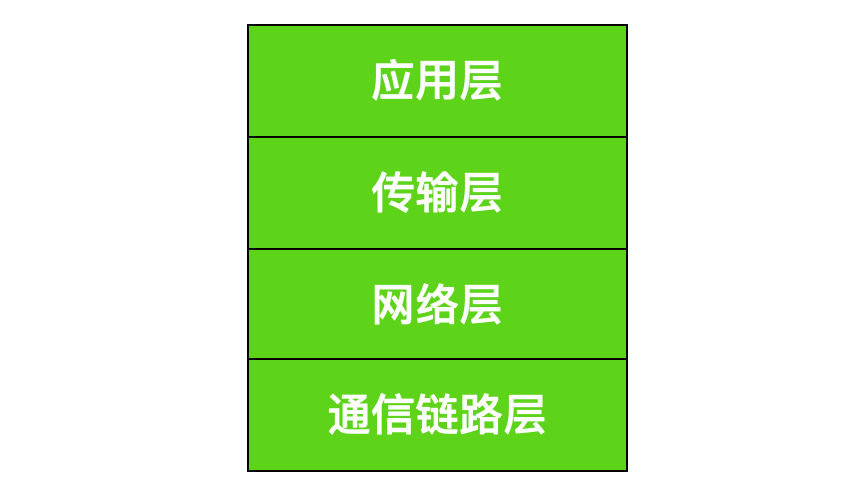
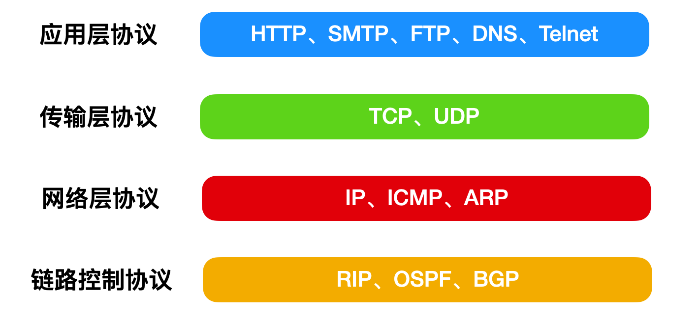
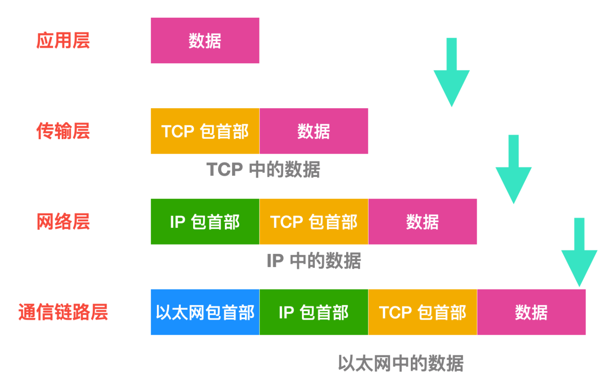
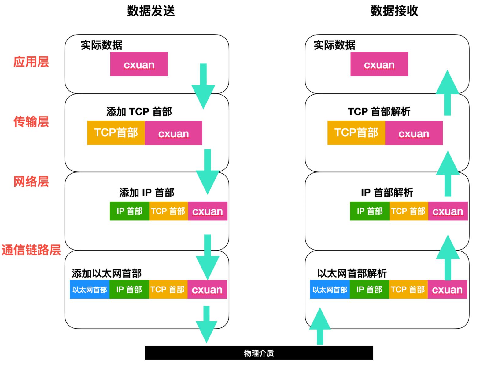

<!--
 * @Author: your name
 * @Date: 2021-04-19 18:34:13
 * @LastEditTime: 2021-04-22 15:28:12
 * @LastEditors: Please set LastEditors
 * @Description: In User Settings Edit
 * @FilePath: /my-docs/docs/tcp.md
-->

## TCP协议

> TCP(Transmission Control Protoco)协议属于计算机网络体系中的 **运输层**。

**运输层的任务是负责向主机中应用层进程之间的通信提供通用的 数据传输服务。所以可以通俗理解TCP协议就是进程间数据通讯传输协议。**

**根据不同应用，运输层主要使用TCP和UDP两种协议之一。**

## TCP协议特点

TCP协议本身是比较复杂的，它包含 **拥塞控制** 、 **可靠传输** 、 **流量控制** 、 **连接管理等功能** ，主要特点包含以下几个方面：

- **TCP是面向连接的协议**。程序在使用TCP协议通讯时，必须要先建立TCP连接。这就好比我要给你打电话，咱俩之间的通讯线路必须是连接状态的。

- **TCP连接是点对点的**。每一条TCP连接只能有两个端口（endpoint）。这个端点就是我们Java网络编程所使用的套接字（socket）。由IP地址+端口号组成（IP:端口号）。
- **TCP连接提供可靠交付**。使用TCP连接传输数据，保证无差错、不丢失、不重复并且按顺序到达

- **TCP连接是双向的通信**。通信的两方，既能发送数据，也能接收数据。就向我们通话时双方一样。

- **TCP面向字节流传输数据**。TCP传送数据时，是把进程交付的数据，按照一段段字节流序列传递的，每次传输其中一段字节序列。应用层接收字节序列后，再将内容还原。

## TCP报文格式

既然 `TCP` 协议属于 **运输层** 。运输层职责是为主机应用层提供进程间的数据传输，所以我们有必要搞清楚TCP协议运输数据时的形式。

`TCP` 协议规定了 `TCP` 传输数据的单元为 **TCP数据报** 。TCP数据报是对应用层进程交付数据的封装。

**TCP数据报** 由两部分组成：**TCP首部** 和 **TCP数据部分**

- **TCP首部**：包含许多控制和描述字段，是TCP全部功能的体现

- **TCP数据部分**：对于应用层进程交付的数据，封装后的字节流序列

应用层进程交付的数据被封装 **TCP报文** ，然后进行传输，TCP连接保证数据传输的可靠性，TCP报文传输的过程示意图：

## TCP报文首部

**TCP报文首部** 定义是 **TCP协议** 的精华所在，TCP复杂功能的实现，全部依靠了首部里各种 **控制字段** 。我们来看下TCP首部都定义了什么

TCP报文的首部由 **20个固定字节** 和 **4n(n取[0~5]整数)个可变的选项字节** 组成，其中固定部分的各字段含义如下：

- **源端口和目的端口**：各占2个字节，分别写入通信双方进程端口号

- **序号seq**：占4个字节。在TCP连接中，传送的字节流中的每一个字节都是要按顺序编号[0~232-1]，整个要传送的字节流的起始序号在必须连接建立时设置，序号字段值代表本报文段所发送的数据的第一个字节的序号

- **确认号ack**：占4个字节，是期望收到对方的下一个报文段的第一个数据字节的序号，即ack=N,就代表了到序号N-1为止的所有数据都被正确接收了。

- **数据偏移**：占4位，表示TCP报文的数据部分起始处距离TCP报文首部的起始处有多远，数据偏移值的单位是32位字（以4字节为计算单位），4位二进制能表示的值[0~15],这就意味着TCP首部最大长度为60字节，也就是选项部分的最大长度为40字节。

- **保留位**：占6位，保留为以后使用，目前置为0

- **控制位**：占6位，每个控制字段占1位，它们的标识和含义是：
    - **紧急URG**：URG=1时，告诉系统此报文中有紧急数据，优先传送，与紧急指针配合使用
    - **确认ACK**：当ACK=1时，确认号才有效，ACK=0时，确认号无效，TCP连接建立后，所有报文ACK必须都为1
    - **推送PSH**：发送方把PSH置为1，接收方收到报文后会尽快交付，不用等缓存填满了再交付
    - **复位RST**：当RST=1时，表明TCP连接出现了严重差错，必须释放连接，然后重新建立新运输连接。RST=1还可以用来拒接一个非法报文段或拒绝打开一个连接。
    - **同步SYN**：在连接建立时用来同步序号。当SYN=1而ACK=0时，表明这是一个连接请求报文段，对方若同意建立连接，则需要在响应报文中使SYN=1和ACK=1
    - **终止FIN**：用来释放一个连接 。当FIN=1时，表明此报文段的发送方数据已经发送完毕，并且要求释放运输连接。

- **窗口**:占2字节，窗口值是[0~216-1]之间的整数。窗口值告诉了对方，从本报文段的确认号算起，允许对方发送的数据量。

- **检验和**：占2字节，用于接收方检验首部和数据部分是否在传输中有差错，类似我们下载文件时的Md5签名校验作用。

- **紧急指针**：占2字节，URG=1时才起作用，用于指明本报文段中的紧急数据的字节数，紧急数据结束后就是普通数据，所以紧急指针指出了紧急数据的末尾在报文中位置。

- **选项**：长度可变，最小0字节，最长达40字节。首部用来动态存储数据。

## 三次握手过程

`TCP` 是 **面向连接的** ，所以每次传输数据之前，必须要建立 **TCP连接** ，在TCP建立连接时主要解决三个层面问题：

- 使连接的每一方都能确认对方的存在

- 协商连接中参数，比如各方窗口值，时间戳等

- 各方对运输资源如缓存大小、连接表等进行分配

我们都知道 **TCP连接** 采用的是 **C/S模式**，主动发起连接的叫 `客户端client` ,被动等待连接的叫 `服务器Server` 。那么TCP建立连接的过程是什样的呢？什么是三次握手呢？

默认情况下 **客户端client** 和 **服务端sever** 的 **TCP进程** 都处于 `CLOSED（关闭`）状态。

**服务端TCP服务** 进入 `LISTEN` 状态，等待客户端连接请求。

1. **第一次握手**：**客户端** 向 **服务端** 发送 **报文段1** 。其中的 `SYN 标志位` (前文已经介绍过各种标志位的作用) **值为 1**，表示 **这是一个用于请求发起连接的报文段**。其中的 `序号字段 seq` (Sequence Number)被设置为 `初始序号x` (Initial Sequence Number，ISN)，TCP 连接双方均可随机选择初始序号。发送完 **报文段1** 之后，客户端进入 `SYN-SENT` 状态，等待服务器的确认。

2. **第二次握手**：**服务器** 在收到 **客户端** 的连接请求后，向客户端发送 **报文段2** 作为应答。其中 `ACK 标志位` 设置为 **1**，表示对客户端做出应答。其确认序号字段 `ack` (Acknowledgment Number，) 生效，该字段值为 `x + 1`，也就是从客户端收到的报文段的序号+1，代表服务器期望下次收到客户端的数据的序号。此外，**报文段2** 的 `SYN 标志位` 也设置为 **1** ，代表这同时也是一个用于发起连接的报文段，`序号 seq` 设置为服务器 `初始序号y` 。发送完 **报文段2** 后，服务器进入 `SYN-RECEIVED`状态。

3. **第三次握手**：**客户端** 在收到 **报文段2** 后，向服务器发送 **报文段3**，其 `ACK 标志`位为 **1**，代表对**服务器做出应答**，确认序号字段 `ack` 为 `y + 1`，序号字段 `seq` 为 `x + 1`。此报文段发送完毕后，双方都进入 `ESTABLISHED` 状态，表示**连接已建立**。

## 为什么是三次握手？

为什么 `client` 收到确认报文后，还要再发送一次确认报文给 `server` 呢？

**概括**：这主要是为了 **防止已失效** 的连接请求报文段突然又送到了 `Server` 端。

**详细而全面**：

1. **防止已过期的连接请求报文突然又传送到服务器，因而产生错误**   

  在双方两次握手即可建立连接的情况下，假设客户端发送 A 报文段请求建立连接，由于网络原因造成 A 暂时无法到达服务器，服务器接收不到请求报文段就不会返回确认报文段，客户端在长时间得不到应答的情况下重新发送请求报文段 B，这次 B 顺利到达服务器，服务器随即返回确认报文并进入 ESTABLISHED 状态，客户端在收到 确认报文后也进入 ESTABLISHED 状态，双方建立连接并传输数据，之后正常断开连接。此时姗姗来迟的 A 报文段才到达服务器，服务器随即返回确认报文并进入 ESTABLISHED 状态，但是已经进入 CLOSED 状态的客户端无法再接受确认报文段，更无法进入 ESTABLISHED 状态，这将导致服务器长时间单方面等待，造成资源浪费

2. **三次握手才能让双方均确认自己和对方的发送和接收能力都正常**

    第一次握手：`client` —> `server`, `server` 确认了 `cilent` 的发送能力和自己的接收能力是正常的；

    第二次握手：`server` —> `client` , `client` 确认了自己的发送能力和 `server` 的接收能力是正常的，但是 `server` 此时不清楚自己的发送能力是否正常;  

    第三次握手：`client` —> `server` , `server` 确认了自己的发送能力正常，同时也表明双方也都确认完毕，可以开始传输数据;

    可见三次握手才能让双方都确认自己和对方的发送和接收能力全部正常，这样就可以愉快地进行通信了。

3. **告知对方自己的初始序号值，并确认收到对方的初始序号值**

    TCP 实现了可靠的数据传输，原因之一就是 TCP 报文段中维护了序号字段和确认序号字段，也就是图中的 `seq` 和 `ack` ，通过这两个字段双方都可以知道在自己发出的数据中，哪些是已经被对方确认接收的。这两个字段的值会在初始序号值得基础递增，如果是两次握手，只有发起方的初始序号可以得到确认，而另一方的初始序号则得不到确认。

## 四次挥手的过程

建立一个连接需要 **3次握手**，而终止一个连接要经过 **4次握手**。

这由 `TCP` 的 `半关闭( half-close)` 造成的。

既然一个 `TCP` 连接是 **全双工 (即数据在两个方向上能同时传递**)， 因此每个方向必须单独地进行关闭。

这原则就是当一方完成它的数据发送任务后就能发送一个 `FIN` 来终止这个方向连接。当一端收到一个 `FIN` ，它必须通知应用层另一端已经终止了数据传送。理论上客户端和服务器都可以发起主动关闭，但是更多的情况下是 **客户端主动发起**。

1. 客户端发送关闭连接的报文段，`FIN` 标志位为 `1`，**请求关闭连接**，并停止发送数据。序号字段 `seq = x` (等于之前发送的所有数据的最后一个字节的序号+1)，然后客户端会进入 `FIN-WAIT-1` 状态，**等待** 来自服务器的 **确认报文**。

2. 服务器收到 `FIN` 报文后，发回确认报文，`ACK = 1`， `ack = x + 1`，并带上自己的序号 `seq = y`，然后服务器就进入 `CLOSE-WAIT` 状态。服务器还会通知上层的应用程序对方已经释放连接，此时 `TCP` 处于 **半关闭状态**，也就是说 **客户端已经没有数据要发送** 了，但是 **服务器还可以发送数据**，**客户端也还能够接收**。

3. 客户端收到服务器的 `ACK` 报文段后随即进入 `FIN-WAIT-2` 状态，此时还**能收到来自服务器的数据**，直到收到 `FIN` 报文段。

4. 服务器发送完所有数据后，会向客户端发送 `FIN` 报文段，各字段值如图所示，随后服务器进入 `LAST-ACK` 状态，等待来自客户端的确认报文段。

5. 客户端收到来自服务器的 `FIN` 报文段后，向服务器发送 `ACK` 报文，随后进入 `TIME-WAIT` 状态，等待 `2MSL`(**2 \* Maximum Segment Lifetime，两倍的报文段最大存活时间**) ，这是 **任何报文段在被丢弃前能在网络中存在的最长时间**，常用值有 **30秒**、**1分钟** 和 **2分钟**。如无特殊情况，客户端会进入 `CLOSED` 状态。

6. 服务器在接收到客户端的 `ACK` 报文后会随即进入 `CLOSED` 状态，由于没有等待时间，一般而言，**服务器比客户端更早进入 `CLOSED` 状态**。

## 为什么 TCP 关闭连接为什么要四次而不是三次？

服务器在收到客户端的 `FIN` 报文段后，可能 **还有一些数据要传输**，所以不能马上关闭连接，但是会 **做出应答**，返回 `ACK` 报文段，接下来可能会继续发送数据，在 **数据发送完** 后，服务器会向客户单发送 `FIN` 报文，表示数据已经发送完毕，请求关闭连接，然后客户端再做出应答，因此一共需要四次挥手。

## 客户端为什么需要在 TIME-WAIT 状态等待 2MSL 时间才能进入 CLOSED 状态？

按照常理，在网络正常的情况下，四个报文段发送完后，双方就可以关闭连接进入 `CLOSED` 状态了。

但是网络并不总是可靠的，如果客户端发送的 `ACK` 报文段丢失，服务器在接收不到 `ACK` 的情况下会 **一直重发 `FIN` 报文段**，这显然不是我们想要的。

因此客户端为了 **确保服务器** 收到了 `ACK`，会设置一个 **定时器**，并在 `TIME-WAIT` 状态等待 `2MSL` 的时间，如果在此期间又收到了来自服务器的 `FIN` 报文段，那么客户端会 **重新设置计时器** 并 **再次等待 `2MSL`** 的时间，如果在这段时间内没有收到来自服务器的 `FIN` 报文，那就说明服务器已经成功收到了 `ACK` 报文，此时客户端就可以进入 `CLOSED` 状态了。