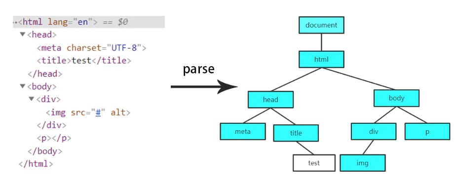

<!--
 * @Author: your name
 * @Date: 2021-05-10 16:01:03
 * @LastEditTime: 2021-05-10 18:58:14
 * @LastEditors: Please set LastEditors
 * @Description: In User Settings Edit
 * @FilePath: /my-docs/docs/92364928.md
-->

## 前提

### Chrome 多进程架构

首先，在开始讲解整个过程前，我们需要认识一下 `Chrome` **多进程架构**。因为，从浏览器输入 `URL` 到页面渲染的整个过程都是由 `Chrome` 架构中的各个进程之间的配合完成。

`Chrome` 的多进程架构：

- **浏览器进程**，它负责用户界面（地址栏、菜单等等）、子进程的管理（例如，进程间通信和数据传递）、存储等等

- **渲染进程**，它负责将接收到的 `HTML` 文档和 `JavaScript` 等转化为用户界面

- **网络进程**，它负责网络资源的请求，例如 `HTTP`请求、`WebSocket` 模块

- **`GPU`（图形处理器）进程**，它负责对 `UI` 界面的展示

- **插件进程**，它负责对插件的管理

## 过程

### 解析输入

发生这个过程的前提，用户在地址栏中输入了 `URL`，而地址栏会根据用户输入，做出如下判断：

- 输入的是非 `URL` 结构的字符串，则会用浏览器默认的搜索引擎搜索该字符串

- 输入的是 `URL` 结构字符串，则会构建完整的 `URL` 结构，浏览器进程会将完整的 `URL` 通过进程间通信，即 `IPC`，发送给网络进程

### 请求过程

在网络进程接收到 `URL` 后，并不是马上对指定 `URL` 进行请求。首先，我们需要进行 `DNS` 解析域名得到对应的 `IP`，然后通过 `ARP` 解析 `IP` 得到对应的 `MAC`（`Media Access Control Address`）地址。

> 域名是我们取代记忆复杂的 `IP` 的一种解决方案，而 `IP` 地址才是目标在网络中所被分配的节点。`MAC` 地址是对应目标网卡所在的固定地址。

#### DNS 解析

而 `DNS` 解析域名的过程分为以下几个步骤：

- 询问 **浏览器** `DNS` 缓存

- 询问 **本地操作系统** `DNS` 缓存（即查找本地 `host` 文件）

- 询问 `ISP`（Internet Service Provider）**互联网服务提供商**（例如电信、移动）的 `DNS` 服务器

- 询问 **根服务器**，这个过程可以进行 `递归` 和 `迭代` 两种查找的方式，两者都是先询问顶级域名服务器查找

#### 通信过程

首先，建立 `TCP` 连接，即 **三次握手** 过程，利用 `TCP` 通道进行数据传输，最后，断开 `TCP` 连接，即 **四次握手** 过程。

> 详情参考另一篇文章 [TCP握手与挥手过程](/8623454.md)

#### 数据处理

当网络进程接收到的 **响应报文状态码**，进行相应的操作。

例如状态码为 `200 OK` 时，会解析响应报文中的 `Content-Type` 首部字段，例如我们这个过程 `Content-Type` 会出现 `application/javascript`、`text/css`、`text/html`，即对应 `Javascript` 文件、`CSS` 文件、`HTML` 文件。

> 详细的 MIME 类型讲解可以看 [MDN](https://developer.mozilla.org/zh-CN/docs/Web/HTTP/Basics_of_HTTP/MIME_types)

> 具体过程参考 [强弱缓存与浏览器返回](./6047613.md)

### 创建渲染进程

当前需要渲染 `HTML` 时，则需要**创建渲染进程**，用于后期渲染 `HTML`。

而对于渲染进程，如果是 **同一站点** 是可以 **共享** 一个 **渲染进程**，例如 `a.abc.com` 和 `c.abc.com` 可以共享一个渲染渲染进程。否则，需要重新创建渲染进程。

> 需要注意的是，同站指的是顶级域名和二级域名相等

### 开始渲染

在创建完渲染进程后，网络进程会将接收到的 `HTML`、`JavaScript` 等数据传递给渲染进程。而在渲染进程接收完数据后，此时用户界面上会发生这几件事：

- 更新地址栏的安全状态

- 更新地址栏的 `URL`

- 前进后退此时 `enable`，显示正在加载状态

- 更新网页

### 渲染过程

> 大家都知道页面渲染的过程也是面试中单独会考的点，并且时常会由这个点延申出另一个问题，即如何避免回流和重绘。

渲染过程，是整个从浏览器输入 `URL` 到页面渲染过程的 **最后一步**。而页面渲染的过程可以分为以下几个步骤：

- 解析 `HTML` 生成 `DOM` 树

- 解析 `CSS` 生成 `CSSOM`

- 加载或执行 `JavaScript`

- 生成渲染树（`Render Tree`）

- 布局

- 分层

- 生成绘制列表

- 光栅化

- 显示

#### 构建 DOM 树

由于网络进程传输给渲染进程的是 `HTML` 字符串，所以，渲染进程需要将 `HTML` 字符串转化成 `DOM` 树。例如：

> 需要注意的是这个 `DOM` 树不同于 `Chrome-devtool` 中 `Element` 选项卡的 `DOM` 树，它是存在内存中的，用于提供 `JavaScript` 对 `DOM` 的操作。

#### 构建 CSSOM

构建 `CSSOM` 的过程，即通过解析 `CSS` 文件、`style` 标签、行内 `style` 等，生成 `CSSOM`。而这个过程会做这几件事：

- 规范 `CSS`，即将 `color: blue` 转化成 `color: rgb()` 形式，可以理解成类似 `ES6` 转 `ES5` 的过程

- 计算元素样式，例如 `CSS` 样式会继承父级的样式，如 `font-size`、`color` 之类的。

> `CSS Object Model` 是一组允许用 `JavaScript` 操纵 `CSS` 的 `API`。详细 `API` 讲解可以看 [MDN](https://developer.mozilla.org/zh-CN/docs/Web/API/CSS_Object_Model)

#### 加载 JavaScript

通常情况下，在构建 `DOM` 树或 `CSSOM` 的同时，如果也要加载 `JavaScript`，则会造成前者的构建的暂停。

当然，我们可以通过 `defer` 或 `sync` 来实现异步加载 `JavaScript`。

虽然 `defer` 和 `sync` 都可以实现异步加载 `JavaScript`，但是前者是在加载后，等待 `CSSOM` 和 `DOM` 树构建完后才执行 `JavaScript`，而后者是在异步加载完马上执行，即使用 `sync` 的方式仍然会造成阻塞。

而 `JavaScript` 执行的过程，即 **编译** 和 **运行** `JavaScript` 的过程。由于 `JavaScript` 是 **解释型** 的语言。所以这个过程会是这样的：

- 针对每句代码进行分行处理，即 `Token` 化

- 根据 `Token`，生成` AST`（`Abstract Sytanx Tree`) **抽象语法树** 和 **创建上下文**

- 解释器解析和执行 `AST`，生成 **字节码** 

- 编译器针对需要反复执行的代码，生成对应的 **机器码** ，提高运行效率

#### 生成渲染树（Render Tree）

在有了 `DOM` 树和 `CSSOM` 之后，需要将两者结合生成渲染树 `Render Tree`，并且这个过程会去除掉那些 `display: node` 的节点。此时，渲染树就具备元素和元素的样式信息。

#### 布局

根据 `Render Tree` 渲染树，对树中每个节点进行计算，确定每个节点在页面中的宽度、高度和位置。

> 需要注意的是，第一次确定节点的大小和位置的过程称为布局，而第二次才被称为回流

#### 分层

由于 **层叠上下文** 的存在，**渲染引擎** 会为具备层叠上下文的元素创建对应的 **图层** ，而诸多图层的叠加就形成了我们看到的一些页面效果。例如，一些 3D 的效果、动画就是基于图层而形成的。

#### 生成绘制列表

对于存在图层的页面部分，需要进行 **有序** 的绘制，而对于这个过程，渲染引擎会将一个个图层的绘制拆分成 **绘制指令**，并按照图层绘制顺序形成一个 **绘制列表**。

#### 光栅化

有了绘制列表后，**渲染引擎** 中的 **合成线程** 会根据当前视口的大小将图层进行 **分块处理** ，然后合成线程会对视口附近的图块生成位图，即光栅化。而渲染进程也维护了一个 **栅格化** 的 **线程池** ，专门用于将图块转为位图。

> 光栅化的过程通常会使用 `GPU` 加速，例如使用 `wil-change`、`opacity`，就会通过 `GPU` 加速显示

#### 显示

当所有的图块都经过 **栅格化** 处理后，渲染引擎中的 **合成线程** 会生成 **绘制图块** 的指令，提交给 **浏览器进程** 。然后浏览器进程将页面绘制到 **内存** 中。最后将内存绘制结果显示在用户界面上。

## 结语

整个浏览器输入 `URL` 到页面渲染的过程涉及到的知识点非常广，如 `Chrome` 多进程的架构、`HTTP` 通信过程、浏览器解析 `JavaScript` 过程、浏览器绘制页面过程以及一些计算机的基础知识等等。

本文记载的也不算十分具体，更多了解还希望童鞋们多多学习和钻研。