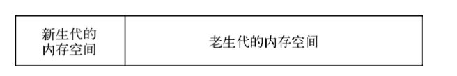
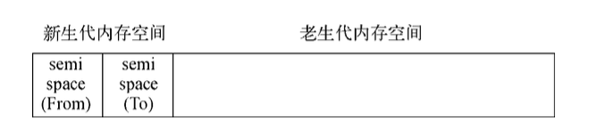
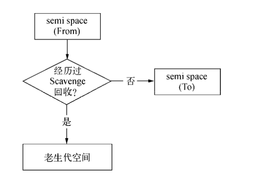
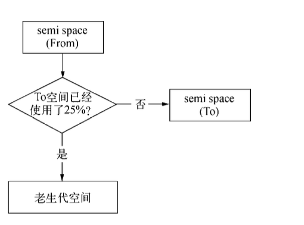
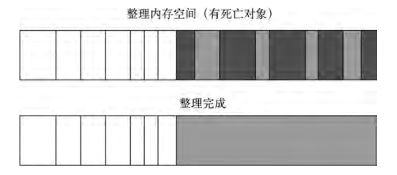
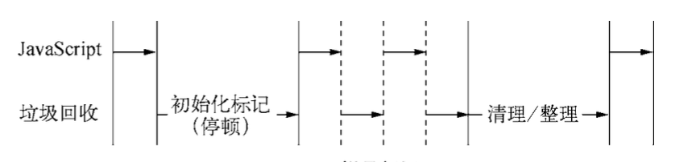

<!--
 * @Author: your name
 * @Date: 2021-06-04 11:11:29
 * @LastEditTime: 2021-06-04 18:53:09
 * @LastEditors: Please set LastEditors
 * @Description: In User Settings Edit
 * @FilePath: /my-docs/docs/926348643.md
-->

## 前言

一般使用 `js` 在前端开发中，并不是很关注 `GC`，但是 `node` 极大的拓展了 `js` 的应用场景，当应用场景移到 **服务端** 之后，我们就能发现 **内存管理的好坏**，**垃圾回收的优良**，都会对服务构成影响。在 `node` 中，这一切都与 `node` 所用 `js引擎` `v8` 息息相关。

## v8 的内存限制

在一般的后端开发语言中，在 **基本内存使用上** 没有限制，在 `Node` 中关注过 `JavaScript` 使用内存时就会发现只能使用部分内存。

<div class="Alert Alert--point">

`64系统` 下为 `1.4 GB`，`32系统` 下为 `0.7 GB`

</div>

这个问题的原因在于 `Node` 基于 `V8` **构建**，所以在 `Node` 中使用的 `JavaScript` 对象基本上都是通过 `V8` 自己的方式 **分配** 和 **管理** 的。

要知晓 `V8` 为何限制了内存的用量，则需要回归到 `V8` 在内存上的 **使用策略**。

```js
// 查询 Node 进程的内存占用信息
$ node
> process.memoryUsage();

{ rss: 23523328, // 所有内存占用，包括指令区和堆栈
  heapTotal: 9682944, // 已经申请到的"堆"的内存，包括用到的和没用到的
  heapUsed: 5800264, // 用到的堆的部分
  external: 8766 } //V8 引擎内部的 C++ 对象占用的内存
```

### 表层原因

表层原因为 `V8` 最初为 **浏览器** 而设计，不太可能遇到用 **大量内存** 的场景。对于网页来说，V8的限制值已经绰绰有余。


### 深层原因

深层原因是 `V8` 的 **垃圾回收机制** 的限制。

按照官方的说法，以 `1.5GB` 的 **垃圾回收堆内存** 为例，`V8` 做一次小的垃圾回收需要 `50ms` 以上，做一次 **非增量式的垃圾回收** 甚至要 `1s` 以上。

这是垃圾回收中引起 `js线程暂停执行` 的时间，在这样的时间花销下，应用的 **性能** 和 **响应能力** 都会直线下降。

这样的情况不仅仅后端服务无法接受，前端浏览器也无法接受。因此在当时的考虑下直接限制堆内存是一个好的选择。


### 修改限制

这个限制也不是不能打开，`V8` 依然提供了选项让我们使用更多的内存，`Node` 在启动时可以通过传递参数的形式，来调整内存限制的大小。

```sh
使用

--max-old-space-size  或  --max-new-space-size

示例：

node --max-old-space-size=1700 test.js // 单位为MB
或
node --max-new-space-size=1024 test.js // 单位为KB
```

<div class='Alert'>

上述参数再V8初始化时生效，一旦生效就 `不能再动态改变`。

</div>

## v8的垃圾回收机制

>`v8` 的垃圾回收策略主要基于 **分代式垃圾回收机制**。

在垃圾回收的演变过程中，没有任何一种 **垃圾回收算法** 能够胜任 **所有场景**，故此，现代的垃圾回收算法中按 **对象的存活时间** 将 **内存的垃圾回收** 进行不同**分代**，然后分别对 **不同分代** 的 **内存** 使用 **最适合的算法**。

### v8的内存分代

在 `v8` 中，主要将内存分为 **新生代** 和 **老生代** ，新生代中的对象为 **存活时间较短** 的对象，老生代中的对象为 **存活时间较长** 或 **常驻** 的对象。



<div class="Alert Alert--point">

`v8堆的整体大小` 就是 **新生代** 所有内存空间 **加上** **老生代** 的内存空间。

在 `64` 位系统和 `32` 位系统下分别可以使用约 `1.4GB` 和 `0.7GB` 的大小。

</div>

### 新生代算法

**新生代中对象主要通过 `Scavenge` 算法进行垃圾回收。在其中主要又采用了 `Cheney` 算法**。

#### 算法原理

`Cheney` 算法是一种采用 **复制的方式** 实现的垃圾回收算法。

它将 **堆内存** 一分为二，这两个空间中，只有一**个处于使用**中，另一个处于**闲置状态**。

处于使用状态的空间称为 `From` 空间，处于闲置状态的空间称为 `To` 空间。

当我们分配对象时，先是在 `From` 空间中进行分配。当开始进行垃圾回收时，会检查 `From` 空间中的 **存活对象**，这些存活对象将被 **复制** 到 `To` 空间中，而非存活对象占用的空间将会被**释放**。完成复制后，`From` 空间和 `To` 空间的 **角色发生对换**。

**简而言之，在垃圾回收的过程中，就是通过将存活对象在两个空间之间进行复制。**



#### 算法利弊

- 弊端：`Scavenge` 的缺点是只能使用 **堆内存中的一半**，这是由 **划分空间** 和 **复制机制** 所决定的。

- 优势：`Scavenge` 由于 **只复制存活** 的对象，并且对于生命周期短的场景存活对象只占少部分，所以它在 **时间效率上** 有优异的表现。

>由于 `Scavenge` 是典型的 **牺牲空间换取时间** 的算法，所以无法大规模地应用到所有的垃圾回收中。但可以发现，`Scavenge` 非常适合应用在新生代中，因为新生代中对象的生命周期较短，恰恰适合这个算法。

#### 晋级

>当一个对象经过多次复制依然存在时，它将会被认为是 **生命周期较长** 的对象，这种对象会被 **移到老生代中**，采用 **新的算法** 进行管理，这种移动称之为 `晋级`。

对象晋级的条件主要有两个，一个是 **对象是否经历过 `Scavenge` 回收** ；另一个是当要从 `From` 空间复制一个对象到 `To` 空间时，如果 **`To` 空间已经使用了超过25%** ，则这个对象直接晋升到老生代空间中。

<div style="display:flex">





</div>

<div class='Alert'>

第二个条件的 `25%` 限制阈值是因为完成回收后，`To` 空间和 `From` 空间会进行调换，如果 `To` 的占比过高，变成 `From` 后将影响后续的内存分配。

</div>


### 老生代算法

对于老生代中的对象，由于 **存活对象占较大比重**，再采用 `Scavenge` 的方式会有两个问题：

一个是 **存活对象较多**，**复制** 存活对象的 **效率将会很低**；

另一个问题依然是 **浪费一半空间** 的问题。

这两个问题导致应对 **生命周期较长** 的对象时 `Scavenge` 会显得捉襟见肘。为此，`V8` 在老生代中主要采 用了 **`Mark-Sweep`** 和 **`Mark-Compact`** 相结合的方式进行垃圾回收。

#### Mark-Sweep

与 `Scavenge` 相比，`Mark-Sweep` 并不将内存空间划分为两半，所以不存在浪费一半空间的行为。

与 `Scavenge` 复制活着的对象不同，`Mark-Sweep` 在标记阶段 **遍历堆中的所有对象**，并 **标记活着的对象**，在随后的清除阶段中，**只清除没有被标记的对象**。

<div class="Alert Alert--point">

**可以看出，`Scavenge` 中只复制活着的对象，而 `Mark-Sweep` 只清理死亡对象**

活对象在新生代中只占较小部分，死对象在老生代中只占较小部分，这是两种回收方式能高效处理的原因。

</div>


<center>黑色为标记死亡对象</center>

<div class="Alert">

`Mark-Sweep` 最大的问题是在进行一次标记清除回收后，内存空间会出现不连续的状态。

这种内存碎片会对后续的内存分配造成问题，因为很可能出现需要分配一个大对象的情况，这时所有的碎片空间都无法完成此次分配，就会提前触发垃圾回收，而这次回收是不必要的。

</div>

#### Mark-Compact

为了解决 `Mark-Sweep` 的内存碎片问题，`Mark-Compact` 被提出来。

`Mark-Compact` 是 **标记整理** 的意思，是在 `Mark-Sweep` 的基础上演变而来的。

**它们的差别在于对象在标记为死亡后，在整理的过程中，将活着的对象往一端移动，移动完成后，直接清理掉边界外的内存。**


<center>白色格子为存活对象，深色格子为死亡对象，浅色格子为白色格子移动后留下的位置</center>


### Incremental Marking（增量标记）

为了避免出现 `JavaScript` 应用逻辑与垃圾回收器看到的不一致的情况，垃圾回收的3种基本算法都需要 **将应用逻辑暂停** 下来，待执行完垃圾回收后再恢复执行应用逻辑，这种行为被称为 **全停顿**（`stop-the-world`)。

在 `V8` 的 **分代式垃圾回收** 中，一次 **小垃圾回收** 只收集 **新生代**，由于新生代默认配置得较小，且其中存活对象通常较少，所以即便它是全停顿的影响也不大。

但 `V8` 的老生代通常配置得较大，且存活对象较多，**全堆垃圾回收**（`full` 垃圾回收）的标记、整理、清理等 动作造成的停顿就会比较可怕，需要设法改善。

为了降低全堆垃圾回收带来的停顿时间，`V8` 先从标记阶段人手，将原本要 **一口气停顿完成** 的动作改为 **增量标记**（`incrementalmarking`)。

也就是拆分为许多小 **步进**，每做完一 **步进** 就让 `JavaScript` 应用逻辑执行一小会儿，**垃圾回收** 与 **应用逻辑** **交替执行** 直到标记阶段完成。

>`V8` 在经过增量标记的改进后，垃圾回收的最大停顿时间可以减少到原本的 `1/6` 左右。



`V8` 后续还引入了 **延迟清理**（`lazy sweeping`)与 **增量式整理** （`incremental compaction`)，让清理与整理动作也变成增量式的。

同时还计划引入 **并行标记** 与 **并行清理** ，进一步利用多核性能降低每次停顿的时间。

## 小结

从 `V8` 的 **自动垃圾回收机制** 的设计角度可以看到，`V8`对内存使用进行限制的缘由。

<div class="Alert Alert--point">

新生代设计为一个较小的内存空间是合理的，而老生代空间过大对于垃圾回收并无特别意义。

`V8` 对内存限制的设置对于 `Chrome` 浏览器这种每个选项卡页面使用一个 `V8` 实例而言，内存的使用是绰缚有余了。

对于 `Node` 编写的服务器端来说，内存限制也并不影响正常场景下的使用。

但是对于 `V8` 的垃圾回收特点和 `JavaScript` 在单线程上的执行情况，垃圾回收是影响性能的因素之一。

想要高性能的执行效率，需要注意让垃圾回收尽量少地进行，尤其是全堆垃圾回收。

</div>

以 `Web` 服务器中的会话实现为例，一般通过内存来存储，但在访问量大的时候会导致老生代中的存活对象骤增，不仅造成清理、整理过程费时，还会造成内存紧张，甚至溢出。


## 感谢

[参考 深入浅出Node.js](https://www.ituring.com.cn/book/1290)
