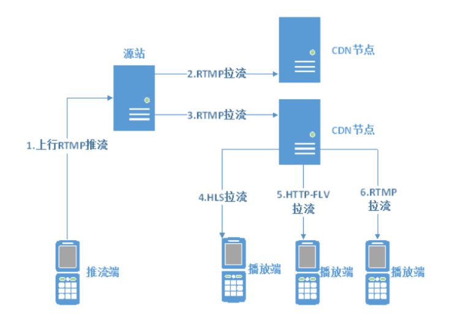
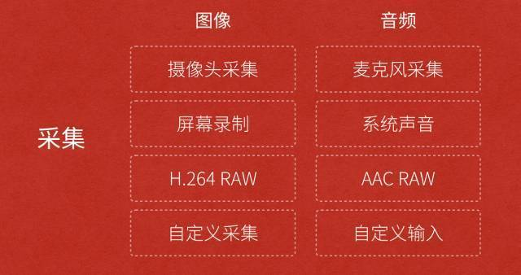
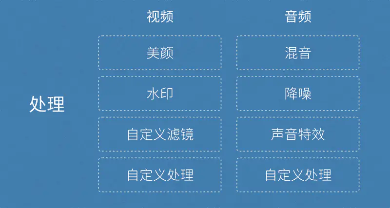
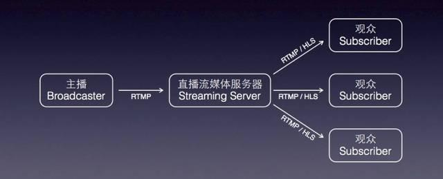

<!--
 * @Author: your name
 * @Date: 2021-05-17 11:57:31
 * @LastEditTime: 2021-05-17 20:16:01
 * @LastEditors: Please set LastEditors
 * @Description: In User Settings Edit
 * @FilePath: /my-docs/docs/962836925.md
-->

## 流式传输

流媒体又叫 **流式媒体**，它是指商家用一个 **视频传送服务器** (比如：`vlc`）把 **节目**（比如：`test.mp4`）当成数据包发出，传送到网络上。用户通过解压设备对这些数据进行解压后，节目就会像发送前那样显示出来。

这个过程的一系列相关的包称为 **流**。

> 流媒体实际指的是一种 **新的媒体传送方式**，而非一种新的媒体。

流媒体技术发端于美国，在美国目前流媒体的应用已很普遍。

流式媒体在播放前并不下载整个文件，只将开始部分内容存入内存，流式媒体的数据流随时传送随时播放，只是在开始时有一些延迟。流媒体实现的关键技术就是`流式传输`。

流式传输方式则是将整个 `A/V` 及 `3D` 等多媒体文件经过特殊的压缩方式分成一个个 **压缩包** ，由视频服务器向用户计算机连续、实时传送。

与单纯的下载方式相比，这种对多媒体文件 **边下载边播** 的流式传输方式不仅使 **启动延时大幅度缩短**，而且对 **系统缓存容量** 的需求也大大降低。

实现流式传输有两种方法：**实时流式传输**（`Realtime streaming`）和 **顺序流式传输**（`progressive streaming`）。

### 顺序流式传输

>是顺序下载，在下载文件的同时用户可观看在线媒体，在给定时刻，用户只能观看已下载的那部分，而不能跳到还未下载的前头部分，顺序流式传输不象实时流式传输在传输期间根据用户连接的速度做调整。

由于标准的 `HTTP` 服务器（`nginx`，`apache`，`tomcat`，`iis`）可发送这种形式的文件，也不需要其他特殊协议，它经常被称作 **HTTP流式传输**。

顺序流式传输比较适合高质量的短片段，如片头、片尾和广告，由于该文件在播放前观看的部分是无损下载的，这种方法保证电影播放的最终质量。这意味着用户在观看前，必须经历延迟，对较慢的连接尤其如此。

顺序流式文件是放在标准 `HTTP` 或 `FTP` 服务器上，易于管理，基本上与防火墙无关。

但是顺序流式传输不适合长片段和有随机访问要求的视频，如：讲座、演说与演示。它也不支持现场广播，严格说来，它是一种点播技术。 

### 实时流式传输

>指保证媒体信号带宽与网络连接配匹，使媒体可被实时观看到。

**实时流** 与 **HTTP流式传输** 不同，需要 **专用的流媒体服务器** 与 **传输协议**。实时流式传输总是实时传送，特别适合现场事件，也支持随机访问，用户可快进或后退以观看前面或后面的内容。

实时流式传输需要特定流媒体服务器，如 `QuickTime` `Streaming Server`、`RealServer` 与 `Windows Media Server`。这些服务器允许你对媒体发送进行更多级别的控制，因而系统设置、管理 **比标准HTTP服务器更复杂**。

实时流式传输还需要 **特殊网络协议**，如：`RTSP` (`Realtime Streaming Protocol`)或 `MMS` (`Microsoft Media Server`)。这些协议在有防火墙时有时会出现问题，导致用户不能看到一些地点的实时内容。

## 流媒体相关技术

### 智能流技术

自动检测网络状况，并将音视频的属性调整到最佳，使用用户收到与其网络速度相符的媒体流，从而获取最佳的用户体验，**多码流技术**。

### 分流技术

一般只在 **直播中** 使用。**发送服务器** 将 **媒体流** 发送到分布在各地的多个 **接收服务器** ，客户端可以就近访问服务器获得较高质量的媒体流，同时减少带宽使用。推流为将直播内容推送至服务器的过程；拉流为服务器已有直播内容，用指定地址进行拉取的过程。

### 缓存技术

解决由于异步网络、网络延迟和抖动导致的数据包错序的问题，数据包先缓存在本地，而缓存系统使用环形链表结构丢弃掉已经播放的内容，防止缓存溢出。

### 内容分发网络技术

架构在 **IP网络** 之上的一个内容叠加网，通过引入主动内容管理、全局负载均衡和内容缓存等技术，将用户请求的流媒体内容发布到距离用户最近的网络边缘，从而提供响应速度，减轻骨干网络的压力。

## 直播的实现

### 直播中使用的主流流媒体协议

- RTMP

`Real Time Messaging Protocol`（实时消息传输协议）的首字母缩写。该协议 **基于TCP**，是一个协议族，包括 `RTMP` 基本协议及 `RTMPT/RTMPS/RTMPE` 等多种变种。

`RTMP` 是一种设计用来进行 **实时数据通信** 的网络协议，主要用来在 `Flash/AIR` 平台和支持 `RTMP` 协议的流媒体/交互服务器之间进行音视频和数据通信。

`RTMP` 基于 `flash` 无法在 `iOS` 的浏览器里播放，但是实时性比 `HLS` 要好。

- HLS

`HTTP Live Streaming`（HTTP直播流技术），`Apple` 的 **动态码率自适应** 技术。主要用于 `PC` 和 `Apple` 终端的 **音视频服务**。包括一个 **`m3u(8)` 的索引文件**， **`TS` 媒体分片文件** 和 **`key` 加密串文件**。

### 直播的模块划分

- 视频录制端

一般是电脑上的音视频输入设备或者手机端的摄像头或者麦克风，目前以移动端的手机视频为主。技术：`webRTC`（用途：H5视频录制）

- 视频播放端

可以是电脑上的播放器，手机端的 `Native` 播放器，还有就是 `H5` 的 `video` 标签等，目前还是已手机端的 `Native` 播放器为主。技术：`HLS` 协议或 `RTMP` 协议（用途：视频播放）、`ffmpeg`（用途：使用 `RTMP` 协议时进行移动端视频解码）

- 视频服务器端

一般是一台 `nginx`／`srs`／... 服务器，用来接受视频录制端提供的视频源，同时提供给视频播放端流服务。技术：`RTMP` 协议（用途：上传视频流）、`nginx rtmp-module` 或 `SRS`(`simple-rtmp-server`)（用途：流服务器）

## 视频直播流程

视频直播的流程可以分为如下几步： 

`采集` >> `处理` >> `编码和封装` >> `推流到服务器` >> `服务器流分发` >> `播放器流播放`

### 采集

采集是整个视频推流过程中的第一个环节，它从系统的采集设备中获取原始视频数据，将其输出到下一个环节。

视频的采集涉及两方面数据的采集：**音频采集** 和 **图像采集**，它们分别对应两种完全不同的 **输入源** 和 **数据格式**。

- 音频采集

音频数据既能与图像结合组合成视频数据，也能以纯音频的方式采集播放，后者在很多成熟的应用场景如 **在线电台** 和 **语音电台** 等起着非常重要的作用。

音频的采集过程主要通过设备将环境中的模拟信号采集成 `PCM` 编码的原始数据，然后编码压缩成 `MP3` 等格式的数据分发出去。

常见的音频压缩格式有：`MP3`，`AAC`，`HE-AAC`，`Opus`，`FLAC`，`Vorbis` (`Ogg`)，`Speex` 和 `AMR`等。 

- 图像采集 

将图像采集的图片结果组合成一组连续播放的动画，即构成视频中可肉眼观看的内容。图像的采集过程主要由摄像头等设备拍摄成 `YUV` 编码的原始数据，然后经过编码压缩成 `H.264` 等格式的数据分发出去。

常见的视频封装格式有：`MP4`、`3GP`、`AVI`、`MKV`、`WMV`、`MPG`、`VOB`、`FLV`、`SWF`、`MOV`、`RMVB` 和 `WebM` 等。 

### 处理

视频或者音频完成采集之后得到原始数据，为了增强一些 **现场效果** 或者加上一些 **额外的效果** ，我们一般会在将其编码压缩前进行处理，比如打上时间戳或者公司 Logo 的水印，祛斑美颜和声音混淆等处理。

在主播和观众连麦场景中，主播需要和某个或者多个观众进行对话，并将对话结果实时分享给其他所有观众，**连麦的处理也有部分工作在推流端完成**。

### 编码和封装

#### 编码

如果把整个流媒体比喻成一个物流系统，那么编解码就是其中配货和装货的过程，这个过程非常重要，它的速度和压缩比对物流系统的意义非常大，影响物流系统的整体速度和成本。

同样，对流媒体传输来说，编码也非常重要，它的**编码性能**、**编码速度** 和 **编码压缩比** 会直接影响整个流媒体传输的用户体验和传输成本。

##### 视频编码的意义 

原始视频数据存储空间大，一个 `1080P` 的 `7s` 视频需要 `817MB` 

原始视频数据传输占用带宽大，`10Mbps` 的带宽传输上述 `7s` 视频需要 `11min` 

而经过 `H.264` 编码压缩之后，视频大小只有 `708k` `，10Mbps` 的带宽仅仅需要 `500ms` ，可以满足实时传输的需求，所以从视频采集传感器采集来的原始视频势必要经过视频编码。

[具体计算逻辑，请参考另一篇博文](/402742734.md)

##### 基本原理 

为什么巨大的原始视频可以编码成很小的视频呢?这其中的技术是什么呢?核心思想就是去除 **冗余信息**

- **空间冗余**：图像相邻像素之间有较强的相关性 

- **时间冗余**：视频序列的相邻图像之间内容相似 

- **编码冗余**：不同像素值出现的概率不同 

- **视觉冗余**：人的视觉系统对某些细节不敏感 

- **知识冗余**：规律性的结构可由先验知识和背景知识得到

#### 封装 

沿用前面的比喻，封装可以理解为采用哪种货车去运输，也就是媒体的 **容器**。 

所谓容器，就是把编码器生成的 **多媒体内容**(视频，音频，字幕，章节信息等)**混合封装** 在一起的标准。

容器使得不同多媒体内容同步播放变得很简单，而容器的另一个作用就是 **为多媒体内容提供索引**，也就是说如果没有容器存在的话一部影片你只能从一开始看到最后，不能拖动进度条，而且如果你不自己去手动另外载入音频就没有声音。

- `AVI` 格式(后缀为 `.avi`) 

- `DV-AVI` 格式(后缀为 `.avi`) 

- `QuickTime File Format` 格式(后缀为 `.mov`) 

- `MPEG` 格式(文件后缀可以是 `.mpg .mpeg .mpe .dat .vob .asf .3gp .mp4`等) 

- `WMV` 格式(后缀为`.wmv` `.asf`) 

- `Real Video` 格式(后缀为 `.rm .rmvb`) 

- `Flash Video` 格式(后缀为 `.flv`) 

- `Matroska` 格式(后缀为 `.mkv`) 

- `MPEG2-TS` 格式 (后缀为 `.ts`) 

目前，我们在流媒体传输，尤其是 **直播** 中主要采用的就是 `FLV` 和 `MPEG2-TS` 格式，分别用于 `RTMP/HTTP-FLV` 和 `HLS` 协议。

### 推流到服务器

推流是直播的第一公里，直播的推流对这个直播链路影响非常大，如果推流的网络不稳定，无论我们如何做优化，观众的体验都会很糟糕。

推送协议主要有三种：

- `RTSP`（`Real Time Streaming Protocol`）：实时流传送协议，是用来控制声音或影像的多媒体串流协议, 由 `Real Networks` 和 `Netscape` 共同提出的；

- `RTMP` (`Real Time Messaging Protocol`)：实时消息传送协议，是 `Adobe` 公司为 `Flash` 播放器和服务器之间音频、视频和数据传输 开发的开放协议；

- `HLS` (`HTTP Live Streaming`)：是苹果公司(`Apple Inc.`)实现的基于 `HTTP` 的流媒体传输协议；

### 服务器流分发

**流媒体服务器的作用是负责直播流的发布和转播分发功能**。 

流媒体服务器有诸多选择，如商业版的 `Wowza`。

### 播放器流播放

主要是实现直播节目在终端上的展现。以使用 `RTMP` 传输协议为例， 所以只要支持 `RTMP` 流协议的播放器都可以使用，譬如：

- 电脑端：`VLC` 等

- 手机端：`Vitamio` 以及 `ijkplayer` 等

### 总结

一般情况下我们把上面流程的前四步称为 **第一部分**，即 **视频主播端** 的操作。视频采集处理后推流到流媒体服务器，第一部分功能完成。

第二部分就是 **流媒体服务器**，负责把从第一部分接收到的流进行处理并分发给观众。

第三部分就是观众，只需要拥有 **支持流传输协议** 的播放器即可。 

