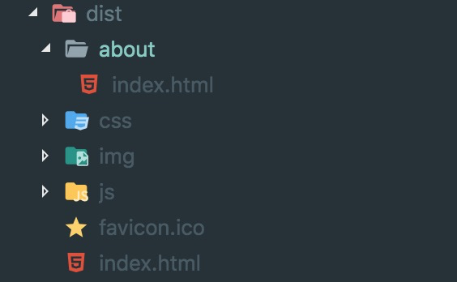
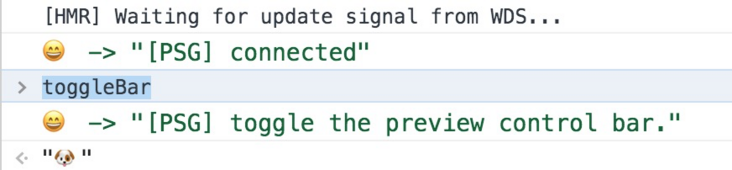
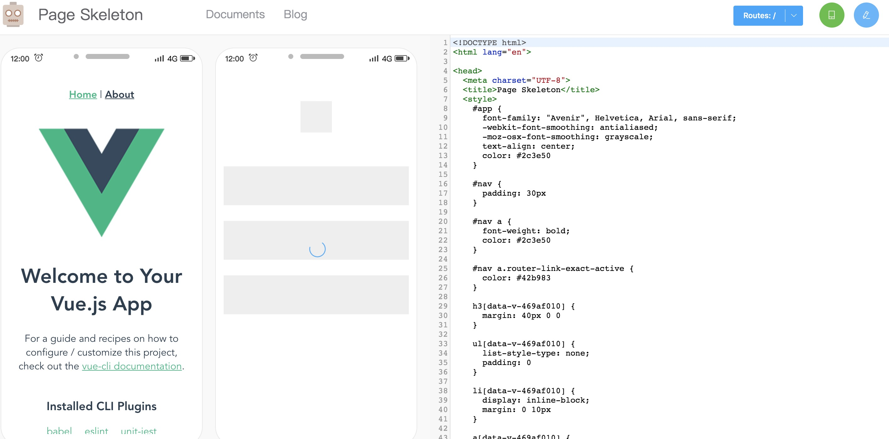

<!--
 * @Author: your name
 * @Date: 2021-05-24 16:49:21
 * @LastEditTime: 2021-05-24 17:52:20
 * @LastEditors: Please set LastEditors
 * @Description: In User Settings Edit
 * @FilePath: /my-docs/docs/96429643.md
-->

## 固定资源

这是个简单粗暴的办法，可以给根节点(一般是 `app`)，加上固定资源，比如 **加载动画**、**loading 图片**等等，框架执行渲染 `dom` 之后替换资源。

## SSR

想到白屏问题，首先想到的解决方案一般都是 **服务端渲染**。

在服务端将渲染逻辑处理好，然后将处理好的 `HTML` 直接返回给前端展示，这样就可以解决白屏的问题，也可以解决 `seo` 的问题，因为不需要动态获取数据了。

但是，这早期写后端时的开发模式很像，前端和后端关联在了一起，不利于维护，同时，对于前端工程师来说，要求也会变高，需要了解一定的后端知识。

<div class="Alert">

虽然有类似 `Nuxt.js` 这类的 `SSR` 框架帮我们简化了服务端的部分，但是在要做定制或是解决 `bug` 时还是无法避免要对服务端部分进行调试、维护，成本颇高，还有需要考虑的服务端渲染会增加 **服务器压力**，要 **处理并发**、**运行速度** 问题等等

</div>

## 预渲染

这个方案是相对简单直接的一个解决办法。

### 配置

尝试成本也比较低，这里介绍如何用 `prerender-spa-plugin` 做预渲染，这样就可以在浏览器进行渲染，而不需要将 `Vue` 或者 `React` 代码部署到服务器上，以`vue-cli3` 的官方 `demo` 为例做配置：

```js
const path = require("path");
const PrerenderSPAPlugin = require("prerender-spa-plugin");
const Renderer = PrerenderSPAPlugin.PuppeteerRenderer;
module.exports = {
  configureWebpack: (config) => {
    let plugins = [];
    plugins.push(
      new PrerenderSPAPlugin({
        staticDir: path.resolve(__dirname, "dist"),
        routes: ["/", "/about"],
        minify: {
          collapseBooleanAttributes: true,
          collapseWhitespace: true,
          decodeEntities: true,
          keepClosingSlash: true,
          sortAttributes: true,
        },
        renderer: new Renderer({
          renderAfterDocumentEvent: "custom-render-trigger",
        }),
      })
    );
    config.plugins = [...config.plugins, ...plugins];
  },
};
```

上面代码是常用 `prerender-spa-plugin` 的配置：

- `staticDir` 预渲染输出的文件地址。

- `routes` 要做预渲染的路由。

- `minify` 压缩相关的配置。

- `renderer` 渲染引擎相关的配置，可以传入自定以的渲染引擎或者直接使用默认的 `PuppeteerRenderer` 。

- `renderAfterDocumentEvent` 是渲染引擎配置中的一个属性，指当某个事件触发时才执行预渲染，[这里有关于渲染引擎的完整属性介绍](https://github.com/chrisvfritz/prerender-spa-plugin#prerendererrenderer-puppeteer-options)，这很重要，尤其是对一些特定场景的下的需求，当然简单场景下完全可以不配置 `renderer` 渲染引擎选项，直接用默认选项。

### 编译结果



`dist` 目录下会生成路由对应的文件夹（生成多页面），打开 `index.html`

```html
<div id="app">
  <div id="nav">
    <a href="/" class="router-link-exact-active router-link-active">Home</a> |
    <a href="/about" class="">About</a>
  </div>
  <div class="home">
    
    <div class="hello" data-v-7b2de9b7="">
      <h1 data-v-7b2de9b7="">Welcome to Your Vue.js App</h1>
      <p data-v-7b2de9b7="">
        For a guide and recipes on how to configure / customize this project,<br
          data-v-7b2de9b7=""
        />check out the
        <a
          href="https://cli.vuejs.org"
          data-v-7b2de9b7=""
          rel="noopener"
          target="_blank"
          >vue-cli documentation</a
        >
      </p>
      <h3 data-v-7b2de9b7="">Installed CLI Plugins</h3>
      <ul data-v-7b2de9b7="">
        <li data-v-7b2de9b7="">
          <a
            href="https://github.com/vuejs/vue-cli/tree/dev/packages/%40vue/cli-plugin-babel"
            data-v-7b2de9b7=""
            rel="noopener"
            target="_blank"
            >babel</a
          >
        </li>
      </ul>
      <h3 data-v-7b2de9b7="">Essential Links</h3>
      ...
    </div>
  </div>
</div>
```

<div class="Alert Alert--point">

为了方便，这里只贴了 `app` 节点里的代码，以往在没有使用预渲染插件时 `app` 节点里面是空的没有内容。

从加载 `index.html` 文件开始到 `js` 文件解析完成之前，由于 `app` 节点里面是空的，因此页面会处于白屏状态。

但是预渲染插件在编译阶段就将对应的路由编译好插入到 `app` 节点，这样就能在 `js` 文件解析过程中有内容展示，`js` 解析完成后，`Vue` 会将 `app` 节点内的内容替换成 `Vue` 渲染好的内容。

</div>

### 弊端

- **动态数据** 无法展示，不同的用户看到的都是 **同样的页面**

- 路由很多时，**代码构建时间太长**

- 用户容易误操作，由于预渲染时 `js` 还 **没有加载**，因此展示出来的内容没有 `js` 的 **交互逻辑**，比如按钮点击，在 `js` 加载完成之前用户点击是**没有反应**

- 预加载内容很少，当页面有内容是 **依赖动态数据加载时**，在编译时是无法加载出动态数据的，因此会导致这部分内容编译不出来

## 骨架屏

骨架屏的实现原理和 **预加载** 类似，都是利用了 [`Puppeteer`](https://zhaoqize.github.io/puppeteer-api-zh_CN/#/) 爬取页面的功能。

> `Puppeteer` 是 `Chrome` 出的一个 `headlessChromenode` 库，提供了 `API` 可以抓取 `SPA` 并生成 **预渲染内容**。

和预加载不太一样的是骨架屏技术会在 `Puppeteer` 生成内容后，利用 **算法** 将 **生成的内容进行替换**，生成骨架页面。[(`详细逻辑`)](https://blog.csdn.net/weixin_33795093/article/details/91428233)

### 配置

`page-skeleton-webpack-plugin` 是一个用来生成骨架屏的 **`webpack` 插件**，接下来就来看看怎么使用，还是以 `vue-cli3` 生成的官方项目为例

```html
<div id="app"><!-- shell --></div>
```

```js
const SkeletonPlugin = require("page-skeleton-webpack-plugin").SkeletonPlugin;
const path = require("path");
module.exports = {
  publicPath: "/",
  outputDir: "dist",
  configureWebpack: (config) => {
    let plugins = [];
    plugins.push(
      new SkeletonPlugin({
        pathname: path.resolve(__dirname, "./shell"), // pathname为来存储 shell 文件的地址
        staticDir: path.resolve(__dirname, "./dist"), // 最好和 `output.path` 相同
        routes: ["/", "/about"], // 将需要生成骨架屏的路由添加到数组中
        port: "7890",
      })
    );
    config.plugins = [...config.plugins, ...plugins];
  },
  chainWebpack: (config) => {
    if (process.env.NODE_ENV === "production") {
      config.plugin("html").tap((opts) => {
        console.log(opts[0]);
        opts[0].minify.removeComments = false;
        return opts;
      });
    }
  },
};
```

<div class="Alert Alert--point">

上面例子是对 `page-skeleton-webpack-plugin` 的简单配置，想要完整的配置可以自行前往 [`github`](https://github.com/ElemeFE/page-skeleton-webpack-plugin) 获取。

</div>

```js
chainWebpack: (config) => {
  if (process.env.NODE_ENV === "production") {
    config.plugin("html").tap((opts) => {
      console.log(opts[0]);
      opts[0].minify.removeComments = false;
      return opts;
    });
  }
};
```

<div class="Alert">

这是修改了 `vue-cli3` 中集成的 `html-webpack-plugin` 的压缩配置，将移除注释去掉了，因为 `page-skeleton-webpack-plugin` 在编译时，注入代码依赖 `<!-- shell -->` 注释，而 `vue-cli3` 中集成的 `html-webpack-plugin` 会在编译做压缩，将注释去掉，因此要单独配置一下，否则会在编译时导致生成 `app` 节点下没有内容。

</div>

## 使用 

运行项目后，在 `Chrome` 调试器里执行 `toggleBar`：



会在页面里显示一个 `Preview skeleton page` 按钮，点击后会生成一个新窗口：



这个窗口显示了当前页面的骨架屏样式和代码，可以修改骨架屏样式，然后点击右上角保存，会将对应路由的骨架屏保存到 `pathname` 对应的文件夹下。

然后执行编译，编译后会在 `staticDir` 中生成路由对应的 `html` ，这些 `html` 中的 `app` 节点下都被插入了路由对应骨架屏代码，然后在 `staticDir` 下启动服务访问，就能看到骨架屏的效果。


