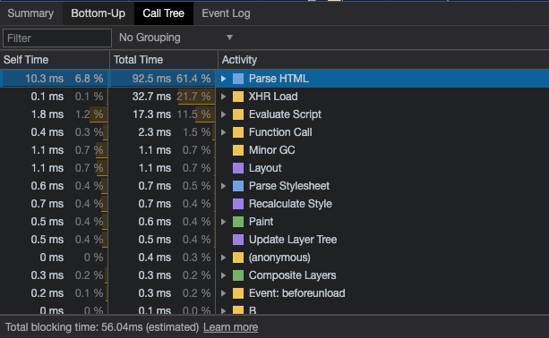

<!--
 * @Author: your name
 * @Date: 2021-04-16 17:09:37
 * @LastEditTime: 2021-04-16 17:16:34
 * @LastEditors: Please set LastEditors
 * @Description: In User Settings Edit
 * @FilePath: /my-docs/docs/css.md
-->

## 事情是从 `Performance` 开始的

 其中一个指标 **`first paint`**

> 指的是首个像素开始绘制到屏幕上的时机，例如一个页面的背景色

## 流程

*从 Performance 中，我们可以看出首次绘制的一系列动作*

1. **CSS** 加载完成

2. **Parse Stylesheet**：解析样式表，构建出 CSSOM

3. **Recalculate Style**：重新计算样式，确定样式规则

4. **Layout**：根据计算结果进行布局，确定元素的大小和位置

5. **Update Layer Tree**：更新渲染层树

6. **Paint**：根据 Layer Tree 绘制页面（位置、大小、颜色、边框、阴影等）

7. **Composite Layers**：组合层，浏览器将图层合并后输出到屏幕

 

